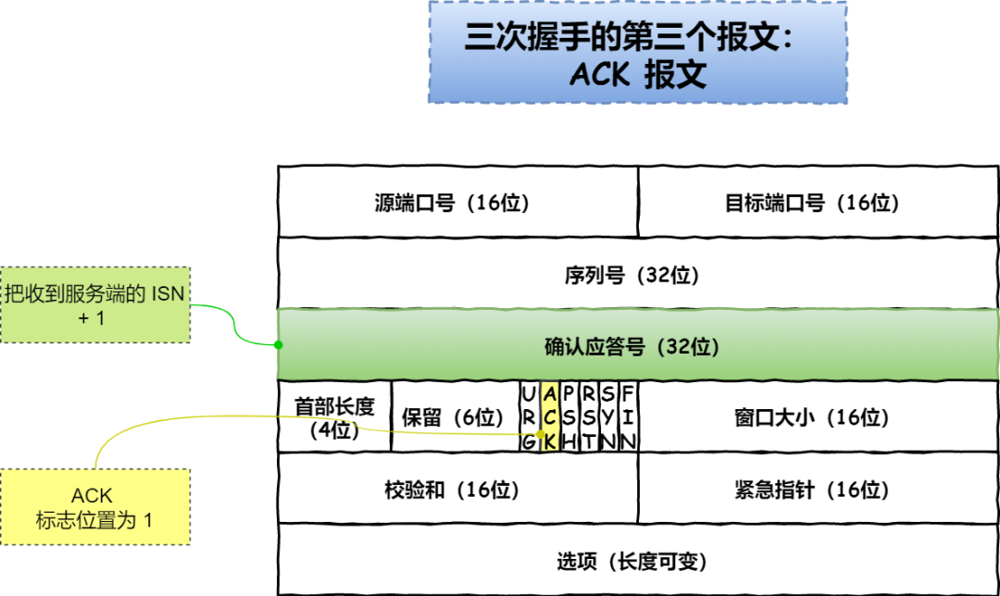
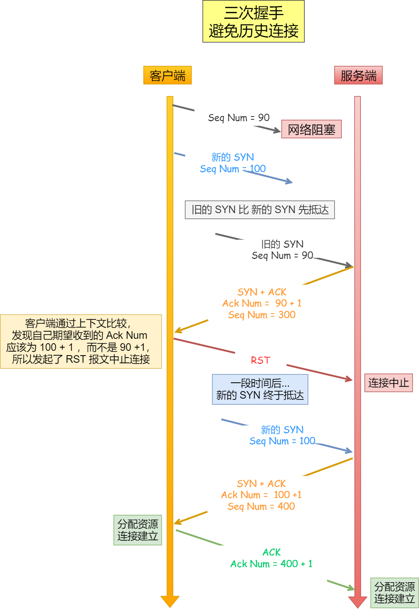
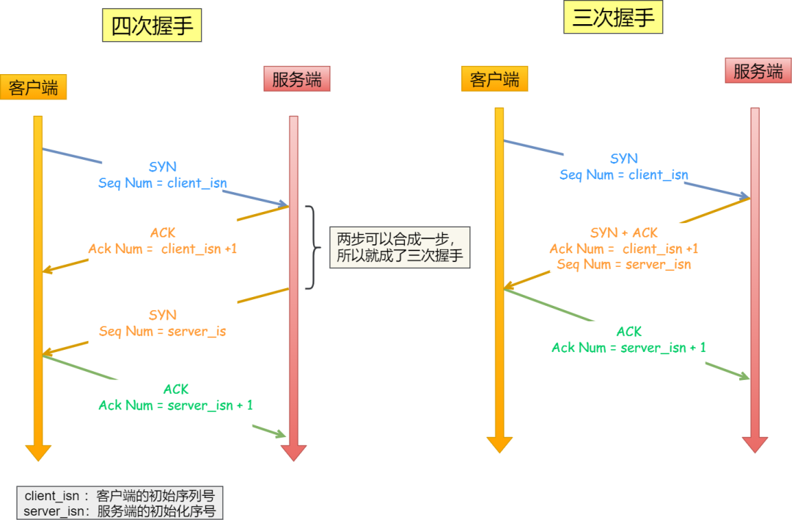

# HTTP基本概念

## `HTTP是什么`

​	http是超文本传输协议

​		协议： HTTP 是一个用在计算机世界里的**协议**。它使用计算机能够理解的语言确立了一种计算机之间交流通信的规范（**两个以上的参与者**），以及相关的各种控制和错误处理方式（**行为约定和规范**）。 

​		传输：  很好理解，就是把一堆东西从 A 点搬到 B 点或者从 B 点 搬到 A 点。 HTTP 协议是一个**双向协议**。数据虽然是在 A 和 B 之间传输，但允许中间有**中转或接力**。  HTTP 是一个在计算机世界里专门用来在**两点之间传输数据**的约定和规范。 

​		超文本： HTTP 传输的内容是「超文本」。超越了普通文本的文本，它是文字、图片、视频等的混合体，最关键有超链接，能从一个超文本跳转到另外一个超文本。 
## `HTTP报文结构与请求步骤`

​	HTTP协议属于应用层，用户访问的第一层就是http
​	HTTP请求报文由请求行、请求头、请求体组成；GET请求无请求体
​	HTTP响应报文由状态行(响应状态码)、响应部首字段、响应内容组实体组成

1.建立TCP连接（三次握手）
2.一旦建立了TCP连接，浏览器向服务器发送请求行
3.浏览器还要以头的形式向服务器发送请求头，之后发送了空白行来通知服务器，结束了该头信息的发送
4.服务器应答，发送状态行（包括协议版本号和状态码）
5.服务器发送应答头
6.服务器发送完应答头之后会发送一个空白行来表示头信息的发送结束，接着以Content-Type应答头所描述的格式发送用户所请求的实际数据
7.TCP关闭连接

## `HTTP常见状态码`

​		1xx：请求已接收，正处理：属于**提示信息** ，是协议处理中的一种中间状态，实际用到的比较少 。

​		2xx：成功： 服务器**成功**处理了客户端的请求 

​				**200 OK**-------成功，如果是非HEAD请求，响应头都会有body数据

​				**204 No Content**------与200一样，但无body数据

​				**206 Partial Content**------HTTP分块下载或断点续传，表示响应返回的body并不是资源的全部		

​		3xx：重定向：需要客户端用新的 URL 重新发送请求获取资源 

​				**301 Moved Permanently**------永久重定向,请求的资源已经不存在，需改用新的 URL 再次访问。 

​				**302 Found**-------- 临时重定向，说明请求的资源还在，但暂时需要用另一个 URL 来访问。 

​				301 和 302 都会在响应头里使用字段 `Location`，指明后续要跳转的 URL，浏览器会自动重定向新的 URL。 

​				**304 Not Found**---- 不具有跳转的含义，表示资源未修改，告诉客户端可以继续使用缓存资源，用于缓存控制。 

​		4xx：客户端发送的**报文有误**，服务器无法处理

​				 **400 Bad Request**------- 客户端请求的报文有错误 

​				 **403 Forbidden** ---------- 服务器禁止访问资源，并不是客户端的请求出错 

​				 **404 Not Found** ---------- 请求的资源在服务器上不存在或未找到 

​		5xx： 客户端请求报文正确，服务端错误，服务器未能实现合法的请求

## `HTTP请求方式`

​		GET：请求已被URI识别的资源，可以通过URL传参给服务器

​		POST：传输信息给服务器，与GET类似

​		PUT：传输文件，报文主题包含文件内容，保存到URI位置

​		HEAD：获得报文首部，与GET类似，不返回报文主题，用于验证URI是否有效

​		DELETE：与PUT相反，删除对应URI位置的文件

**URI和URL**

​		URI：统一资源标识符：用于区分互联网上不同的资源，并不是常说的网址

​		URI包括URL

​		scheme协议名：//  +  host:port主机名和端口  +  /path请求路径  +  ？query查询参数  +  #fragment锚点

## `HTTP常见字段`

​		Host：www.baidu.com  客户端发送请求时用来指定服务器的域名

​		Content-Length------表明本次回应的数据长度

​		Connection : keep-alive ------ 用于客户端要求服务器使用 TCP 持久连接，以便其他请求复用 

​		Content-Type: text/html; charset=utf-8 ------ 用于服务器回应时，告诉客户端，本次数据是什么格式 

​		Accept: **/* *-------------- 客户端请求的时候，可以使用 `Accept` 字段声明自己可以接受哪些数据格式 

​		Content-Encoding--------字段说明数据的压缩方法。表示服务器返回的数据使用了什么压缩格式 

​		Accept-Encoding: gzip, deflate -------- 客户端在请求时，该字段说明自己可以接受哪些压缩方法 
## `HTTP传输`

#### 		定长和不定长数据传输
​			定长包体：发送端传输时带上Content-Length，指明包体长度
​			不定长包体：Transfer-Encoding：chunked，定长字段会被忽略，基于长连接持续推送动态内容

#### 		处理大文件传输
​			对于几百M和上G的文件，一口气传输显然不可能，HTTP针对这一场景，采取了范围请求的解决方案，允许客户端仅仅请求一个资源的一部分。
​			前提是服务器支持范围请求，服务器加上Accept-Ranges：none这一响应头，用来告知客户端这边支持范围请求

#### 		处理表单数据
​			http中有两种主要的表单提交方式，体现两种不同的content-Type取值
​			application/x-www-form-urlencoded：数据会被编码成以&分隔的键值对，以URL编码方式编码
​			multipart/form-data：字段包含boundary，每个表单元素都是独立的资源表述，对图片等文件的上传，基本采用该字段，因为没有必要URL编码，巨大的消耗

## `HTTP代理`
负载均衡----客户端的请求只会到达代理服务器，后面有多少源服务器，IP都不知道，代理拿到这个请求后通过特定的算法分发给不同的源服务器，让各台源服务器负载尽量平均

保障安全----利用心跳机制监控后台的服务器，一旦发生故障机就将其踢出集群，并对上下行的数据进行过滤，对非法IP限流

缓存代理----将内容缓存到代理服务器，客户端可以从代理处获得

代理缓存---为缓解源服务器压力而引入，代理服务器接管一部分HTTP缓存，客户端缓存过期后就近到代理缓存中获得，代理过期后才请求源服务器

# GET与POST

## `GET与POST区别`

​		GET是从服务器获取指定的资源，请求的参数位置一般是写在 URL 中，请求的参数只允许 ASCII 字符 ，而且浏览器会对 URL 的长度有限制， HTTP协议本身对 URL长度并没有做任何规定。

​		POST是根据报文body主体对指定的资源做出处理。请求携带数据的位置一般是写在报文 body 中， body 中的数据可以是任意格式的数据，只要客户端与服务端协商好即可，而且浏览器不会对 body 大小做限制。 

GET重点是从服务器上获取资源，POST重点是向服务器发送数据

GET传输数据量小，受URL长度限制，POST可以传大量数据，所以上传文件时只能以POST方式

GET不安全，因为请求数据在URL上，可见的，故会泄漏私密信息，POST在请求体上，安全

​	缓存上，GET会被浏览器缓存下来，有历史记录，      后者不会
​	编码上，GET只能URL编码，只能接收ASCII字符，    后者无限制
​	参数上，GET放在URL上，不安全，                               后者在请求体上，安全
​	幂等性上，GET幂等的（表示执行相同的操作，结果相同），后者不是
​	TCP上，GET一次性发送出去，	后者分两个TCP包，响应后才会发body部分

## `GET和POST方法都是安全和幂等的吗`

​		  在 HTTP 协议里，安全是指请求方法不会破坏服务器上的资源 。

​										   幂等是多次执行相同的操作，结果都是相同的 。

​		 `GET`是安全、幂等、可被缓存的。  因为它是**只读**操作，无论操作多少次，服务器上的数据都是**安全**的，且每次的结果都是**相同**的。所以，可以对 GET 请求的数据做**缓存**，这个缓存可以做到浏览器本身上（彻底避免浏览器发请求），也可以做到代理上（如nginx），而且在浏览器中 GET 请求可以保存位书签。 

​		 `POST`因为是「新增或提交数据」的操作，会修改服务器上的资源，所以是**不安全**的，且多次提交数据就会创建多个资源，所以**不是幂等**的。所以，**浏览器一般不会缓存 POST 请求，也不能把 POST 请求保存为书签**。POST 不安全，不幂等，（大部分实现）不可缓存。

​			POST 用 body 传输数据，而 GET 用 URL 传输，这样数据会在浏览器地址拦容易看到，但是并不能说 GET 不如 POST 安全的。  因为 HTTP 传输的内容都是明文的，虽然在浏览器地址拦看不到 POST 提交的 body 数据，但是只要抓个包就都能看到了。所以，***要避免传输过程中数据被窃取，就要使用 HTTPS 协议，这样所有 HTTP 的数据都会被加密传输。*** 

 			GET 请求可以带 body 吗？  理论上，任何请求都可以带 body 的。只是因为 RFC 规范定义的 GET 请求是获取资源，所以根据这个语义不需要用到 body 。 另外，URL 中的查询参数也不是 GET 所独有的，POST 请求的 URL 中也可以有参数的。 

# HTTP缓存技术

## `HTTP缓存有哪些实现方式`
​		 对于一些具有重复性的 HTTP 请求，比如每次请求得到的数据都一样的，我们可以把这对「请求-响应」的数据都**缓存在本地**，那么下次就直接读取本地的数据，不必在通过网络获取服务器的响应了，这样的话 HTTP/1.1 的性能肯定肉眼可见的提升。 
​		 所以，避免发送 HTTP 请求的方法就是通过**缓存技术**， 因此 HTTP 协议的头部有不少是针对缓存的字段。 
​		 HTTP 缓存有两种实现方式，分别是**强制缓存和协商缓存**。 
## `什么是强制缓存`
​		 强缓存指的是只要浏览器判断缓存没有过期，则直接使用浏览器的本地缓存，决定是否使用缓存的主动性在于浏览器这边。 
​		 强缓存是利用下面这两个 HTTP **响应**头部（Response Header）字段实现的，它们都用来表示资源在客户端缓存的有效期：  **Cache-Control的优先级高于 Expires** 。 
​		 `Cache-Control`， 是一个相对时间； 
​		 `Expires`，是一个绝对时间； 
具体流程如下：

```js
	1. 当浏览器第一次请求访问服务器资源时，服务器会在返回这个资源的同时，在 Response 头部加上 Cache-Control，Cache-Control 中设置了过期时间大小； 
  	2. 浏览器再次请求访问服务器中的该资源时，会先通过请求资源的时间与 Cache-Control 中设置的过期时间大小，来计算出该资源是否过期，如果没有，则使用该缓存，否则重新请求服务器；
  	3. 服务器再次收到请求后，会再次更新 Response 头部的 Cache-Control。 
```
## `什么是协商缓存`
​		 当我们在浏览器使用开发者工具的时候，你可能会看到过某些请求的响应码是 `304`，这个是告诉浏览器可以使用本地缓存的资源，通常这种通过服务端告知客户端是否可以使用缓存的方式被称为协商缓存。 
​		下面就是一个协商缓存的过程，所以**协商缓存就是与服务端协商之后，通过协商结果来判断是否使用本地缓存**。 


协商缓存可以基于两种头部来实现。

第一种：请求头部中的 `If-Modified-Since` 字段与响应头部中的 `Last-Modified` 字段实现，这两个字段的意思是：

- 响应头部中的 `Last-Modified`：标示这个响应资源的最后修改时间；

- 请求头部中的 `If-Modified-Since`：当资源过期了，发现响应头中具有 Last-Modified 声明，则再次发起请求的时候带上 Last-Modified 的时间，服务器收到请求后发现有 If-Modified-Since 则与被请求资源的最后修改时间进行对比（Last-Modified），如果最后修改时间较新（大），说明资源又被改过，则返回最新资源，HTTP 200 OK；如果最后修改时间较旧（小），说明资源无新修改，响应 HTTP 304 走缓存。


第二种：请求头部中的 `If-None-Match` 字段与响应头部中的 `ETag` 字段，这两个字段的意思是：

- 响应头部中 `Etag`：唯一标识响应资源；

- 请求头部中的 `If-None-Match`：当资源过期时，浏览器发现响应头里有 Etag，则再次向服务器发起请求时，会将请求头If-None-Match 值设置为 Etag 的值。服务器收到请求后进行比对，如果资源没有变化返回 304，如果资源变化了返回 200。

第一种实现方式是基于时间实现的，第二种实现方式是基于一个唯一标识实现的，相对来说后者可以更加准确地判断文件内容是否被修改，避免由于时间篡改导致的不可靠问题。

如果 HTTP 响应头部同时有 Etag 和 Last-Modified 字段的时候， Etag 的优先级更高，也就是先会判断 Etag 是否变化了，如果 Etag 没有变化，然后再看  Last-Modified。

注意，**协商缓存这两个字段都需要配合强制缓存中 Cache-control 字段来使用，只有在未能命中强制缓存的时候，才能发起带有协商缓存字段的请求**。


使用 ETag 字段实现的协商缓存的过程如下；

- 当浏览器第一次请求访问服务器资源时，服务器会在返回这个资源的同时，在 Response 头部加上 ETag 唯一标识，这个唯一标识的值是根据当前请求的资源生成的；
- 
- 当浏览器再次请求访问服务器中的该资源时，首先会先检查强制缓存是否过期，如果没有过期，则直接使用本地缓存；如果缓存过期了，会在 Request 头部加上 If-None-Match 字段，该字段的值就是 ETag 唯一标识；
- 服务器再次收到请求后，**会根据请求中的 If-None-Match 值与当前请求的资源生成的唯一标识进行比较**：
- - **如果值相等，则返回 304 Not Modified，不会返回资源**；
  - 如果不相等，则返回 200 状态码和返回资源，并在 Response 头部加上新的 ETag 唯一标识；
- 如果浏览器收到 304 的请求响应状态码，则会从本地缓存中加载资源，否则更新资源。

# HTTP特性

## `HTTP（1.1）的优点`
​		**简单**----------报文格式为header+body，头部信息为key-value简单文本形式，易于理解；
​		**灵活和易于扩展**---------各类请求方法，头字段允许开发人员自定义扩充，同时HTTP工作在应用层（OSI第七层），下层可以随意变化，HTTPS也就是在HTTP与TCP层之间增加了SSL/TLS安全传输层，HTTP/3甚至把TCP层换成了基于UDP的QUIC;
​		**应用广泛和跨平台**-------跨平台的优越性；

## `HTTP（1.1）的缺点`
​		1.**无状态双刃剑**
​			好处：服务器不会记住HTTP状态，减轻服务器压力；
​			坏处：无记忆能力时，完后一系列关联性操作时会非常麻烦
​		2.**明文传输双刃剑**
​			好处： 明文意味着在传输过程中的信息，是可方便阅读的，通过浏览器的 F12 控制台或 Wireshark 抓包都可以直接肉眼查看，为我们调试工作带了极大的便利性。 
​			坏处： **信息裸奔**。在传输的漫长的过程中，信息的内容都毫无隐私可言 
​		3.**不安全**

- 通信使用明文（不加密），内容可能会被窃听。比如，**账号信息容易泄漏，那你号没了。**
- 不验证通信方的身份，因此有可能遭遇伪装。比如，**访问假的淘宝、拼多多，那你钱没了。**
- 无法证明报文的完整性，所以有可能已遭篡改。比如，**网页上植入垃圾广告，视觉污染，眼没了。**

## `HTTP（1.1）的性能如何`

​		 HTTP 协议是基于 **TCP/IP**，并且使用了「**请求 - 应答**」的通信模式，所以性能的关键就在这**两点**里。 

1.**长连接**------ 早期 HTTP/1.0 性能上的一个很大的问题，那就是每发起一个请求，都要新建一次 TCP 连接（三次握手），而且是串行请求，做了无谓的 TCP 连接建立和断开，增加了通信开销。  为了解决上述 TCP 连接问题，HTTP/1.1 提出了**长连接**的通信方式，也叫持久连接。这种方式的好处在于减少了 TCP 连接的重复建立和断开所造成的额外开销，减轻了服务器端的负载。  当然，如果某个 HTTP 长连接超过一定时间没有任何数据交互，服务端就会主动断开这个连接 


2.**管道网络传输**------ 即可在同一个 TCP 连接里面，客户端可以发起多个请求，只要第一个请求发出去了，不必等其回来，就可以发第二个请求出去，可以**减少整体的响应时间。** 


但是**服务器必须按照接收请求的顺序发送对这些管道化请求的响应**。

注意，是按照服务端**收到的请求**顺序响应，并不管哪个请求是先发送的，假设客户端先发送 A 请求，后发送 B 请求，如果服务端先收到 B 请求，就先响应 B 请求，然后再响应 A 请求，但是假设处理 B 请求的时候，耗时比较长，那么请求 A 的响应就会被阻塞，这称为「队头堵塞」。

所以，**HTTP/1.1 管道解决了请求的队头阻塞，但是没有解决响应的队头阻塞**。

 *3. 队头阻塞* 

「请求 - 应答」的模式加剧了 HTTP 的性能问题。

因为当顺序发送的请求序列中的一个请求因为某种原因被阻塞时，在后面排队的所有请求也一同被阻塞了，会招致客户端一直请求不到数据，这也就是「**队头阻塞**」，好比上班的路上塞车。


# HTTP与HTTPS

## `HTTP与HTTPS有哪些区别`

1. 安全上，HTTP明文传输，HTTPS在TCP和HTTP之间加入了SSL安全协议，使得报文加密传输。
2. 连接上，HTTP在经历TCP三次握手后便可传输，HTTPS还要额外增加一个SSL握手。
3. 端口号，一个80，一个443.
4. HTTPS要申请数字证书，确保服务器的身份可信。

## `HTTPS解决了HTTP哪些问题`

​	信息加密----交互信息无法被窃取；

​			对称与非对称相结合加密

​	校验机制----只要篡改信息就无法显示；

​	身份证书-----防止冒名顶替；

​			 将**服务器公钥放在数字证书**（由数字证书认证机构颁发）中，只要证书是可信的，公钥就是可信的。 


## `HTTPS是如何建立连接的`

SSL/TLS 协议基本流程：

- 客户端向服务器索要并验证服务器的公钥。
- 双方协商生产「会话秘钥」。
- 双方采用「会话秘钥」进行加密通信。 

前两步也就是 SSL/TLS 的建立过程，也就是 TLS 握手阶段。

​	SSL/TLS 的「握手阶段」涉及**四次**通信，可见下图 


SSL/TLS 协议建立的详细流程：

*1. ClientHello*

首先，由客户端向服务器发起加密通信请求，也就是 `ClientHello` 请求。

在这一步，客户端主要向服务器发送以下信息：

（1）客户端支持的 SSL/TLS 协议版本，如 TLS 1.2 版本。

（2）客户端生产的随机数（`Client Random`），后面用于生成「会话秘钥」条件之一。

（3）客户端支持的密码套件列表，如 RSA 加密算法。

*2. SeverHello*

服务器收到客户端请求后，向客户端发出响应，也就是 `SeverHello`。服务器回应的内容有如下内容：

（1）确认 SSL/ TLS 协议版本，如果浏览器不支持，则关闭加密通信。

（2）服务器生产的随机数（`Server Random`），也是后面用于生产「会话秘钥」条件之一。

（3）确认的密码套件列表，如 RSA 加密算法。

（4）服务器的数字证书。

*3.客户端回应*

客户端收到服务器的回应之后，首先通过浏览器或者操作系统中的 CA 公钥，确认服务器的数字证书的真实性。

如果证书没有问题，客户端会**从数字证书中取出服务器的公钥**，然后使用它加密报文，向服务器发送如下信息：

（1）一个随机数（`pre-master key`）。该随机数会被服务器公钥加密。

（2）加密通信算法改变通知，表示随后的信息都将用「会话秘钥」加密通信。

（3）客户端握手结束通知，表示客户端的握手阶段已经结束。这一项同时把之前所有内容的发生的数据做个摘要，用来供服务端校验。

上面第一项的随机数是整个握手阶段的第三个随机数，会发给服务端，所以这个随机数客户端和服务端都是一样的。

**服务器和客户端有了这三个随机数（Client Random、Server Random、pre-master key），接着就用双方协商的加密算法，各自生成本次通信的「会话秘钥」**。

*4. 服务器的最后回应*

服务器收到客户端的第三个随机数（`pre-master key`）之后，通过协商的加密算法，计算出本次通信的「会话秘钥」。

然后，向客户端发送最后的信息：

（1）加密通信算法改变通知，表示随后的信息都将用「会话秘钥」加密通信。

（2）服务器握手结束通知，表示服务器的握手阶段已经结束。这一项同时把之前所有内容的发生的数据做个摘要，用来供客户端校验。

至此，整个 SSL/TLS 的握手阶段全部结束。接下来，客户端与服务器进入加密通信，就完全是使用普通的 HTTP 协议，只不过用「会话秘钥」加密内容。

# HTTP的演变

- http1.0

  ​	无状态、无连接的应用层协议--------每次清求都要与服务器建立一个TCP连接，处理完成后立即断开TCP连接（无连接），不跟踪客户端，也不记录过去的清求（无状态）

- http1.1

  ​	使用TCP长连接，客户端未明确提出断开TCP连接，就一直保持连接，可发送多次HTTP请求

  ​	管线化---可以发送多个HTTP请求

  ​	断点续传原理

  缺点：请求和响应头部未压缩就发送，越多越延迟，只压缩Body部分

  ​		   每次互相发送相同的首部造成的浪费较多

  ​		   服务器按请求顺序响应，响应慢客户端就一直请求不到数据，也就是队头阻塞

  ​		   无请求优先级控制

  ​		   请求只能从客户端开始，服务器只能被动响应

- http2.0

  ​	头部压缩-----同时发出多个请求，头一样的话，协议会消除重复的部分，所谓的HPACK算法：两端同时维护一张头信息表，所有字段存入这张表，生成一个索引号，以后就不发送同样字段，只发送索引号，这样就提高了速度

  ​	二进制格式-----头和信息体全面采用二进制格式，收到后无需转换直接解析，增加了传输效率

  ​	数据流-----数据包不是按顺序发送的，同一个连接里面连续的数据包可能属于不同的回应，每个请求或回应所有的数据包，称为一个数据流，每个数据流都标记一个独一无二的编号。-----客户端还可以指定数据流的优先级，优先级高的请求，服务器就先响应该请求。

  ​	多路复用----一个连接中并发多个请求或回应，而不用按顺序一一对应，无队头阻塞问题。  举例来说，在一个 TCP 连接里，服务器收到了客户端 A 和 B 的两个请求，如果发现 A 处理过程非常耗时，于是就回应 A 请求已经处理好的部分，接着回应 B 请求，完成后，再回应 A 请求剩下的部分 。

  ​	服务器推送----在一定程度上改善了传统的「请求 - 应答」工作模式，服务不再是被动地响应，也可以主动向客户端发送消息。举例来说，在浏览器刚请求 HTML 的时候，就提前把可能会用到的 JS、CSS 文件等静态资源主动发给客户端，减少延时的等待，也就是服务器推送（Server Push，也叫 Cache Push）。-----重大更新

## `HTTP/1.1相比HTTP/1.0提高了哪些性能`

HTTP/1.1 相比 HTTP/1.0 性能上的改进：

- 使用 TCP 长连接的方式改善了 HTTP/1.0 短连接造成的性能开销。
- 支持管道（pipeline）网络传输，只要第一个请求发出去了，不必等其回来，就可以发第二个请求出去，可以减少整体的响应时间。

但 HTTP/1.1 还是有性能瓶颈：

- 请求 / 响应头部（Header）未经压缩就发送，首部信息越多延迟越大。只能压缩 `Body` 的部分；
- 发送冗长的首部。每次互相发送相同的首部造成的浪费较多；
- 服务器是按请求的顺序响应的，如果服务器响应慢，会招致客户端一直请求不到数据，也就是队头阻塞；
- 没有请求优先级控制；
- 请求只能从客户端开始，服务器只能被动响应。

## `HTTP/2做了什么优化`

 HTTP/2 协议是基于 HTTPS 的，所以 HTTP/2 的安全性也是有保障的。 


那 HTTP/2 相比 HTTP/1.1 性能上的改进：

*1. 头部压缩*

HTTP/2 会**压缩头**（Header）如果你同时发出多个请求，他们的头是一样的或是相似的，那么，协议会帮你**消除重复的部分**。

这就是所谓的 `HPACK` 算法：在客户端和服务器同时维护一张头信息表，所有字段都会存入这个表，生成一个索引号，以后就不发送同样字段了，只发送索引号，这样就**提高速度**了。

*2. 二进制格式*

HTTP/2 不再像 HTTP/1.1 里的纯文本形式的报文，而是全面采用了**二进制格式**，头信息和数据体都是二进制，并且统称为帧（frame）：**头信息帧（Headers Frame）和数据帧（Data Frame）**。

这样虽然对人不友好，但是对计算机非常友好，因为计算机只懂二进制，那么收到报文后，无需再将明文的报文转成二进制，而是直接解析二进制报文，这**增加了数据传输的效率**。

*3. 数据流*

HTTP/2 的数据包不是按顺序发送的，同一个连接里面连续的数据包，可能属于不同的回应。因此，必须要对数据包做标记，指出它属于哪个回应。

在 HTTP/2 中每个请求或相应的所有数据包，称为一个数据流（`Stream`）。每个数据流都标记着一个独一无二的编号（Stream ID），**不同 Stream 的帧是可以乱序发送的（因此可以并发不同的 Stream ）**，因为每个帧的头部会携带 Stream ID 信息，所以接收端可以通过 Stream ID 有序组装成 HTTP 消息

客户端和服务器**双方都可以建立 Stream**， Stream ID 也是有区别的，客户端建立的 Stream 必须是奇数号，而服务器建立的 Stream 必须是偶数号。


客户端还可以**指定数据流的优先级**。优先级高的请求，服务器就先响应该请求。

*4. 多路复用*

HTTP/2 是可以在**一个连接中并发多个请求或回应，而不用按照顺序一一对应**。

移除了 HTTP/1.1 中的串行请求，不需要排队等待，也就不会再出现「队头阻塞」问题，**降低了延迟，大幅度提高了连接的利用率**。

举例来说，在一个 TCP 连接里，服务器收到了客户端 A 和 B 的两个请求，如果发现 A 处理过程非常耗时，于是就回应 A 请求已经处理好的部分，接着回应 B 请求，完成后，再回应 A 请求剩下的部分。


*5. 服务器推送*

HTTP/2 还在一定程度上改善了传统的「请求 - 应答」工作模式，服务不再是被动地响应，也可以**主动**向客户端发送消息。

比如，客户端通过 HTTP/1.1 请求从服务器那获取到了 HTML 文件，而 HTML 可能还需要依赖 CSS 来渲染页面，这时客户端还要再发起获取 CSS 文件的请求，需要两次消息往返，如下图左边部分：


#### ----------------------------------------------

--------------------------------------------------------------------------------------------------------------------------------------------------------------------------------------------------

# TCP基本认识

## `TCP头格式`


**序列号**：在建立连接时由计算机生成的随机数作为其初始值，通过 SYN 包传给接收端主机，每发送一次数据，就「累加」一次该「数据字节数」的大小。**用来解决网络包乱序问题。**

**确认应答号**：指下一次「期望」收到的数据的序列号，发送端收到这个确认应答以后可以认为在这个序号以前的数据都已经被正常接收。**用来解决丢包的问题。**

**控制位：**

- *ACK*：该位为 `1` 时，「确认应答」的字段变为有效，TCP 规定除了最初建立连接时的 `SYN` 包之外该位必须设置为 `1` 。
- *RST*：该位为 `1` 时，表示 TCP 连接中出现异常必须强制断开连接。
- *SYN*：该位为 `1` 时，表示希望建立连接，并在其「序列号」的字段进行序列号初始值的设定。
- *FIN*：该位为 `1` 时，表示今后不会再有数据发送，希望断开连接。当通信结束希望断开连接时，通信双方的主机之间就可以相互交换 `FIN` 位为 1 的 TCP 段。

## `为什么需要TCP协议？工作在哪一层`

如果需要保障网络数据包的可靠性，那么就需要由上层（传输层）的 `TCP` 协议来负责。

因为 TCP 是一个工作在**传输层**的**可靠**数据传输的服务，它能确保接收端接收的网络包是**无损坏、无间隔、非冗余和按序的。**

## `什么是TCP`

 TCP 是**面向连接的、可靠的、基于字节流**的传输层通信协议。 

- **面向连接**：一定是「一对一」才能连接，不能像 UDP 协议可以一个主机同时向多个主机发送消息，也就是一对多是无法做到的；
- **可靠的**：无论的网络链路中出现了怎样的链路变化，TCP 都可以保证一个报文一定能够到达接收端；
- **字节流**：消息是「没有边界」的，所以无论我们消息有多大都可以进行传输。并且消息是「有序的」，当「前一个」消息没有收到的时候，即使它先收到了后面的字节，那么也不能扔给应用层去处理，同时对「重复」的报文会自动丢弃。

## `什么是TCP连接`

**用于保证可靠性和流量控制维护的某些状态信息，这些信息的组合，包括Socket、序列号和窗口大小称为连接。** 

所以我们可以知道，建立一个 TCP 连接是需要客户端与服务器端达成上述三个信息的共识。

- **Socket**：由 IP 地址和端口号组成
- **序列号**：用来解决乱序问题等
- **窗口大小**：用来做流量控制

## `如何唯一确定一个TCP连接`

TCP 四元组可以唯一的确定一个连接，四元组包括如下：

- 源地址
- 源端口
- 目的地址
- 目的端口

源地址和目的地址的字段（32位）是在 IP 头部中，作用是通过 IP 协议发送报文给对方主机。

源端口和目的端口的字段（16位）是在 TCP 头部中，作用是告诉 TCP 协议应该把报文发给哪个进程。

## `有一个IP的服务器监听了一个端口，它的TCP的最大连接数是多少`

服务器通常固定在某个本地端口上监听，等待客户端的连接请求。

因此，客户端 IP 和 端口是可变的，其理论值计算公式如下:

对 IPv4，客户端的 IP 数最多为 `2` 的 `32` 次方，客户端的端口数最多为 `2` 的 `16` 次方，也就是服务端单机最大 TCP 连接数，约为 `2` 的 `48` 次方。

当然，服务端最大并发 TCP 连接数远不能达到理论上限，会受以下因素影响：

- **文件描述符限制**，每个 TCP 连接都是一个文件，如果文件描述符被占满了，会发生 too many open files。Linux 对可打开的文件描述符的数量分别作了三个方面的限制：

- - **系统级**：当前系统可打开的最大数量，通过 cat /proc/sys/fs/file-max 查看；
  - **用户级**：指定用户可打开的最大数量，通过 cat /etc/security/limits.conf 查看；
  - **进程级**：单个进程可打开的最大数量，通过 cat /proc/sys/fs/nr_open 查看；

- **内存限制**，每个 TCP 连接都要占用一定内存，操作系统的内存是有限的，如果内存资源被占满后，会发生 OOM。

## `UDP和TCP的区别，应用场景分别是什么`

UDP 不提供复杂的控制机制，利用 IP 提供面向「无连接」的通信服务。

UDP 协议真的非常简，头部只有 `8` 个字节（ 64 位），UDP 的头部格式如下：


- 目标和源端口：主要是告诉 UDP 协议应该把报文发给哪个进程。
- 包长度：该字段保存了 UDP 首部的长度跟数据的长度之和。
- 校验和：校验和是为了提供可靠的 UDP 首部和数据而设计，防止收到在网络传输中受损的 UDP包。

### **TCP 和 UDP 区别：**

和UDP相比，TCP有三大核心属性(面向连接，可靠性，面向字节流)

应用场景，实时性要求高的用UDP，其他最好TCP

*1. 连接*

- TCP 是面向连接的传输层协议，传输数据前先要建立连接。
- UDP 是不需要连接，即刻传输数据。

*2. 服务对象*

- TCP 是一对一的两点服务，即一条连接只有两个端点。
- UDP 支持一对一、一对多、多对多的交互通信

*3. 可靠性*

- TCP 是可靠交付数据的，数据可以无差错、不丢失、不重复、按需到达。
- UDP 是尽最大努力交付，不保证可靠交付数据。

*4. 拥塞控制、流量控制*

- TCP 有拥塞控制和流量控制机制，保证数据传输的安全性。
- UDP 则没有，即使网络非常拥堵了，也不会影响 UDP 的发送速率。

*5. 首部开销*

- TCP 首部长度较长，会有一定的开销，首部在没有使用「选项」字段时是 `20` 个字节，如果使用了「选项」字段则会变长的。
- UDP 首部只有 8 个字节，并且是固定不变的，开销较小。

*6. 传输方式*

- TCP 是流式传输，没有边界，但保证顺序和可靠。
- UDP 是一个包一个包的发送，是有边界的，但可能会丢包和乱序。

*7. 分片不同*

- TCP 的数据大小如果大于 MSS 大小，则会在传输层进行分片，目标主机收到后，也同样在传输层组装 TCP 数据包，如果中途丢失了一个分片，只需要传输丢失的这个分片。
- UDP 的数据大小如果大于 MTU 大小，则会在 IP 层进行分片，目标主机收到后，在 IP 层组装完数据，接着再传给传输层。

### **TCP 和 UDP 应用场景：**

由于 TCP 是面向连接，能保证数据的可靠性交付，因此经常用于：

- `FTP` 文件传输；
- HTTP / HTTPS；

由于 UDP 面向无连接，它可以随时发送数据，再加上UDP本身的处理既简单又高效，因此经常用于：

- 包总量较少的通信，如 `DNS` 、`SNMP` 等；
- 视频、音频等多媒体通信；
- 广播通信；

## `为什么UDP头部没有首部长度字段，而TCP头部有首部长度字段呢`

原因是 TCP 有**可变长**的「选项」字段，而 UDP 头部长度则是**不会变化**的，无需多一个字段去记录 UDP 的首部长度。 

## `为什么UDP头部有包长度字段，而TCP头部无包长度字段`

先说说 TCP 是如何计算负载数据长度：


其中 IP 总长度 和 IP 首部长度，在 IP 首部格式是已知的。TCP 首部长度，则是在 TCP 首部格式已知的，所以就可以求得 TCP 数据的长度。

大家这时就奇怪了问：“ UDP 也是基于 IP 层的呀，那 UDP 的数据长度也可以通过这个公式计算呀？为何还要有「包长度」呢？”

这么一问，确实感觉 UDP 「包长度」是冗余的。

**因为为了网络设备硬件设计和处理方便，首部长度需要是 `4 `字节的整数倍。**

如果去掉 UDP 「包长度」字段，那 UDP 首部长度就不是 `4` 字节的整数倍了，所以小林觉得这可能是为了补全 UDP 首部长度是 `4` 字节的整数倍，才补充了「包长度」字段。

# TCP连接建立

## `TCP三次握手过程和历史连接`

TCP 是面向连接的协议，所以使用 TCP 前必须先建立连接，而**建立连接是通过三次握手来进行的。**三次握手的过程如下图（PS：图中的 SYS_SENT 状态是 SYN_SENT，偷懒就不重新画图了）： 


 一开始，客户端和服务端都处于 `CLOSED` 状态。先是服务端主动监听某个端口，处于 `LISTEN` 状态 


客户端会随机初始化序号（`client_isn`），将此序号置于 TCP 首部的「序号」字段中，同时把 `SYN` 标志位置为 `1` ，表示 `SYN` 报文。接着把第一个 SYN 报文发送给服务端，表示向服务端发起连接，该报文不包含应用层数据，之后客户端处于 `SYN-SENT` 状态。 


服务端收到客户端的 `SYN` 报文后，首先服务端也随机初始化自己的序号（`server_isn`），将此序号填入 TCP 首部的「序号」字段中，其次把 TCP 首部的「确认应答号」字段填入 `client_isn + 1`, 接着把 `SYN` 和 `ACK` 标志位置为 `1`。最后把该报文发给客户端，该报文也不包含应用层数据，之后服务端处于 `SYN-RCVD` 状态。 



客户端收到服务端报文后，还要向服务端回应最后一个应答报文，首先该应答报文 TCP 首部 `ACK` 标志位置为 `1` ，其次「确认应答号」字段填入 `server_isn + 1` ，最后把报文发送给服务端，这次报文可以携带客户到服务器的数据，之后客户端处于 `ESTABLISHED` 状态。 

服务器收到客户端的应答报文后，也进入 `ESTABLISHED` 状态。 

从上面的过程可以发现**第三次握手是可以携带数据的，前两次握手是不可以携带数据的**，这也是面试常问的题。 

 一旦完成三次握手，双方都处于 `ESTABLISHED` 状态，此时连接就已建立完成，客户端和服务端就可以相互发送数据了。 

## `为什么是三次握手？而不是两次、四次`

​		相信大家比较常回答的是：“因为三次握手才能保证双方具有接收和发送的能力。”

这回答是没问题，但这回答是片面的，并没有说出主要的原因。

在前面我们知道了什么是 **TCP 连接**：

- 用于保证可靠性和流量控制维护的某些状态信息，这些信息的组合，包括**Socket、序列号和窗口大小**称为连接。

所以，重要的是**为什么三次握手才可以初始化Socket、序列号和窗口大小并建立 TCP 连接。**

接下来，以三个方面分析三次握手的原因：

- 三次握手才可以阻止重复历史连接的初始化（主要原因）
- 三次握手才可以同步双方的初始序列号
- 三次握手才可以避免资源浪费

###  *原因一：避免历史连接* 

 简单来说，三次握手的**首要原因是为了防止旧的重复连接初始化造成混乱。** 

我们考虑一个场景，客户端先发送了 SYN（seq = 90） 报文，但是被网络阻塞了，服务端并没有收到，接着客户端又重新发送了 SYN（seq = 100） 报文，注意不是重传 SYN，重传的 SYN 的序列号是一样的，来看看三次握手是如何阻止历史连接的： 



客户端连续发送多次 SYN 建立连接的报文，在**网络拥堵**情况下：

- 一个「旧 SYN 报文」比「最新的 SYN 」 报文早到达了服务端；
- 那么此时服务端就会回一个 `SYN + ACK` 报文给客户端；
- 客户端收到后可以根据自身的上下文，判断这是一个历史连接（序列号过期或超时），那么客户端就会发送 `RST` 报文给服务端，表示中止这一次连接。

**如果是两次握手连接，就无法阻止历史连接**，那为什么 TCP 两次握手为什么无法阻止历史连接呢？

我先直接说结论，主要是因为**在两次握手的情况下，「被动发起方」没有中间状态给「主动发起方」来阻止历史连接，导致「被动发起方」可能建立一个历史连接，造成资源浪费**。

你想想，两次握手的情况下，「被动发起方」在收到 SYN 报文后，就进入 ESTABLISHED 状态，意味着这时可以给对方发送数据给，但是「主动发」起方此时还没有进入 ESTABLISHED 状态，假设这次是历史连接，主动发起方判断到此次连接为历史连接，那么就会回 RST 报文来断开连接，而「被动发起方」在第一次握手的时候就进入 ESTABLISHED 状态，所以它可以发送数据的，但是它并不知道这个是历史连接，它只有在收到 RST 报文后，才会断开连接。 


可以看到，上面这种场景下，「被动发起方」在向「主动发起方」发送数据前，并没有阻止掉历史连接，导致「被动发起方」建立了一个历史连接，又白白发送了数据，妥妥地浪费了「被动发起方」的资源。

因此，**要解决这种现象，最好就是在「被动发起方」发送数据前，也就是建立连接之前，要阻止掉历史连接，这样就不会造成资源浪费，而要实现这个功能，就需要三次握手**。

所以，**TCP 使用三次握手建立连接的最主要原因是防止「历史连接」初始化了连接。**

### *原因二：同步双方初始序列号，确保双方都能确认都具有接收和发送的能力*

TCP 协议的通信双方， 都必须维护一个「序列号」， 序列号是可靠传输的一个关键因素，它的作用：

- 接收方可以去除重复的数据；
- 接收方可以根据数据包的序列号按序接收；
- 可以标识发送出去的数据包中， 哪些是已经被对方收到的（通过 ACK 报文中的序列号知道）；

可见，序列号在 TCP 连接中占据着非常重要的作用，所以当客户端发送携带「初始序列号」的 `SYN` 报文的时候，需要服务端回一个 `ACK` 应答报文，表示客户端的 SYN 报文已被服务端成功接收，那当服务端发送「初始序列号」给客户端的时候，依然也要得到客户端的应答回应，**这样一来一回，才能确保双方的初始序列号能被可靠的同步。**



四次握手其实也能够可靠的同步双方的初始化序号，但由于**第二步和第三步可以优化成一步**，所以就成了「三次握手」。

而两次握手只保证了一方的初始序列号能被对方成功接收，没办法保证双方的初始序列号都能被确认接收。

### *原因三：避免资源浪费*

如果只有「两次握手」，当客户端的 `SYN` 请求连接在网络中阻塞，客户端没有接收到 `ACK` 报文，就会重新发送 `SYN` ，由于没有第三次握手，服务器不清楚客户端是否收到了自己发送的建立连接的 `ACK` 确认信号，所以每收到一个 `SYN` 就只能先主动建立一个连接，这会造成什么情况呢？

如果客户端的 `SYN` 阻塞了，重复发送多次 `SYN` 报文，那么服务器在收到请求后就会**建立多个冗余的无效链接，造成不必要的资源浪费。**


即两次握手会造成消息滞留情况下，服务器重复接受无用的连接请求 `SYN` 报文，而造成重复分配资源。

*小结*

TCP 建立连接时，通过三次握手**能防止历史连接的建立，能减少双方不必要的资源开销，能帮助双方同步初始化序列号**。序列号能够保证数据包不重复、不丢弃和按序传输。

不使用「两次握手」和「四次握手」的原因：

- 「两次握手」：无法防止历史连接的建立，会造成双方资源的浪费，也无法可靠的同步双方序列号；
- 「四次握手」：三次握手就已经理论上最少可靠连接建立，所以不需要使用更多的通信次数。

## `为什么每次TCP连接时，初始化的序列号都要求不一样呢`

主要原因有两个方面：

- 为了防止历史报文被下一个相同四元组的连接接收（主要方面）；
- 为了安全性，防止黑客伪造的相同序列号的 TCP 报文被对方接收；

接下来，详细说说第一点。

假设每次建立连接，客户端和服务端的初始化序列号都是从 0 开始：


过程如下：

- 客户端和服务端建立一个 TCP 连接，在客户端发送数据包被网络阻塞了，而此时服务端的进程重启了，于是就会发送 RST 报文来断开连接。
- 紧接着，客户端又与服务端建立了与上一个连接相同四元组的连接；
- 在新连接建立完成后，上一个连接中被网络阻塞的数据包正好抵达了服务端，刚好该数据包的序列号正好是在服务端的接收窗口内，所以该数据包会被服务端正常接收，就会造成数据错乱。

可以看到，**如果每次建立连接，客户端和服务端的初始化序列号都是一样的话，很容易出现历史报文被下一个相同四元组的连接接收的问题**。

如果每次建立连接客户端和服务端的初始化序列号都「不一样」，就有大概率因为历史报文的序列号「不在」对方接收窗口，从而很大程度上避免了历史报文，比如下图：


相反，如果每次建立连接客户端和服务端的初始化序列号都「一样」，就有大概率遇到历史报文的序列号刚「好在」对方的接收窗口内，从而导致历史报文被新连接成功接收。

所以，每次初始化序列号不一样能够很大程度上避免历史报文被下一个相同四元组的连接接收，注意是很大程度上，并不是完全避免了（因为序列号会有回绕的问题，所以需要用时间戳的机制来判断历史报文， ，详细看篇：[TCP 是如何避免历史报文的？](https://mp.weixin.qq.com/s?__biz=MzUxODAzNDg4NQ==&mid=2247502644&idx=1&sn=a402e26b4b2d6b166986e1317c04d690&scene=21#wechat_redirect)）。 

## `初始化序列号ISN是如何随机产生的`

起始 `ISN` 是基于时钟的，每 4 微秒 + 1，转一圈要 4.55 个小时。

RFC793 提到初始化序列号 ISN 随机生成算法：ISN = M + F(localhost, localport, remotehost, remoteport)。

- `M` 是一个计时器，这个计时器每隔 4 微秒加 1。
- `F` 是一个 Hash 算法，根据源 IP、目的 IP、源端口、目的端口生成一个随机数值。要保证 Hash 算法不能被外部轻易推算得出，用 MD5 算法是一个比较好的选择。

可以看到，随机数是会基于时钟计时器递增的，基本不可能会随机成一样的初始化序列号。

## `既然IP层会分片、为什么TCP层还需要MSS呢`


- `MTU`：一个网络包的最大长度，以太网中一般为 `1500` 字节；
- `MSS`：除去 IP 和 TCP 头部之后，一个网络包所能容纳的 TCP 数据的最大长度；

如果在 TCP 的整个报文（头部 + 数据）交给 IP 层进行分片，会有什么异常呢？

当 IP 层有一个超过 `MTU` 大小的数据（TCP 头部 + TCP 数据）要发送，那么 IP 层就要进行分片，把数据分片成若干片，保证每一个分片都小于 MTU。把一份 IP 数据报进行分片以后，由目标主机的 IP 层来进行重新组装后，再交给上一层 TCP 传输层。

这看起来井然有序，但这存在隐患的，**那么当如果一个 IP 分片丢失，整个 IP 报文的所有分片都得重传**。

因为 IP 层本身没有超时重传机制，它由传输层的 TCP 来负责超时和重传。

当接收方发现 TCP 报文（头部 + 数据）的某一片丢失后，则不会响应 ACK 给对方，那么发送方的 TCP 在超时后，就会重发「整个 TCP 报文（头部 + 数据）」。

因此，可以得知由 IP 层进行分片传输，是非常没有效率的。

所以，为了达到最佳的传输效能 TCP 协议在**建立连接的时候通常要协商双方的 MSS 值**，当 TCP 层发现数据超过 MSS 时，则就先会进行分片，当然由它形成的 IP 包的长度也就不会大于 MTU ，自然也就不用 IP 分片了。


 经过 TCP 层分片后，如果一个 TCP 分片丢失后，**进行重发时也是以 MSS 为单位**，而不用重传所有的分片，大大增加了重传的效率。 

## `三次握手丢失情况`
 `第一次握手丢失了，客户重传`

当客户端想和服务端建立 TCP 连接的时候，首先第一个发的就是 SYN 报文，然后进入到 `SYN_SENT` 状态。

在这之后，如果客户端迟迟收不到服务端的 SYN-ACK 报文（第二次握手），就会触发「**超时重传**」机制，重传 SYN 报文。

不同版本的操作系统可能超时时间不同，有的 1 秒的，也有 3 秒的，这个超时时间是写死在内核里的，如果想要更改则需要重新编译内核，比较麻烦。

当客户端在 1 秒后没收到服务端的 SYN-ACK 报文后，客户端就会重发 SYN 报文，那到底重发几次呢？

在 Linux 里，客户端的 SYN 报文最大重传次数由 `tcp_syn_retries`内核参数控制，这个参数是可以自定义的，默认值一般是 5。

通常，第一次超时重传是在 1 秒后，第二次超时重传是在 2 秒，第三次超时重传是在 4 秒后，第四次超时重传是在 8 秒后，第五次是在超时重传 16 秒后。没错，**每次超时的时间是上一次的 2 倍**。

当第五次超时重传后，会继续等待 32 秒，如果服务端仍然没有回应 ACK，客户端就不再发送 SYN 包，然后断开 TCP 连接。

所以，总耗时是 1+2+4+8+16+32=63 秒，大约 1 分钟左右。

 `第二次握手丢失了，两者都重传`

当服务端收到客户端的第一次握手后，就会回 SYN-ACK 报文给客户端，这个就是第二次握手，此时服务端会进入 `SYN_RCVD` 状态。

第二次握手的 `SYN-ACK` 报文其实有两个目的 ：

- 第二次握手里的 ACK， 是对第一次握手的确认报文；
- 第二次握手里的 SYN，是服务端发起建立 TCP 连接的报文；

所以，如果第二次握手丢了，就会发送比较有意思的事情，具体会怎么样呢？

因为第二次握手报文里是包含对客户端的第一次握手的 ACK 确认报文，所以，如果客户端迟迟没有收到第二次握手，那么客户端就觉得可能自己的 SYN 报文（第一次握手）丢失了，于是**客户端就会触发超时重传机制，重传 SYN 报文**。

然后，因为第二次握手中包含服务端的 SYN 报文，所以当客户端收到后，需要给服务端发送 ACK 确认报文（第三次握手），服务端才会认为该 SYN 报文被客户端收到了。

那么，如果第二次握手丢失了，服务端就收不到第三次握手，于是**服务端这边会触发超时重传机制，重传 SYN-ACK 报文**。

在 Linux 下，SYN-ACK 报文的最大重传次数由 `tcp_synack_retries`内核参数决定，默认值是 5。

因此，当第二次握手丢失了，**客户端和服务端都会重传**：

- 客户端会重传 SYN 报文，也就是第一次握手，最大重传次数由 `tcp_syn_retries`内核参数决定；
- 服务端会重传 SYN-AKC 报文，也就是第二次握手，最大重传次数由 `tcp_synack_retries` 内核参数决定。

 `第三次握手丢失了，服务端重传`

客户端收到服务端的 SYN-ACK 报文后，就会给服务端回一个 ACK 报文，也就是第三次握手，此时客户端状态进入到 `ESTABLISH` 状态。

因为这个第三次握手的 ACK 是对第二次握手的 SYN 的确认报文，所以当第三次握手丢失了，如果**服务端那一方迟迟收不到这个确认报文，就会触发超时重传机制**，重传 SYN-ACK 报文，直到收到第三次握手，或者达到最大重传次数。

注意，***ACK 报文是不会有重传的*，当 ACK 丢失了，就由对方重传对应的报文**。

## `什么是SYN攻击，如何避免SYN攻击`

​	        服务端创建的两个队列；对应三次握手的两个阶段，
​			对服务端会产生两个后果：处理大量SYN包，返回大量ACK，占满半连接队列；服务端不断重送数据，耗尽资源
​			如何应对；增加半连接队列容量，减少重试次数，利用SYN Cookie

我们都知道 TCP 连接建立是需要三次握手，假设攻击者短时间伪造不同 IP 地址的 `SYN` 报文，服务端每接收到一个 `SYN` 报文，就进入`SYN_RCVD` 状态，但服务端发送出去的 `ACK + SYN` 报文，无法得到未知 IP 主机的 `ACK` 应答，久而久之就会**占满服务端的半连接队列**，使得服务器不能为正常用户服务。 

###  ***避免 SYN 攻击方式一*** 

当网卡接收数据包的速度大于内核处理的速度时，会有一个队列保存这些数据包。控制该队列的最大值如下参数： 

SYN_RCVD 状态连接的最大个数： 

超出处理能时，对新的 SYN 直接回报 RST，丢弃连接：

###  ***避免 SYN 攻击方式二*** 

 我们先来看下 Linux 内核的 `SYN` 队列（半连接队列）与 `Accpet` 队列（全连接队列）是如何工作的？ 


正常流程：

- 当服务端接收到客户端的 SYN 报文时，会将其加入到内核的「 SYN 队列」；
- 接着发送 SYN + ACK 给客户端，等待客户端回应 ACK 报文；
- 服务端接收到 ACK 报文后，从「 SYN 队列」移除放入到「 Accept 队列」；
- 应用通过调用 `accpet()` socket 接口，从「 Accept 队列」取出连接。


应用程序过慢：

- 如果应用程序过慢时，就会导致「 Accept 队列」被占满。


受到 SYN 攻击：

- 如果不断受到 SYN 攻击，就会导致 SYN 队列（半连接队列）被占满，从而导致无法在建立新的连接。

 `tcp_syncookies` 的方式可以应对 SYN 攻击的方法： 


- 当 「 SYN 队列」满之后，后续服务器收到 SYN 包，不进入「 SYN 队列」；
- 计算出一个 `cookie` 值，再以 SYN + ACK 中的「序列号」返回客户端，
- 服务端接收到客户端的应答报文时，服务器会检查这个 ACK 包的合法性。如果合法，直接放入到「 Accept 队列」。
- 最后应用通过调用 `accpet()` socket 接口，从「 Accept 队列」取出的连接。

# TCP连接断开

## `TCP四次挥手过程和状态变迁`

 双方都可以主动断开连接，断开连接后主机中的「资源」将被释放，四次挥手的过程如下图： 


 														客户端主动关闭连接 —— TCP 四次挥手 

- 客户端打算关闭连接，此时会发送一个 TCP 首部 `FIN` 标志位被置为 `1` 的报文，也即 `FIN` 报文，之后客户端进入 `FIN_WAIT_1` 状态。
- 服务端收到该报文后，就向客户端发送 `ACK` 应答报文，接着服务端进入 `CLOSED_WAIT` 状态。
- 客户端收到服务端的 `ACK` 应答报文后，之后进入 `FIN_WAIT_2` 状态。
- 等待服务端处理完数据后，也向客户端发送 `FIN` 报文，之后服务端进入 `LAST_ACK` 状态。
- 客户端收到服务端的 `FIN` 报文后，回一个 `ACK` 应答报文，之后进入 `TIME_WAIT` 状态
- 服务器收到了 `ACK` 应答报文后，就进入了 `CLOSED` 状态，至此服务端已经完成连接的关闭。
- 客户端在经过 `2MSL` 一段时间后，自动进入 `CLOSED` 状态，至此客户端也完成连接的关闭。

你可以看到，每个方向都需要**一个 FIN 和一个 ACK**，因此通常被称为**四次挥手**。

这里一点需要注意是：**主动关闭连接的，才有 TIME_WAIT 状态。**

## `为什么挥手需要四次？`

再来回顾下四次挥手双方发 `FIN` 包的过程，就能理解为什么需要四次了。

- 关闭连接时，客户端向服务端发送 `FIN` 时，仅仅表示客户端不再发送数据了但是还能接收数据。
- 服务器收到客户端的 `FIN` 报文时，先回一个 `ACK` 应答报文，而服务端可能还有数据需要处理和发送，等服务端不再发送数据时，才发送 `FIN` 报文给客户端来表示同意现在关闭连接。

从上面过程可知，服务端通常需要等待完成数据的发送和处理，所以服务端的 `ACK` 和 `FIN` 一般都会分开发送，从而比三次握手导致多了一次。

## `第一次挥手丢失了，客户端重传，次数用尽直接挂`

当客户端（主动关闭方）调用 close 函数后，就会向服务端发送 FIN 报文，试图与服务端断开连接，此时客户端的连接进入到 `FIN_WAIT_1` 状态。

正常情况下，如果能及时收到服务端（被动关闭方）的 ACK，则会很快变为 `FIN_WAIT2`状态。

如果第一次挥手丢失了，那么客户端迟迟收不到被动方的 ACK 的话，也就会触发超时重传机制，重传 FIN 报文，重发次数由 `tcp_orphan_retries` 参数控制。

当客户端重传 FIN 报文的次数超过 `tcp_orphan_retries` 后，就不再发送 FIN 报文，直接进入到 `close` 状态。

## `第二次挥手丢失了，客户端重传`

当服务端收到客户端的第一次挥手后，就会先回一个 ACK 确认报文，此时服务端的连接进入到 `CLOSE_WAIT` 状态。

在前面我们也提了，**ACK 报文是不会重传的**，所以如果服务端的第二次挥手丢失了，客户端就会触发超时重传机制，重传 FIN 报文，直到收到服务端的第二次挥手，或者达到最大的重传次数。

这里提一下，当客户端收到第二次挥手，也就是收到服务端发送的 ACK 报文后，客户端就会处于 `FIN_WAIT2` 状态，在这个状态需要等服务端发送第三次挥手，也就是服务端的 FIN 报文。

对于 close 函数关闭的连接，由于无法再发送和接收数据，所以`FIN_WAIT2` 状态不可以持续太久，而  `tcp_fin_timeout` 控制了这个状态下连接的持续时长，默认值是 60 秒。

这意味着对于调用 close 关闭的连接，如果在 60 秒后还没有收到 FIN 报文，客户端（主动关闭方）的连接就会直接关闭。

## `第三次挥手丢失了，服务端重传？`

当服务端（被动关闭方）收到客户端（主动关闭方）的 FIN 报文后，内核会自动回复 ACK，同时连接处于 `CLOSE_WAIT` 状态，顾名思义，它表示等待应用进程调用 close 函数关闭连接。

此时，内核是没有权利替代进程关闭连接，必须由进程主动调用 close 函数来触发服务端发送 FIN 报文。

服务端处于 CLOSE_WAIT 状态时，调用了 close 函数，内核就会发出 FIN 报文，同时连接进入 LAST_ACK 状态，等待客户端返回 ACK 来确认连接关闭。

如果迟迟收不到这个 ACK，服务端就会重发 FIN 报文，重发次数仍然由 `tcp_orphan_retrie`s 参数控制，这与客户端重发 FIN 报文的重传次数控制方式是一样的。

## `第四次挥手丢失了，服务端重传？`

当客户端收到服务端的第三次挥手的 FIN 报文后，就会回 ACK 报文，也就是第四次挥手，此时客户端连接进入 `TIME_WAIT` 状态。

在 Linux 系统，TIME_WAIT 状态会持续 2MSL 后才会进入关闭状态。

然后，服务端（被动关闭方）没有收到 ACK 报文前，还是处于 LAST_ACK 状态。

如果第四次挥手的 ACK 报文没有到达服务端，服务端就会重发 FIN 报文，重发次数仍然由前面介绍过的 `tcp_orphan_retries` 参数控制。

## `为什么TIME_WAIT等待的时间是2MSL？`

`MSL` 是 Maximum Segment Lifetime，**报文最大生存时间**，它是任何报文在网络上存在的最长时间，超过这个时间报文将被丢弃。因为 TCP 报文基于是 IP 协议的，而 IP 头中有一个 `TTL` 字段，是 IP 数据报可以经过的最大路由数，每经过一个处理他的路由器此值就减 1，当此值为 0 则数据报将被丢弃，同时发送 ICMP 报文通知源主机。

MSL 与 TTL 的区别：MSL 的单位是时间，而 TTL 是经过路由跳数。所以 **MSL 应该要大于等于 TTL 消耗为 0 的时间**，以确保报文已被自然消亡。

**TTL 的值一般是 64，Linux 将 MSL 设置为 30 秒，意味着 Linux 认为数据报文经过 64 个路由器的时间不会超过 30 秒，如果超过了，就认为报文已经消失在网络中了**。

TIME_WAIT 等待 2 倍的 MSL，比较合理的解释是：网络中可能存在来自发送方的数据包，当这些发送方的数据包被接收方处理后又会向对方发送响应，所以**一来一回需要等待 2 倍的时间**。

比如，如果被动关闭方没有收到断开连接的最后的 ACK 报文，就会触发超时重发 `FIN` 报文，另一方接收到 FIN 后，会重发 ACK 给被动关闭方， 一来一去正好 2 个 MSL。

可以看到 **2MSL时长** 这其实是相当于**至少允许报文丢失一次**。比如，若 ACK 在一个 MSL 内丢失，这样被动方重发的 FIN 会在第 2 个 MSL 内到达，TIME_WAIT 状态的连接可以应对。

为什么不是 4 或者 8 MSL 的时长呢？你可以想象一个丢包率达到百分之一的糟糕网络，连续两次丢包的概率只有万分之一，这个概率实在是太小了，忽略它比解决它更具性价比。

`2MSL` 的时间是从**客户端接收到 FIN 后发送 ACK 开始计时的**。如果在 TIME-WAIT 时间内，因为客户端的 ACK 没有传输到服务端，客户端又接收到了服务端重发的 FIN 报文，那么 ***2MSL 时间将重新计时***。

## `为什么需要TIME_WAIT状态？`

**主动**发起关闭连接的一方，才会有 `TIME-WAIT` 状态。

需要 TIME-WAIT 状态，主要是两个原因：

- 防止历史连接中的数据，**被后面相同四元组的连接错误的接收**；
- 保证「被动关闭连接」的一方，**能被正确的关闭**；

### *原因一：防止历史连接中的数据，被后面相同四元组的连接错误的接收*

为了能更好的理解这个原因，我们先来了解序列号（SEQ）和初始序列号（ISN）。

- **序列号**，是 TCP 一个头部字段，标识了 TCP 发送端到 TCP 接收端的数据流的一个字节，因为 TCP 是面向字节流的可靠协议，为了保证消息的顺序性和可靠性，TCP 为每个传输方向上的每个字节都赋予了一个编号，以便于传输成功后确认、丢失后重传以及在接收端保证不会乱序。**序列号是一个 32 位的无符号数，因此在到达 4G 之后再循环回到 0**。
- **初始序列号**，在 TCP 建立连接的时候，客户端和服务端都会各自生成一个初始序列号，它是基于时钟生成的一个随机数，来保证每个连接都拥有不同的初始序列号。**初始化序列号可被视为一个 32 位的计数器，该计数器的数值每 4 微秒加 1，循环一次需要 4.55 小时**。

给大家抓了一个包，下图中的 Seq 就是序列号，其中红色框住的分别是客户端和服务端各自生成的初始序列号。


​																						TCP 抓包图

通过前面我们知道，**序列号和初始化序列号并不是无限递增的，会发生回绕为初始值的情况，这意味着无法根据序列号来判断新老数据**。

假设 TIME-WAIT 没有等待时间或时间过短，被延迟的数据包抵达后会发生什么呢？


​													TIME-WAIT 时间过短，收到旧连接的数据报文

如上图：

- 服务端在关闭连接之前发送的 `SEQ = 301` 报文，被网络延迟了。
- 接着，服务端以相同的四元组重新打开了新连接，前面被延迟的 `SEQ = 301` 这时抵达了客户端，而且该数据报文的序列号刚好在客户端接收窗口内，因此客户端会正常接收这个数据报文，但是这个数据报文是上一个连接残留下来的，这样就产生数据错乱等严重的问题。

为了防止历史连接中的数据，被后面相同四元组的连接错误的接收，因此 TCP 设计了 TIME_WAIT 状态，状态会持续 `2MSL` 时长，这个时间**足以让两个方向上的数据包都被丢弃，使得原来连接的数据包在网络中都自然消失，再出现的数据包一定都是新建立连接所产生的。**

### *原因二：保证「被动关闭连接」的一方，能被正确的关闭*

在 RFC 793 指出 TIME-WAIT 另一个重要的作用是：

*TIME-WAIT - represents waiting for enough time to pass to be sure the remote TCP received the acknowledgment of its connection termination request.*

也就是说，TIME-WAIT 作用是**等待足够的时间以确保最后的 ACK 能让被动关闭方接收，从而帮助其正常关闭。**

如果客户端（主动关闭方）最后一次 ACK 报文（第四次挥手）在网络中丢失了，那么按照 TCP 可靠性原则，服务端（被动关闭方）会重发 FIN 报文。

假设客户端没有 TIME_WAIT 状态，而是在发完最后一次回 ACK 报文就直接进入 CLOSED 状态，如果该  ACK 报文丢失了，服务端则重传的 FIN 报文，而这时客户端已经进入到关闭状态了，在收到服务端重传的 FIN 报文后，就会回 RST 报文。


​														 TIME-WAIT 时间过短，没有确保连接正常关闭 

如上图：

- 上图红色框框客户端四次挥手的最后一个 `ACK` 报文如果在网络中被丢失了，此时如果客户端 `TIME-WAIT` 过短或没有，则就直接进入了 `CLOSED` 状态了，那么服务端则会一直处在 `LASE_ACK` 状态。
- 当客户端发起建立连接的 `SYN` 请求报文后，服务端会发送 `RST` 报文给客户端，连接建立的过程就会被终止。

服务端收到这个 RST 并将其解释为一个错误（Connection reset by peer），这对于一个可靠的协议来说不是一个优雅的终止方式。

为了防止这种情况出现，客户端必须等待足够长的时间确保对端收到 ACK，如果对端没有收到 ACK，那么就会触发 TCP 重传机制，服务端会重新发送一个 FIN，这样一去一来刚好两个 MSL 的时间。


​																	TIME-WAIT 时间正常，确保了连接正常关闭

但是你可能会说重新发送的 ACK 还是有可能丢失啊，没错，但 TCP 已经等待了那么长的时间了，已经算仁至义尽了。

##  `TIME_WAIT 过多有什么危害 `

过多的 TIME-WAIT 状态主要的危害有两种：

- 第一是内存资源占用；
- 第二是对端口资源的占用，一个 TCP 连接至少消耗一个本地端口；

第二个危害是会造成严重的后果的，要知道，端口资源也是有限的，一般可以开启的端口为 `32768～61000`，也可以通过如下参数设置指定：

```
net.ipv4.ip_local_port_range
```

**如果「发起连接方」的 TIME_WAIT 状态过多，占满了所有端口资源，则会导致无法创建新连接。**

客户端（发起连接方）受端口资源限制： 

- 客户端TIME_WAIT过多，就会导致端口资源被占用，因为端口就 65536 个，被占满就会导致无法创建新的连接。

服务端（被动连接方）受系统资源限制：

- 由于一个四元组表示 TCP 连接，理论上服务端可以建立很多连接，服务端确实只监听一个端口。但是连接过多，会占用系统资源，比如文件描述符、内存资源、CPU 资源、线程资源等。

# TCP快速打开

​			利用Cookie

​			优势不在首轮三次握手，而在于后面的握手，

# 粘包、拆包

​			UDP是基于报文发送的，首部16bit来指示UDP数据报文的长度，在应用层能很好地将不同的数据报文区分开；

​			TCP是基于字节流的，应用层和传输层之间的数据交互是大小不等的数据块，TCP并没有将这些数据块区分边界，仅仅是一连串没有机构的字节流，首部也没有表示数据长度的字段-----故TCP传输数据的时候会有粘包和拆包

1. 要发送的数据大于TCP发送缓冲区剩余空间的大小---拆包
2. 待发送数据大于MSS(最大报文长度)，TCP传输前----拆包
3. 要发送数据小于TCP发送缓冲区的大小，TCP将多次写入缓冲区的数据一次发送出去将发生------------------------------------粘包
4. 接受数据端的应用层没有及时读取接收缓冲区的数据---粘包

**解决方法**

TCP本身是面向字节流的，无法理解上层的业务数据，所以底层是无法保证数据包不被拆分和重组的，所以只能通过上层的应用协议栈设计来解决

1. 消息定长--发送端每个数据包封装为固定长度，不够0补
2. 设置消息边界--服务端从网络流中按消息边界分离出消息内容，在包尾增加回车换行符进行分割
3. 将消息分为消息头和消息体

# TCP时间戳

​			计算往返时延RTT

​			防止序列号回绕问题

# Nagle算法和延迟确认


# TCP的可靠性分析

### 1.校验和

### 2.序列号

### 3.超时重传

### 4.连接管理

### 5.流量控制


### 6.拥塞控制


# ------------------------------------------------------------------------------------------------------------------------------------------------------------------------------------------------------------------------------------------------


