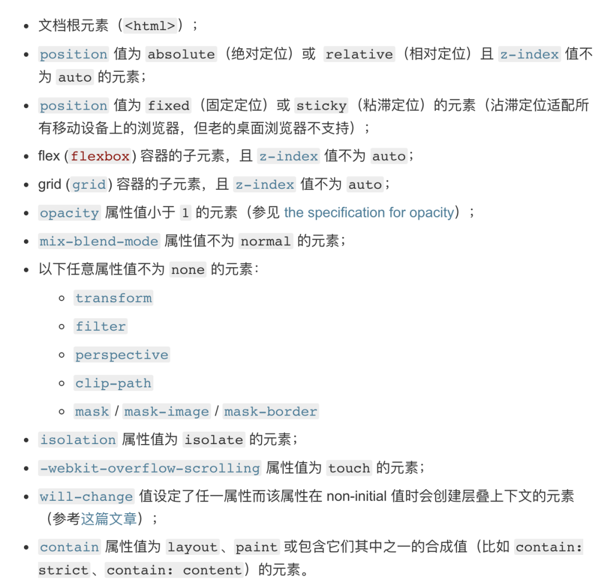
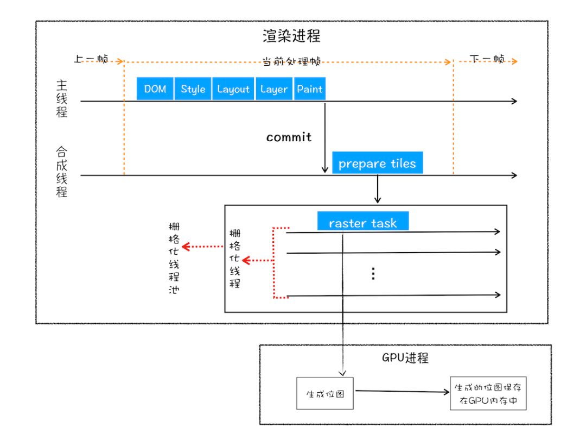
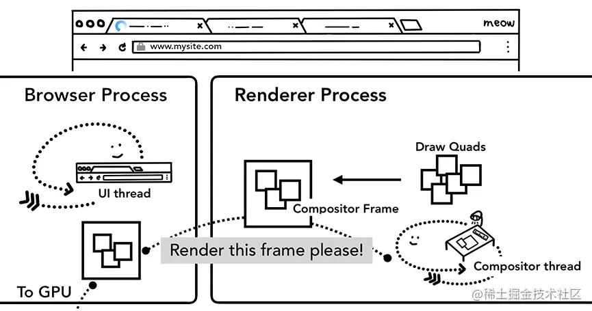
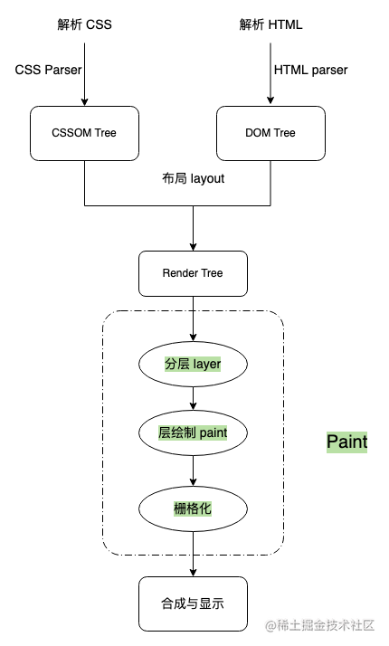
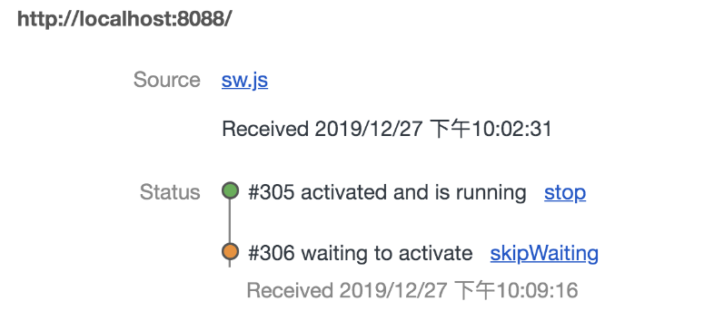
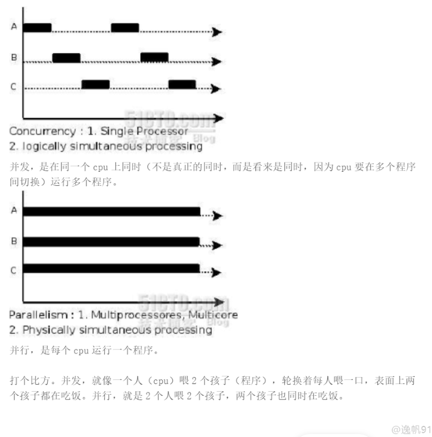

## URL输入-------------------

### 网络篇：

1. **用户输入阶段**：先判断是搜索还是网址，前者就将内容和默认引擎拼接合成新的URL，后者会根据URL协议合成合法的URL;
2. **构建请求**：浏览器进程首先会构建请求行信息，然后通过进程间通信(IPC)将URL请求发送给网络进程
3. **查找强缓存**：看是否有强缓存，如果有缓存资源，拦截请求并将资源返回给浏览器进程。否则会启动一个网络线程进行网络请求来请求DNS服务器进行解析域名；
4. **DNS解析**：网络进程首先从DNS数据缓存服务中查找是否缓存过当前域名信息，有直接返回，否则进行DNS解析返回域名对应的端口和IP地址，如果没有指定端口，http默认80端口，https默认443端口；
5. **建立TCP连接**：获取服务器IP地址后会与服务器建立TCP连接，然后发送请求获取数据。（ `Chrome` 有个机制，同一个域名同时最多只能建立 6 个 `TCP` 连接，如果在同一个域名下同时有 10 个请求发生，那么其中 4 个请求会进入排队等待状态，直至进行中的请求完成。如果当前请求数量少于6个，会直接建立 `TCP` 连接）
6. **发送Http请求**： 浏览器首先会向服务器发送请求行，它包含了请求方法、请求 `URI` 和 `HTTP` 协议的版本；另外还会发送请求头，告诉服务器一些浏览器的相关信息，比如浏览器内核，请求域名、`Cookie` 等；如果需要传递参数，则还需要发送请求体； 
7. **服务器处理请求**： 服务器首先返回响应行，包括协议版本和状态码，比如状态码 200 表示继续处理该请求；（如果是 301，则表示重定向，将会在响应头的 `Locaiton` 字段中加上重定向的地址信息，接下来浏览器获取这个地址，将会重新导航。）服务器也会向浏览器发送响应头，包含了一些信息，比如服务器生成返回数据的时间、返回的数据类型（`JSON`、`HTML`、流媒体等类型），以及服务器要在客户端保存的 `Cookie` 等；继续发送响应体的数据； 
8. **网络线程拿到数据后**，会依据 Content-Type判断响应内容的格式，解析文件为HTML后，网络线程会通知UI线程，UI线程会创建一个渲染器进程来渲染页面，浏览器进程通过IPC将数据传递给渲染器进程，正式进入渲染流程。

### 渲染机制

1. **解析HTML，构建DOM树**
2. **计算CSS，构建CSS规则树、JS脚本**（通过DOM API 和CSSOM API来操作DOM树和CSS规则树）
3.  **解析 CSS 和 HTML** 

​		得到了包含 DOM 结构的 DOM Tree，以及节点样式的 CSSOM Tree。但是只有这些还不能渲染出页面，还不能确定每个节点渲染的位置。**接下来就需要计算出 DOM 树中可见元素的几何位置** **，这个过程也叫做布局（layout）** 

​	**3.1 构建render Tree**

​		在 DOM Tree 中得到的是一棵完整的树，但是有些节点是不需要展示在页面中的，例如：display：none 的节点，同时也有一些**不存在DOM树中但需要显示**在页面上的元素（比如伪类），因此，在这个过程中需要**忽略掉不可见元素，添加不在 DOM 树中但需要显示的元素**，最终生成一棵**只包含可见元素**的 Render Tree 

​		在这里需要特别注意的是 visibility: hidden ，它虽然也是让元素不可见，但是它仍然占据页面的空间，而display: none 将元素从渲染树中完全移除，元素既不可见，也不是布局的组成部分 

​	**3.2 布局计算**

​		 在得到了 Render Tree 后，就需要对 Render Tree 中各节点的几何坐标位置进行计算，最后生成带有节点位置信息的 Render Tree。

​	**4. 分层layer**

​		现在我们已经有了一棵完整的 Render Tree ，知道了页面的样式和位置信息，但是我们还不知道绘制各个元素的**顺序**，是先画雪地还是先画冰墩墩，都会存在遮挡的问题，针对绘制顺序的问题，渲染引擎采用了**分层机制** 

​		每个 DOM 元素都会有自己对应的 Layout Object，根据层级等关系，一些 Layout Object 会拥有共同的渲染层 Paint Layer，对于一些特殊状态的元素会有公共的合成层。

​	**4.1 渲染层**

​				渲染层产生的最普遍条件就是根据“层叠上下文”，满足以下条件的元素都会有自己的渲染层

​				tips: 若子元素没有单独的渲染层，则随父级元素同层

​				**那么渲染层和合成层产生的条件是什么呢？** 



​	**4.2 合成层**

 			   根据网上资料，对于合成层的产生有主要有以下常见 

- 有 3D transform
- 对 opacity、fliter、transform 应用了 animation 或者 transition（需要是 active 的 animation 或者 transition，当 animation 或者 transition 效果未开始或结束后，提升合成层也会失效）
- will-change 设置为 opacity、transform、top、left、bottom、right（其中 top、left 等需要设置明确的定位属性，如 relative 等

有了渲染层，为什么还要有合成层呢？

**渲染层是为保证页面元素以正确的顺序，合成层是为了减少渲染的开销**。

提升为合成层的好处主要有以下几点

- 合成层的位图，会采用硬件加速，也就是会交由 GPU 合成，比 CPU 处理要快
- 重新绘制时，只会重新绘制自己这一层，不会影响到其他层
- 对于已提升为合成层中的 transform 和 opacity 效果，都只是几何变换，透明度变换等，不会触发 layout 和 paint，直接由 GPU 完成即可

5. **层绘制paint**

分好层后，在这一步，会将一个渲染层的绘制拆分成很多小的绘画指令以及记录需要执行哪些绘画调用和调用顺序 

6. **栅格化（光栅化）**

到这里，我们现在只是**得到了绘制的顺序以及绘制指令列表，并没有真正的去绘制页面，** 实际上绘制操作是由渲染引擎的合成线程完成的。

在有些情况下，图层很大，内容很长，而真正在视口中的内容只有一小部分，如果直接绘制整个图层会产生很大的开销，因此为了**降低绘制成本，尽可能快的呈现页面内容**，合成线程进行了一些优化，也就是这里所说的光栅化

主要会进行**划分图块和生成** **位图**两步

绘制前，合成线程会对页面进行**分块**，然后将每个图块发送给栅格线程，栅格线程将图块转换为**位图**。合成器线程可以优先处理不同的栅格线程，这样就可以首先对视口（或附近）中的事物进行栅格化。

通常，栅格化过程都会使用 GPU 来加速生成，生成的位图被保存在 GPU 内存中。



7. **合成与显示**

合成器线程能够对不同的栅格线程进行**优先处理**，所以出现在视口内的图块会被首先栅格。

一旦图块栅格化完成，合成器线程会生成一个绘制图块的命令—— DrawQuad ，并提交DrawQuad给浏览器进程 ，从而创建一个合成器帧。

合成器帧会通过 IPC 提交给浏览器进程，浏览器进程将合成器帧传给 GPU，GPU 将该帧显示到屏幕上

*DrawQuad：包含图块在内存中的位置信息以及图块在页面的绘制位置信息。*

*合成器帧：收集了一个页面帧所有 DrawQuad 的集合*



1. 渲染进程将 HTML 转换成浏览器能够读懂的 **DOM** **TREE** 结构
2. 渲染引擎将 CSS 样式表转化为浏览器可以理解的 **styleSheets**，计算 DOM 节点的样式
3. 创建 **render 树**，并计算可见元素的布局信息
4. 对 render 树进行分层，并生成 **layer 树**
5. 将每个图层生成**绘制列表**，提交给合成线程
6. 合成线程将图层分块，在光栅化线程中将块图转化为**位图**
7. 图块光栅化完成后，合成线程会发送图块命令 **DrawQuad** 给浏览器进+程
8. 浏览器进程接收到 DrawQuad 信息后**生成页面**，显示到屏幕上



​		渲染过程中遇到JS文件怎么办（浏览器的GUI渲染线程和JS引擎线程互斥）

​		JS文件不只是阻塞DOM的构建，会导致CSSOM也阻塞DOM的构建

​		生成渲染树后，根据渲染树进行布局，也叫回流，弄清各节点在页面中的确切位置和大小，输出是盒模型，完成后浏览器发出Paint Setup和Paint事件，转换为像素

​		async和defer(延迟执行)的区别，load和DOMContentLoaded

​		为什么操作DOM慢

## JS与CSS阻塞问题-------

 `DOMContentLoaded`事件将在页面`DOM`解析完成后触发 

1. CSS不会阻塞页面DOM的解析，但render树的生成匙依赖DOM树和CSS规则树，所以CSS会阻塞render的生成，进而会阻塞DOM的渲染。
2. JS会阻塞DOM的解析
3. CSS会阻塞JS的执行，进而会通过JS来阻塞DOM的解析；设想`JS`脚本中的内容是获取`DOM`元素的`CSS`样式属性，如果`JS`想要获取到`DOM`最新的正确的样式，势必需要所有的`CSS`加载完成，否则获取的样式可能是错误或者不是最新的。因此要等到`JS`脚本前面的`CSS`加载完成，`JS`才能再执行，并且不管`JS`脚本中是否获取`DOM`元素的样式，浏览器都要这样做。
4. JS会触发页面渲染，浏览器遇到script标签且没有defer或async属性时会触发页面渲染。而这个结论才是解释为何`CSS`会阻塞`JS`的执行的真正原因，浏览器无法预先知道脚本的具体内容，因此在碰到``标签时，只好先渲染一次页面，确保``脚本内能获取到`DOM`的最新的样式。倘若在决定渲染页面时，还有尚未加载完成的`CSS`样式，只能等待其加载完成再去渲染页面。
5. 图片、视频、字体其实是一样的，不会阻塞DOM的加载和渲染，只会延迟onload事件的触发。


## 回流与重绘----------------

### 		回流：

​				元素位置和尺寸发生变化（浏览器窗口尺寸--resize事件，设置style属性）

​				offset族，scroll族、client族

​				window.getComputedStyle方法

### 		重绘：

​				样式发生变化-----跳过生成布局数和建立图层树阶段，直接生成绘制列表，然后分块。生成位图等

​		如何减少回流、重绘：

​				transform代替top

​				visiblity代替display：none

​				不要使用table布局等

## CSS硬件加速-------------

​	 还有一种情况，是直接合成。比如利用 CSS3 的`transform`、`opacity`、`filter`这些属性就可以实现合成的效果，也就是大家常说的**GPU加速**。 

GPU加速的原因

​		    在合成的情况下，会直接跳过布局和绘制流程，直接进入`非主线程`处理的部分，即直接交给`合成线程`处理。交给它处理有两大好处:

1. 能够充分发挥`GPU`的优势。合成线程生成位图的过程中会调用线程池，并在其中使用`GPU`进行加速生成，而GPU 是擅长处理位图数据的。

2. 没有占用主线程的资源，即使主线程卡住了，效果依然能够流畅地展示。

   ### 实践意义

   ​     知道上面的原理之后，对于开发过程有什么指导意义呢？

   1. 避免频繁使用 style，而是采用修改`class`的方式。

   2. 使用`createDocumentFragment`进行批量的 DOM 操作。

   3. 对于 resize、scroll 等进行防抖/节流处理。

   4. 添加 will-change: tranform ，让渲染引擎为其单独实现一个图层，当这些变换发生时，仅仅只是利用合成线程去处理这些变换，而不牵扯到主线程，大大提高渲染效率。当然这个变化不限于`tranform`, 任何可以实现合成效果的 CSS 属性都能用will-change


## 浏览器渲染性能原理-------

​	js——style——layout（布局）——paint（绘制）——composite（渲染层合并）

​			layout----计算大小和位置，回流发生在这个位置

​			paint-----绘制各个层的文字，颜色，图像，边框阴影

1.优化js执行效率：

​			requestAnimationFrame代替setInterval或setTimeout实现动画

​			webworkers

​			批量更新DOM

2.避免大规模、复杂布局

​			尽可能避免回流

​			flexbox流式布局

​			避免强制同步布局事件发生---js脚本获取的元素属性都是上一帧的，如果当前帧获取属性之前又对元素节点改动，导致浏览器必须先应用属性修改，在执行布局，最后再执行js逻辑----先读后写好

​			避免连续的强制同步布局发生

3.简化绘制的复杂度、减少绘制区域，绘制最耗时

​			提升移动或渐变元素的绘制层---用transform

4.优先使用渲染层合并属性、控制层的数量

​			transform、opacity实现动画效果--会跳过布局和绘制，只做渲染层的合并

​			提升动画效果中的元素，采用will-change创建新的渲染层

5.对用户输入事件的处理函数去抖动

## 浏览器调度进程和线程----

多线程可以并行处理任务，线程不能单独存在，它是由进程来启动和管理的，一个进程是一个程序的运行实例；


**浏览器进程**----管理各标签页，页面显示和功能（前进后退），网络资源的管理下载

**插件进程**----负责第三方插件使用

**GPU进程**----3D绘制和硬件加速

**渲染进程**---每个窗口一个渲染进程（浏览器内核），从接收下载文件到呈现整个页面的过程，由浏览器渲染进程负责。

​		***GUI渲染线程***-------绘制界面HTML元素，当需要回流和重绘时，执行该线程

​		***定时器触发线程***-------该线程用来计数

​		***事件触发线程***------事件被触发时把事件添加到待处理队列的队尾，等待JS引擎的处理。如定时任务、鼠标点击、Ajax异步请求

​		***异步http请求线程***

​		***js引擎线程***

为什么js设置成单线程--------作为脚本语言，主要用途是与用户互动以及操作DOM，这决定了只能是单线程

webworkers是多线程吗--------不能操作DOM，主要用途是用来减轻cpu密集型计算类逻辑的负担。

## 帧的开始和结束-----------

渲染进程中的线程

​	合成线程---老大，操作系统告知浏览器刷新一帧图像信号的线程，

​	主线程---执行js，样式，布局，绘制

​	合成图块栅格化线程---处理栅格化

1.开始新的一帧

2.输入事件的处理

3.requestAnimationFrame

4.解析HTML

5.重新计算样式

6.布局

7.更新图层树

8.Paint

9.合成

10.栅格化规划和栅格化

11.帧结束

12.发送帧

福利时间

## 浏览器缓存----------------

浏览器在第一次请求发生后再次请求时，会先获取该资源缓存的header信息，判断是否命中强缓存， 若命中直接从缓存中获取资源信息，包括缓存header信息；本次请求根本就不会与服务器进行通信 

如果没有命中强缓存，浏览器会发送请求到服务器，请求会携带第一次请求返回的有关缓存的header字段信息  （Last-Modified/If-Modified-Since和Etag/If-None-Match），  由服务器根据请求中的相关header信息来比对结果是否协商缓存命中；若命中，则服务器返回新的响应header信息更新缓存中的对应header信息，但是并不返回资源内容，它会告知浏览器可以直接从缓存获取；否则返回最新的资源内容。

| **强缓存**   | 从缓存取 | 200（from cache）   | 否，直接从缓存取                           |
| **协商缓存** | 从缓存取 | 304（not modified） | 是，正如其名，通过服务器来告知缓存是否可用 |

- no-cache：不使用本地缓存。需要使用缓存协商，先与服务器确认返回的响应是否被更改，如果之前的响应中存在ETag，那么请求的时候会与服务端验证，如果资源未被更改，则可以避免重新下载。
- no-store：直接禁止游览器缓存数据，每次用户请求该资源，都会向服务器发送一个请求，每次都会下载完整的资源。
- public：可以被所有的用户缓存，包括终端用户和CDN等中间代理服务器。
- private：只能被终端用户的浏览器缓存，不允许CDN等中继缓存服务器对其缓存。

协商缓存都是由服务器来确定缓存资源是否可用的，所以客户端与服务器端要通过某种标识来进行通信，从而让服务器判断请求资源是否可以缓存访问，这主要涉及到下面两组header字段，**这两组搭档都是成对出现的，即第一次请求的响应头带上某个字段（Last-Modified或者Etag），则后续请求则会带上对应的请求字段（If-Modified-Since或者If-None-Match），若响应头没有\**Last-Modified或者Etag\**字段，则请求头也不会有对应的字段**。 

- 浏览器第一次跟服务器请求一个资源，服务器在返回这个资源的同时，在respone的header加上Last-Modified的header，这个header表示这个资源在服务器上的最后修改时间
- 浏览器再次跟服务器请求这个资源时，在request的header上加上If-Modified-Since的header，这个header的值就是上一次请求时返回的Last-Modified的值
- 服务器再次收到资源请求时，根据浏览器传过来If-Modified-Since和资源在服务器上的最后修改时间判断资源是否有变化，如果没有变化则返回304 Not Modified，但是不会返回资源内容；如果有变化，就正常返回资源内容。当服务器返回304 Not Modified的响应时，response header中不会再添加Last-Modified的header，因为既然资源没有变化，那么Last-Modified也就不会改变，这是服务器返回304时的response header
- 浏览器收到304的响应后，就会从缓存中加载资源
- 如果协商缓存没有命中，浏览器直接从服务器加载资源时，Last-Modified的Header在重新加载的时候会被更新，下次请求时，If-Modified-Since会启用上次返回的Last-Modified值
 **Etag/If-None-Match**
  这两个值是由服务器生成的每个资源的唯一标识字符串，只要资源有变化就这个值就会改变；其判断过程与**Last-Modified/If-Modified-Since**类似，与Last-Modified不一样的是，当服务器返回304 Not Modified的响应时，由于ETag重新生成过，response header中还会把这个ETag返回，即使这个ETag跟之前的没有变化 

***你可能会觉得使用Last-Modified已经足以让浏览器知道本地的缓存副本是否足够新，为什么还需要Etag呢？HTTP1.1中Etag的出现主要是为了解决几个Last-Modified比较难解决的问题：***

- 一些文件也许会周期性的更改，但是他的内容并不改变(仅仅改变的修改时间)，这个时候我们并不希望客户端认为这个文件被修改了，而重新GET；
- 某些文件修改非常频繁，比如在秒以下的时间内进行修改，(比方说1s内修改了N次)，If-Modified-Since能检查到的粒度是s级的，这种修改无法判断(或者说UNIX记录MTIME只能精确到秒)；
- 某些服务器不能精确的得到文件的最后修改时间。

这时，利用Etag能够更加准确的控制缓存，因为Etag是服务器自动生成或者由开发者生成的对应资源在服务器端的唯一标识符。

Last-Modified与ETag是可以一起使用的，服务器会优先验证ETag，一致的情况下，才会继续比对Last-Modified，最后才决定是否返回304。

### 用户行为与缓存

- 用户在地址栏回车、页面链接跳转、新开窗口、前进后退时，缓存是有效的
- 用户在点击浏览器刷新或按 `F5` 时，`Last-Modified/Etag` 是有效的，但`Expires、Cache-Control` 重置失效
- 用户在强制刷新按 `Ctr+F5` 时，缓存全部失效

请求缓存资源返回的状态码区别

- `200`：强缓Expires/Cache-Control存失效时，返回新的资源文件
- `304(Not Modified )`：协商缓存Last-modified/Etag没有过期时，服务端返回状态码304
- `200(from cache)`: 强缓Expires/Cache-Control两者都存在，未过期，Cache-Control优先Expires时，浏览器从本地获取资源成功

1. 一般情况下，使用`Cache-Control/Expires`会配合`Last-Modified/ETag`一起使用，因为即使服务器设置缓存时间, 当用户点击“刷新”按钮时，浏览器会忽略缓存继续向服务器发送请求，这时`Last-Modified/ETag`将能够很好利用`304`，从而减少响应开销。
2. 当用户在按F5进行刷新的时候，会忽略`Expires/Cache-Control`的设置，会再次发送请求去服务器请求，而`Last-Modified/Etag`还是有效的，服务器会根据情况判断返回`304`还是`200`；
3. 而当用户使用Ctrl+F5进行强制刷新的时候，会跳过强缓存和协商缓存，重新从服务器下载资源。
4. 分布式系统里多台机器间文件的`last-modified`必须保持一致，以免负载均衡到不同机器导致比对失败
   分布式系统尽量关闭掉`Etag`(每台机器生成的`etag`都会不一样)


### 强缓存

​		首先检查强缓存，不需要发送http请求，

​	   	Expires---http1.0时候的规范，是一个绝对时间

​			Cache-Control(优先)---http1.1时候的规范，

​		强缓存失效，进入协商缓存

### 协商缓存

​		请求头携带相应的缓存tag来向服务器发请求，服务器根据这个tag来决定是否使用缓存

​		tag分为两种

​			Last-Modified,最后修改时间，第一次请求时响应头加上该字段

​				再次请求时携带If-Modified-Since字段，如果改变了，返回新资源，否则304告诉浏览器用缓存

​			ETag，文件唯一标识

​				再次请求将标识值作为If-None-Match字段内容发给服务器，如果改变了，返回新资源，否则304告诉浏览器用缓存

​			精准度上；后者更好，性能上：前者更好，服务器优先Etag

### 缓存位置

​		强缓存命中或协商缓存返回304时，用缓存中的资源，位置主要有：（优先级从高到低）

​				Service Worker：离线缓存，消息推送，网络代理等功能，离线缓存就是Service Worker Cache

​				Memory Cache：内存缓存，效率快，存活时间短，渲染进程结束就不存在了

​				Disk Cache：磁盘中的缓存，效率慢，容量和时长好

​				Push Cache：推送缓存

## 浏览器本地存储-----------

浏览器本地存储主要有

​		1.Cookie：

​			用来弥补Http状态的不足，做状态存储：但容量小，性能缺陷，安全也有问题

​		2.WebStorage又分为

​				localStorage，和Cookie有一点一样，针对同一个域名，在同一个域名下会存储相同的一段localStorage，区别就是容量上，只存在于客户端，默认不参与服务端的通信，接口封装上。用来存储logo，图片资源等一些内容稳定的资源，不会过期

​				localStorage.setitem(key,value)

​				sessionStorage：容量上，只存在于客户端，默认不参与服务端的通信，接口封装上和localStorage一样，本质区别就是sessionStorage只是会话级别的存储，会话结束后就不存在了。存表单信息，这样刷新也不会消失，也可以存本次浏览记录，关闭页面后就不需要了，用它最合适不过了，例如微博		

​		3.IndexedDB：非关系型数据库，本质是数据库，容量无上限，

​				键值对存储

​				异步操作：数据库读写属于I/O操作

​				同源策略限制：既无法访问跨域的数据库

## Cookie

​	什么是Cookie：一小段的文本信息。客户端请求服务器，如果服务器需要记录该用户状态，就向客户端浏览器颁发一个Cookie，浏览器保存后，再次请求时就把请求的网址连同该Cookie一同提交给服务器，检查后辨认用户状态。

​	为什么会有Cookie的存在：Cookie是为了辨认用户身份的，HTTP本身是无状态的。但在某些情况下我们需要记住用户在未登录的状态下浏览了什么，比如淘宝。这时候就需要借助我们的Cookie了。 客户端请求服务器后，如果服务器需要记录用户状态，服务器会在响应信息中包含一个Set-Cookie的响应头，客户端会根据这个响应头存储Cookie信息。再次请求服务器时，客户端会在请求信息中包含一个Cookie请求头，而服务器会根据这个请求头进行用户身份、状态等较验。

​	原理： 1.客户端发起请求  2.服务器Set-Cookie  3.返回服务器响应结果  4.客户端读取Set-Cookie   5.再次发起请求

​				6.服务器检查cookie，返回响应结果

​	弊端：cookie中所有数据在客户端能被修改，一些重要数据就不能放在cookie中了，且cookie字段太多会影响传输效率，为解决这些问题就有了Session

​	客户端禁用cookie怎么办： 会使用一种叫做url重写的技术来进行会话跟踪，即每次http交互，url后面都会被附加上一个诸如sid=**的参数，服务端据此来识别用户。  

​	通过document.cookie=`${key}=${value}`来设置读取,max-age=`{2*24*60*60}`来设置时长


## session

​	另一种记录客户状态的机制，保存在服务器上，客户端浏览器在访问服务器，服务器把客户端信息以某种形式记录在服务器上，客服端再次访问时只需从该session查找就好了
​	原理：

​			1.用户首次通过用户名和密码访问服务器时，服务器验证用户数据

​			2.验证成功构在服务器端写入session数据，向客户端返回sessionid

​			3.浏览器将sessionid保存在cookie上

​			4.再次访问时携带sessionid，服务器会拿着sessionid从服务器获取session数据，

​			5.进行用户信息查询，进行其他的操作，实现状态保持

​	两者对比：

​			位置不同：前者浏览器，后者服务器

​			安全性：前者不安全

​			有效期：前者保存时间长，后者关闭浏览器结束会话，session失效（cookie的sessionid过期时间默认设置为-1）

​			对服务器的压力：前者压力小，后者压力大

​			跨域支持上：前者支持跨域名访问，后者仅在他所在的域名有效

​	弊端：

​			1.服务器压力增大

​			2.CSRF跨站攻击

​			3.扩展性不强----搭建了多台服务器，session只保存在其中一个，访问另一个时就拿不到session，token可以解决第三个弊端

## token

​	         用户身份的验证方式，通常被被叫做令牌  

​			认证机制：

​				1.登录后，服务器会对用户数据加密，生成一个就字符串token，返还给客户端（服务器并不保存）

​				2.浏览器将收到的token存储在Local Storage中（js代码写入，js获取，并不会向cookie自动携带）

​				3.再次访问浏览器发送token，服务器解密，完成后进行用户数据的查询，成功后实现状态保持

这样的话，服务器只是做了token的解密和用户数据的查询，不需要在服务端去保留用户的认证或者会话信息，意味着基于token的认证机制的应用不需要考虑用户在哪一台服务器登录，为应用的扩展提供了便利，解决了session扩展性的弊端

##  同源策略

​		两个url的协议、域名、端口完全一致，那么这两个url就是同源的，可以通过window.orgin和location.orgin得到当前源

​		同源策略就是不同源之间的页面不准互相访问数据，就是为了保护用户隐私（微信好友为例）

​		问题的根源就是在于无法区分发送者，同源策略是浏览器行为，实际上跨域请求是能发送的，服务器也能正常接收，数据也能正常返回，只是浏览器把跨域请求的数据给屏蔽了而已；


###  跨域

​		浏览器遵循同源政策（协议scheme、host主机和端口post都相同则为同源），非同源不能修改对方的DOM，不能访问对方的Cookie、IndexDB和LocalStorage，限制XMLHttpRequest请求

###  CORS跨域

​		CORS允许浏览器向跨源服务器，发出XMLHttpRequest请求，从而克服了AJAX只能同源使用的限制。

​		分为简单请求和复杂请求

​				简单请求：请求方式为HEAD、POST、GET，头信息不超出以下字段（Accept，Content-Type等）

​								先在头信息加上一个Orgin字段，用来说明本次请求来自哪个源

​								服务器根据这个源判断是否接受本次请求；

​								如果接受，响应会有一个Access-Control-Allow-Orgin字段

​								如果不接受，无此字段，浏览器会报一个错误，且该错误无法通过状态码识别，这是弊端

​				复杂请求：比如请求方法为PUT/DELETE，或Content-Type字段类型为application/json等

​								会先发一个预检请求，请求为option方法，通过该请求来知道服务端是否允许跨端

###  JSONP跨域

​			兼容IE、可以跨域

​			不知道状态码，响应头，只知道成功和失败，不支持POST只支持GET

###  Nginx

## 内容安全策略-----------

内容安全策略（`Content Security Policy`）简称 `CSP`，通过它可以明确的告诉客户端浏览器当前页面的哪些外部资源可以被加载执行，而哪些又是不可以的。 


## XSS攻击--------------------

什么是XSS攻击

​	跨站脚本攻击，攻击者利用网站没有对用户提交数据进行转义处理或者过滤不足的缺点，进而添加一些代码，嵌入到web页面中去。使别的用户访问都会执行相应的嵌入代码。从而盗取用户资料（如cookie）

实现方式

​	**存储型**：将脚本存储到了服务端的数据库，然后在客户端执行这些脚本如留言评论区提交一段脚本代码 ， 前后端没有做好转义；当用户浏览该页面时恶意脚本可以通过document.cookie获取页面的cookie信息，然后通过XMR将这些信息发送给恶意服务器，从而模拟登录。

​	**反射型**： 恶意脚本作为网络请求的一部分，web服务器不会存储反射型XSS攻击的恶意脚本，这是与上者的不同地方；

​	**DOM文档型**： 并不会经过服务端，而是作为中间人的角色，在数据传输过程劫持到网络数据包，然后**修改里面的 html 

防范措施

​	一个信念：不相信任何用户的输入，前后端都对用户输入进行转码或过滤

​	两个利用：利用CSP，利用Cookie的HttpOnly属性禁止js通过document.cookie获得。

## CSRF攻击------------------

什么是CSRF攻击

​	 黑客诱导用户点击链接，打开黑客的网站，然后黑客利用用户**目前的登录状态**发起跨站请求。 

三件事：

​	自动发GET请求

​	自动发POST请求

​	诱导点击发送GET请求

 `CSRF`攻击的原理。和`XSS`攻击对比，CSRF 攻击并不需要将恶意代码注入用户当前页面的`html`文档中，而是跳转到新的页面，利用服务器的**验证漏洞和用户之前的登录状态来**模拟用户进行操作。 

防范措施

​	利用Cookie的SameSite属性，strict模式下浏览器禁止第三方请求携带cookie

​	验证来源站点Referer ，这个可以伪造，也不安全。

​	CSRF Token

## HTTPS为什么更安全-----

​	对称加密

A发给B随机数1和加密套件，B接收后返还A随机数2和加密套件，现在AB都有随机数1、2和加密套件生成相同的密匙

​	非对称加密（服务器有公匙和私匙）

A发给B随机数1和加密套件，B接收后返还A随机数2和加密套件和公匙，然后A用公匙加密随机数1、2生成密匙，B用私匙解密，但B用私匙加密后A只能用公匙加密，仍旧有泄漏风险

​	两者结合

A发给B随机数1和加密套件，B接收后返还A随机数2和加密套件和公匙，然后A用公匙加密一个随机数3给B，B用私匙解密后，现在两者都有三个随机数可以生成最终的密匙，主要中间人拿不到随机数3，因为没有私匙解密，所以安全，前面非对称后面对称。

​	数字证书

服务器向浏览器证明自己的身份以及把公匙传给浏览器

​	加密过程

A发给B随机数1和加密套件，B接收后返还A随机数2和加密套件，现在AB都有随机数1、2和加密套件生成相同的密匙

## 懒加载-----

html标签如果解析的时候发现img的src值，浏览器会立即开启一个线程去请求资源。如果src的值相同则只请求一次，因为http发出请求时会检验是否有缓存

​	法一

A: document.documentElement.clientHeight 可视窗口的高度
B: element.offsetTop dom相对于文档顶部的距离
C: document.documentElement.scrollTop 滚动条滚动的距离
B - C < A 即说明元素在可视区域内

​	法二：getBoundingClientRect

const domObj = element.getBoundingClientRect();
domObj.top：元素上边到视窗上边的距离;
 domObj.right：元素右边到视窗左边的距离;
 domObj.bottom：元素下边到视窗上边的距离;
 domObj.left：元素左边到视窗左边的距离;
const clientHeight = window.innerHeight;
当 domObj.top < clientHeight 表示dom在可视区域内了

## 浏览器的五种Observe--
​	一、IntersectionObserver----------------------------监听元素的可见性

​		可应用于懒加载----有代码

​	二、MutationObserver----------------------------监听元素的属性和子节点的变化

​		监听一个普通对象的变化可以用Object.defineproperty或者Proxy

​		监听元素的属性和子节点增删改的变化可以用MutationObserver，

​	三、ResizeObserver----------------------------监听元素的大小的变化

​		窗口可以用addEventListener('resize')，元素则用ResizeObserver，宽和高

​	还有两个与元素无关的： 

## 虚拟列表----


## webworker----

一直以来，一个网页只会有两个线程：GUI 渲染线程和 JS 引擎线程。即便你的 JS 写得再天花乱坠，也只能在一个进程里面执行。然而，JS 引擎线程和 GUI 渲染线程是互斥的，因此在 JS 执行的时候，UI 页面会被阻塞住。**为了在进行高耗时 JS 运算时，UI 页面仍可用**，那么就得另外开辟一个独立的 JS 线程来运行这些高耗时的 JS 代码，这就是 [Web Worker](https://developer.mozilla.org/en-US/docs/Web/API/Web_Workers_API/Using_web_workers)。

Web Worker 有两个特点：

1. 只能服务于新建它的页面，不同页面之间不能共享同一个 Web Worker。
2. 当页面关闭时，该页面新建的 Web Worker 也会随之关闭，不会常驻在浏览器中。

## serviceworker----

终于说到本文的主角了。[Service Worker](https://developer.mozilla.org/en-US/docs/Web/API/Service_Worker_API/Using_Service_Workers) 与 Web Worker 相比，相同点是：它们都是在常规的 JS 引擎线程以外开辟了新的 JS 线程。不同点主要包括以下几点：

1. Service Worker 不是服务于某个特定页面的，而是服务于多个页面的。（按照同源策略）
2. Service Worker 会**常驻在浏览器中**，即便注册它的页面已经关闭，Service Worker 也不会停止。本质上它是一个后台线程，只有你主动终结，或者浏览器回收，这个线程才会结束。
3. 生命周期、可调用的 API 等等也有很大的不同。

总而言之，Service Worker 是 Web Worker 进一步发展的产物。

1. **Parsed**：首次注册 Service Worker 时，如果满足 Service Worker 运行的条件（在 https / localhost）环境下。这也是 第一步： 

2. **Installing**： Service Worker 脚本解析完成后，浏览器会试着安装，进入下一状态，“installing” ， 我们通常在该环节缓存文件，**event.waitUntil()** 方法，则 installing 事件会一直等到该方法中的 Promise 完成之后才会成功；若 Promise 被拒，则安装失败，Service Worker 直接进入废弃（redundant）状态。 

3. **激活（Activating）**： 第一次注册并安装成功后，会触发 activate 事件： 

4. **waiting**： 上面我们介绍的是第一次注册安装完毕，但是我们缓存的内容不是一成不变的。不可能永远是一成不变的， 当有sw脚本更新时，在后台默默注册安装新的脚本文件，安装成功后进入 waiting 状态。 这个时候有两种选择：
   - 当前所有老版本控制的页面关闭后，再次打开时，新版本的脚本触发 activate 事件
   - 手动调用 this.skipWaiting();
   
   基于这一点。
在 activate 我们会处理前后 sw脚本 需要管理的缓存，这里依据当前 sw.js 的缓存名字，判断实现清除之前的缓存。
为什么要处理：
- 除非明确地更新缓存，否则缓存将不会被更新；除非删除，否则缓存数据不会过期
   - 浏览器都硬性限制了一个域下缓存数据的大小
   
     ```js
     this.addEventListener('activate', function (event) {
     	console.log('激活 sw.js，可以开始处理 fetch 请求。');
     	event.waitUntil(
     		caches.keys().then(function (keyList) {
     			return Promise.all(keyList.map(function (key) {
     				console.log(CACHE_NAME, key)
     				if (CACHE_NAME.indexOf(key) === -1) {
     					/**
     					 * delete() 方法查询request为key的 Cache 条目，如果找到，
     					 * 则删除该 Cache 条目
     					 */
     					return caches.delete(key);
     				}
     			}))
     		})
     	)
     });
     ```
   
5. **Activated**： 如果 Service Worker 处于激活态，就可以应对事件性事件 —— fetch。
   当然 有必要介绍一下 所有事件如下：
   事件：install、activate、message、fetch、push、async。
   我们已经学会 三个了。
   fetch：处理浏览器发出的请求。 

   如果匹配上我们之前的缓存，直接从缓存里面返回，
   如果没有的话请求完放到缓存里面。
   ** 我们对缓存的操作都是，使用 CacheStorage.open(cacheName) 打开一个Cache 对象，再使用 Cache 对象的方法去处理缓存 ** 
## 并发与并行

**并发与并行的区别及其相同点**
所有的并发处理都有排队等候:唤醒;执行至少三个这样的步骤.所以并发肯定是宏观概念:在微观上他们都是序列被处理的;只不过资源不会在某一个上被阻赛(一般是通过时间片轮转)，所以在宏观上看多个几乎同时到达的请求同时在被处理。如果是同一时刻到达的请求也会根据优先级的不同，而先后进入队列排队等候执行。

并发与并行是两个既相似而又不相同的概念:并发性，又称共行性，是指能处理多个同时性活动的能力;并行是指同时发生的两个并发事件，具有并发的含义，而并发则不一定并行，也亦是说并发事件之间不一定要同一时刻发生。



## History对象----------------

`window.history`属性指向 History 对象，它表示当前窗口的浏览历史。 
由于安全原因，浏览器不允许脚本读取这些地址，但是允许在地址之间导航。

```js
//History 对象主要有两个属性。
History.length：当前窗口访问过的网址数量（包括当前网页）
History.state：History 堆栈最上层的状态值（详见下文）

//History 对象方法。
history.back();
history.forward();
history.go(-2);
history.go(0); // 刷新当前页面
注意，移动到以前访问过的页面时，页面通常是从浏览器缓存之中加载，而不是重新要求服务器发送新的网页。

//History.pushState()方法用于在历史中添加一条记录。
window.history.pushState(state, title, url);
假定当前网址是example.com/1.html，使用pushState()方法在浏览记录（History 对象）中添加一个新记录。
添加新记录后，浏览器地址栏立刻显示example.com/2.html，但并不会跳转到2.html，甚至也不会检查2.html是否存在，它只是成为浏览历史中的最新记录。这时，在地址栏输入一个新的地址(比如访问google.com)，然后点击了倒退按钮，页面的 URL 将显示2.html；你再点击一次倒退按钮，URL 将显示1.html。

//总之，pushState()方法不会触发页面刷新，只是导致 History 对象发生变化，地址栏会有反应。
var stateObj = { foo: 'bar' };
history.pushState(stateObj, 'page 2', '2.html');
history.state // {foo: "bar"}

如果pushState的 URL 参数设置了一个新的锚点值（即hash），并不会触发hashchange事件。反过来，如果 URL 的锚点值变了，则会在 History 对象创建一条浏览记录。

如果pushState()方法设置了一个跨域网址，则会报错。

// 报错
// 当前网址为 http://example.com
history.pushState(null, '', 'https://twitter.com/hello');
上面代码中，pushState想要插入一个跨域的网址，导致报错。这样设计的目的是，防止恶意代码让用户以为他们是在另一个网站上，因为这个方法不会导致页面跳转。

//History.replaceState()方法用来修改 History 对象的当前记录，其他都与pushState()方法一模一样。

//popstate事件
每当同一个文档的浏览历史（即history对象）出现变化时，就会触发popstate事件。

注意，仅仅调用pushState()方法或replaceState()方法 ，并不会触发该事件，只有用户点击浏览器倒退按钮和前进按钮，或者使用 JavaScript 调用History.back()、History.forward()、History.go()方法时才会触发。另外，该事件只针对同一个文档，如果浏览历史的切换，导致加载不同的文档，该事件也不会触发。

使用的时候，可以为popstate事件指定回调函数。

注意，页面第一次加载的时候，浏览器不会触发popstate事件。
```


