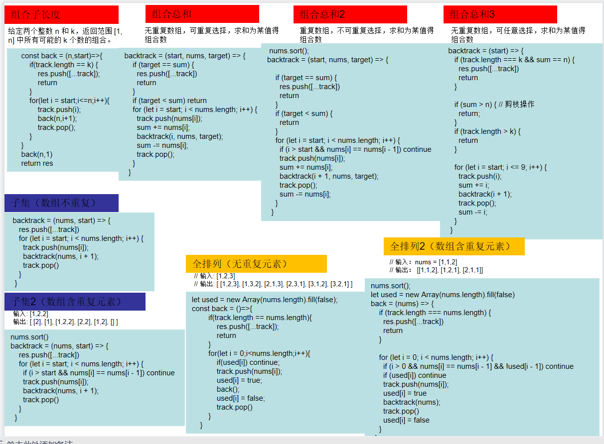
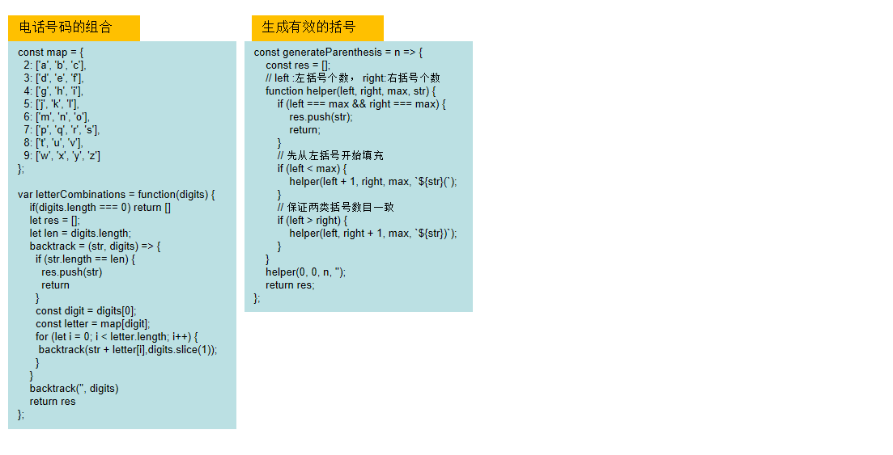
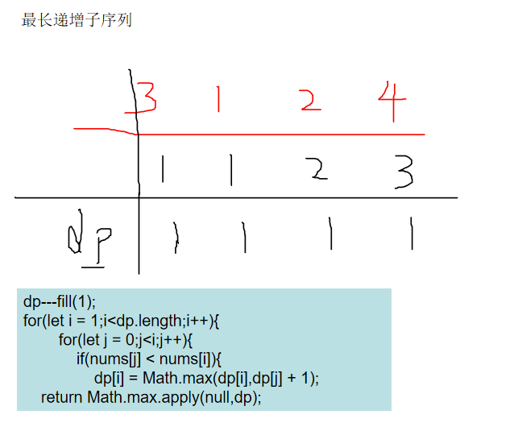
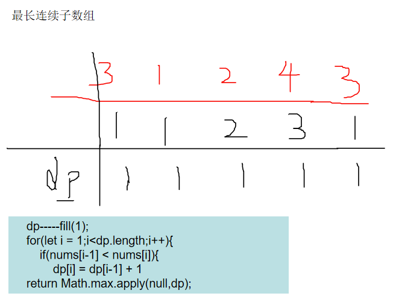
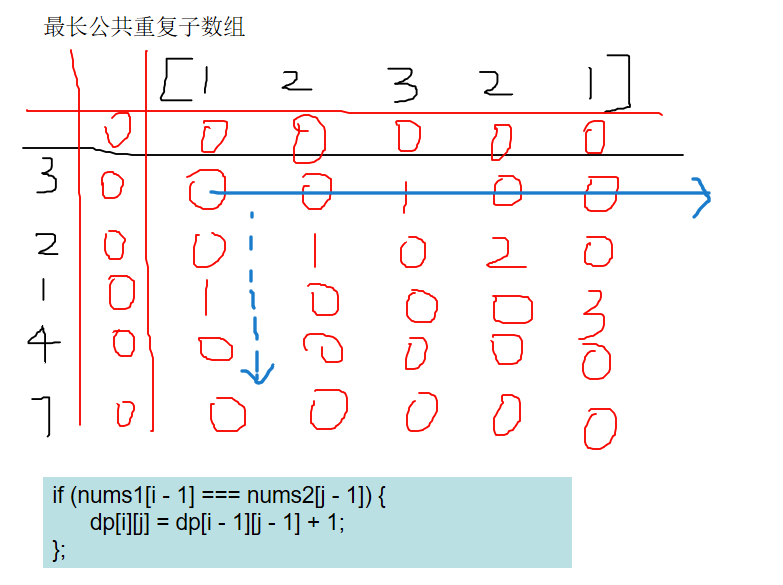
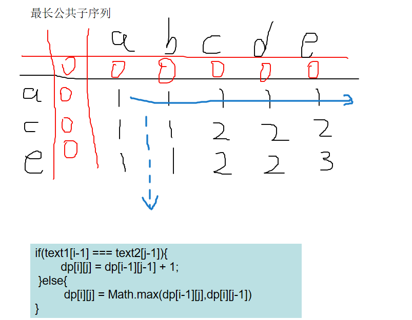
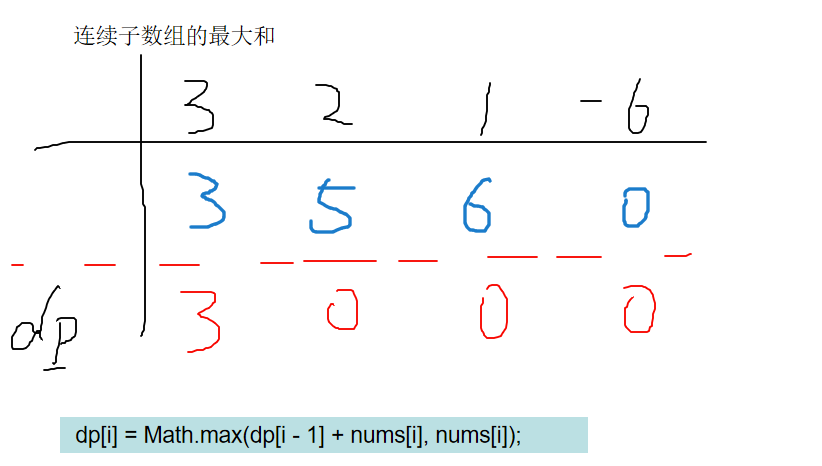
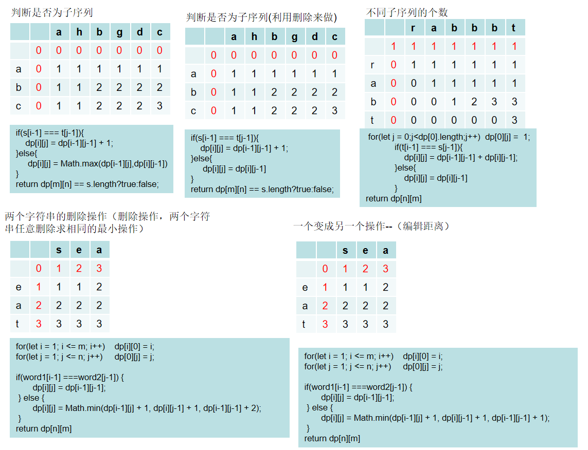
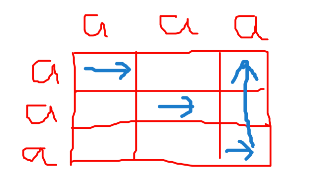

# 框架一：链表-------------------

stack结构——依据队列或栈都可以

快慢指针——解决环的问题及中间、倒数的问题

#### 1.反转链表系列

```javascript
function ReverseList(pHead){
    // write code here
    let p = pHead;
    let dummy = new ListNode(-1);
    let res = dummy;
    let stack = [];
    while(p){
        stack.push(p);
        p = p.next;    
    }
    while(stack.length){
        res.next = stack.pop();
        res = res.next;
    }
    res.next = null;
    return dummy.next;
}

//指定区间反转
function reverseBetween( head ,  m ,  n ) {
    // write code here
      // write code here
    let p = head;
    let dummy = new ListNode(-1);
    let res = dummy;
    let stack = [];
    
    for(let i =1;i<m;i++){
        res.next = new ListNode(p.val);
        p=p.next;
        res=res.next;
    }
    
    for(let i =m;i<=n;i++){
       stack.push(p);
        p=p.next;
    }
    while(stack.length){
        res.next = new ListNode(stack.pop().val);
        res=res.next;
    }
    
     while(p){
        res.next = new ListNode(p.val);
        p=p.next;
        res=res.next;
     }
    return dummy.next;
}

//每k个反转
function reverseKGroup( head ,  k ) {
    // write code here
    let p =head;
    let dummy = new ListNode(-1);
    let res = dummy;
    let stack =[];
    while(p){
        stack.push(p);
        p=p.next;
        if(stack.length ==k){
            while(stack.length){
                res.next = new ListNode(stack.pop().val);
                res = res.next;
            }
        }
    }
     while(stack.length){
                res.next = new ListNode(stack.shift().val);
                res = res.next;
     }
    return dummy.next
}
```
#### 2.合并链表系列
```javascript
function Merge(pHead1, pHead2){
    // write code here
    let p1 = pHead1;
    let p2 = pHead2;
    let dummy  = new ListNode(-1);
    let res = dummy;

    while(p1 && p2){
        if(p1.val>p2.val){
            res.next = new ListNode(p2.val);
            res  = res.next;
            p2  =p2.next;
        }else{
            res.next = new ListNode(p1.val);
            res = res.next;
            p1 =p1.next;
        }
    }
    while(p1){
        res.next = new ListNode(p1.val);
        res = res.next;
        p1 = p1.next;
    }
    while(p2){
        res.next = new ListNode(p2.val);
        res = res.next;
        p2 = p2.next;
    }
    return dummy.next
}
```
```javascript
//合并k个链表
function mergeKLists( lists ) {
    // write code here
    let dummy  = new ListNode(-1);
    let res = dummy;
    let stack = [];
    for(let i = 0;i<lists.length;i++){
            let len = lists[i];
            while(len){
                stack.push(len);
                len = len.next;
            }
    }   
    stack.sort((l,r)=>{
        return r.val-l.val
    })
    while(stack.length){
        res.next = stack.pop();
        res = res.next;
    }
    res.next = null;
    return dummy.next
}
```

#### 3.链表环

```javascript
//判断是否有环
function hasCycle( head ) {
    // write code here
    let p1 = head;
    let p2 = head;
    while(p1 && p1.next){
        p1 = p1.next.next;
        p2 = p2.next;
        if(p1 == p2 ){
            return true
        }
    }
    return false
}
```
```javascript
//判断环入口结点
function EntryNodeOfLoop(head){
    // write code here
    let p1 = head;
    let p2 = head;
    while(p1 && p1.next){
        p1 = p1.next.next;
        p2 = p2.next;
        if(p1 == p2 ){
            break
        }
    }
    if(!p1 || !p1.next){
        return null
    }
    p2 = head;
    while(p1!=p2){
        p1 = p1.next;
        p2 = p2.next;
    }
    return p1
}
```

#### 4.链表倒数最后k个结点
```javascript
function FindKthToTail( pHead ,  k ) {
    // write code here
    let p1 = pHead;
    let p2 = pHead;
    for(let i = 0;i<k;i++){
        if(p1){
            p1 = p1.next
        }else{
            return p1
        }
    }
    
    while(p1){
        p1 = p1.next;
        p2 = p2.next;
    }
    return p2
}
```
#### 5.删除链表倒第n个结点
```javascript
function removeNthFromEnd( head ,  n ) {
    // write code here
    let dummy = new ListNode(-1);
    dummy.next = head;
    let p1 = dummy;
    let p2 = dummy;
    
    for(let i = 0;i<n+1;i++){
        if(p1){
            p1 = p1.next
        }else{
            return p1
        }
    }
    
    while(p1){
        p1 = p1.next;
        p2 = p2.next;
    }
    p2.next = p2.next.next;
    return dummy.next
}
```

#### 6.两个链表的第一个公共结点
```javascript
function FindFirstCommonNode(pHead1, pHead2){
    // write code here
    let p1 = pHead1;
    let p2 = pHead2;
    while(p1 != p2){
        if(p1){
            p1 =p1.next
        }else{
            p1 = pHead2
        }
        
        if(p2){
            p2 =p2.next
        }else{
            p2 = pHead1
        }
    }
    return p1
}
```

#### 7.单链表排序
```javascript
function sortInList( head ) {
    // write code here
    let stack = [];
    let dummy = new ListNode(-1);
    let p  = dummy;
    while(head){
        stack.push(head.val);
        head = head.next;
    }
    stack.sort((l,r)=>{
        return l - r;
    })
    while(stack.length>0){
        p.next = new ListNode(stack.shift());
        p = p.next;
    }
    return dummy.next;
}
```

#### 8.判断链表是否回文
```javascript
function isPail( head ) {
    // write code here
    let stack = [];
    let dummy = new ListNode(-1);
    let p  = dummy;
    while(head){
        stack.push(head.val);
        head = head.next;
    }
    let left = 0;let right = stack.length - 1;
    while(left<=right){
        if(stack[left] !== stack[right]) return false;
        left++;
        right--
    }
    return true;
}
```

#### 9.链表的奇偶重排
```javascript
function oddEvenList( head ) {
    // write code here
    let dummy = new ListNode(-1);
    let p = dummy;
    let stack_1 = [];
    let stack_2 = [];
    let count = 0;
    while(head){
        if(count%2 === 0){
            stack_1.push(head.val);
            head = head.next;
            count++
        }else{
            stack_2.push(head.val);
            head = head.next;
            count++;
        }
    };
    while(stack_1.length>0){
        p.next = new ListNode(stack_1.shift());
        p = p.next;
    }
    while(stack_2.length>0){
        p.next = new ListNode(stack_2.shift());
        p = p.next;
    }
    return dummy.next;
}
```

#### 10.删除链表中重复元素
```javascript
function deleteDuplicates( head ) {
    // write code here
    if(!head) return head;
    let dummy = new ListNode(head.val);
    let p  =dummy;
    while(head){
        if(p.val !== head.val){
            p.next = new ListNode(head.val);
            p =p.next;
        };
        head = head.next;
    }
    return dummy;
}
//删除链表中重复元素_22
var deleteDuplicates = function(head) {
    if(!head||!head.next) return head;
    let dummy = new ListNode(-1);
    let p  =dummy;
    
    let map = new Map();
    while(head){
        const str = head.val;
        const count = map.get(str);
        map.set(str, (count || 0)+1); 
        head = head.next;
    }
    const map1 = [...map].filter(([key,value])=>{
        return value === 1
    })
    while(map1.length>0){
        p.next = new ListNode(map1.shift()[0]);
        p = p.next;
    };
    return dummy.next;
};

```

#### 11.链表相加
```javascript
var addTwoNumbers = function(head1, head2) {
     // write code here
    let dummy = new ListNode(-1);
    let str_1 = '';
    let str_2 = '';
    while(head1){
        str_1 += head1.val;
        head1 = head1.next;
    }
    while(head2){
        str_2 += head2.val;
        head2 = head2.next;
    }
    let sum = (BigInt(str_1) + BigInt(str_2)).toString().split('');
    while(sum.length>0){
        let cur = new ListNode(sum.pop());
        cur.next = dummy.next;
        dummy.next = cur;
    }
    return dummy.next;
}
```

# 框架二：二叉树----------

#### 1.层序遍历框架（10）

```javascript
//1.二叉树的层序遍历
let qq = [root];      
let res = [];
while(qq.length){
	let len = qq.length;
	res.push([]);
	for(let i = 0;i<len;i++){  
    	const n = qq.shift();
		res[res.length-1].push(n.val)
		if(n.left) qq.push(n.left);    
		if(n.right) qq.push(n.right);   
	}
}
//2.之字形打印，while每轮结束判断长度是否为偶进行翻转；
//3. 199——二叉树的右视图
//4. 637——二叉树的层平均值
//5. 429——N叉树的层序遍历
//6. 515——在每个树行中找最大值
//7. 116——填充每个节点的下一个右侧节点指针
//8. 117——填充每个节点的下一个右侧节点指针2
//9. 104——二叉树的最大深度
//10.111——二叉树的最小深度
```
#### 2.后序遍历框架(回溯思路)
```javascript
                //最大深度系列
                    if(!root) return 0;
                    let left = back(root.left);
                    let right = back(root.right);
                    return Math.max(left,right) + 1;
                //最大直径
                    let res = 0;
                    const map = (root)=>{
                        if(!root) return 0;
                        let left = map(root.left);
                        let right = map(root.right);
                        res = Math.max(res,left+right)
                        return Math.max(left,right) + 1
                    }
                    map(root);
                    return res
                //验证平衡树
                    const get = (root)=>{
                        if(!root) return 0;
                        let left = get(root.left);
                        if(left === -1) return -1;
                        let right = get(root.right);
                        if(right === -1) return -1;
                        return Math.abs(left - right) >1?-1:Math.max(left,right) + 1
                    }
                    return get(root) === -1?false:true
//二叉树变链表
	if(!root) return;
    flatten(root.left);  flatten(root.right);
    let left = root.left;   let right = root.right;
    root.left = null;
    root.right = left;
    let p = root;
    while(p.right){ p = p.right;}
    p.right = right;
    return root
                    //祖先问题
                    //二叉树找最近公共祖先
                        const gonggong = (root, p, q)=>{
                            if(!root) return null;
                            if(root ==q ||root == p ){
                                return root;
                            };
                            let left = gonggong(root.left,p,q);
                            let right = gonggong(root.right,p,q);
                            if(left && right) return root;
                            if(!left) return right;
                            return left; 
                        }
                        return gonggong(root, p, q)
                    //二叉搜索树找最近公共祖先
                    if((root.val<=p&&root.val>=q)||(root.val<=q&&root.val>=p)){
                            return root.val
                        }else if(root.val>=p&&root.val>=q){
                            return lowestCommonAncestor(root.left,p,q); 
                        }else{
                            return lowestCommonAncestor(root.right,p,q);
                    }
//树中路径和问题
    let res = [];
    let track = [];
    const backtrack = (root,sum)=>{
        if(!root) return;
        track.push(root.val);
        sum -=root.val;
        if(!root.left&&!root.right&&sum ==0){
            res.push([...track])
        }
       backtrack(root.left,sum);
       backtrack(root.right,sum);
       track.pop();
    }
    backtrack(root,sum);
    return res.length === 0?false:true;
//树中路径问题
var binaryTreePaths = function(root) {
    let result = [];
    let str = '';
    const back = (root,str)=>{
        if(!root) return
        str += root.val;
        if(!root.left && !root.right){
            result.push(str);
            return
        }
        back(root.left,str + '->');
        back(root.right,str + '->');
    }
    back(root,str);
    return result
};
                        //寻找重复的子树
                         var findDuplicateSubtrees = function(root) {
                            const res = [];
                            const visited = new Map();
                            const traverse = (root)=> {
                              if (!root) return '#'
                              const left = traverse(root.left);
                              const right = traverse(root.right);

                              const str = `${left}+${right}+${root.val}`;
                              const count = visited.get(str);
                              if (count == 1) res.push(root)
                              visited.set(str, (count || 0)+1);
                              return str
                            }
                            traverse(root);
                            return res;
                        };
```
#### 3.前序遍历框架

```javascript
//二叉搜索树的搜索
    const ses = (root,val)=>{
        if(!root) return null;
        if(root.val === val) return root;
        if(root.val > val) return ses(root.left,val);
        if(root.val < val) return ses(root.right,val);
    }
    return ses(root,val)
//验证二叉搜索树
    let res = true;
    const isValid = (root,min,max)=>{
        if(!root) return;
        if(root.val<=min || root.val>=max){
            res = false;
        }
        isValid(root.left,min,root.val);
        isValid(root.right,root.val,max)
    }
    isValid(root,Number.MIN_SAFE_INTEGER,Number.MAX_SAFE_INTEGER);
    return res;
//二叉搜索子树的最大键值和
var maxSumBST = function(root) {
    const isValid = (root,min,max)=>{
        if(!root) return true;
        if(root.val<=min||root.val>=max){
            return false
        };
        return isValid(root.left,min,root.val)&&isValid(root.right,root.val,max);
    }
    let result = Number.MIN_SAFE_INTEGER;
    const sum = (root)=>{
        if(!root) return 0;
        let left = sum(root.left);
        let right = sum(root.right);    
        result  = Math.max(left + right +root.val,result); 
        return left + right +root.val
    }
    const deep = (root)=>{
        if(!root) return
        if(isValid(root,Number.MIN_SAFE_INTEGER,Number.MAX_SAFE_INTEGER)){
            return sum(root);
        }
        deep(root.left);
        deep(root.right);
    }
    deep(root);
    return result > 0? result:0;
};
//左叶子之和
var sumOfLeftLeaves = function(root) {
    let res = 0;
    const sum = (root)=>{
        if(!root) return 0;
        if(root.left&&!root.left.left&&!root.left.right){
            res += root.left.val
        }
        sum(root.left);
        sum(root.right);
    }
    sum(root);
    return res;
};
//翻转二叉树
    if(!root) return null;
    [root.left,root.right]=[root.right,root.left];
    inver(root.left);
    inver(root.right);
    return root
//对称二叉树
    if(!pRoot) return true
    const backtrack = (root1,root2)=>{
        if(!root1&&!root2) return true;
        if(root1 == null || root2 === null||root1.val != root2.val) return false;
        return backtrack(root1.left,root2.right)&&backtrack(root1.right,root2.left)
    }
    return backtrack(pRoot.left,pRoot.right)
//合并二叉树
     const backtrack =(t1 , t2)=>{
        if(!t1&&!t2) return 
        if(t1&&t2)  t1.val = t1.val+t2.val;
        if(t1&&!t2) return t1
        if(!t1&&t2) return t2
        
        t1.left = backtrack(t1.left,t2.left);
        t1.right = backtrack(t1.right,t2.right)
        return t1
    }
    backtrack(t1,t2);
    return t1

                /////////////////////数组生成二叉树问题
                //最大二叉树
                var constructMaximumBinaryTree = function(nums) {
                    if(nums.length==0){
                        return null
                    }
                    let maxNum = Math.max(...nums);
                    let index = nums.indexOf(maxNum);

                    let root =  new TreeNode(maxNum);
                    root.left = constructMaximumBinaryTree(nums.slice(0,index)),
                    root.right = constructMaximumBinaryTree(nums.slice(index+1))
                    return root;
                };
                //前和中构造二叉树
                var buildTree = function(preorder, inorder) {
                    const build =(preorder,inorder)=>{
                        if(preorder.length === 0){
                            return null
                        }
                        let index = inorder.indexOf(preorder[0]);

                        let leftsize = preorder.slice(1,index + 1);
                        let rightsize = preorder.slice(index + 1);

                        let root = new TreeNode(preorder[0]);
                        root.left = build(leftsize,inorder.slice(0,index))
                        root.right = build(rightsize,inorder.slice(index+1));
                        return root
                    }
                    return build(preorder,inorder);
                };
                //中和后构造二叉树
                var buildTree = function(inorder, postorder) {
                     const build =(inorder,postorder)=>{
                        if(inorder.length === 0){
                            return null
                        }
                        let index = inorder.indexOf(postorder[postorder.length - 1]);

                        let leftsize = postorder.slice(0,index);
                        let rightsize = postorder.slice(index,postorder.length - 1);

                        let root = new TreeNode(postorder[postorder.length - 1]);
                        root.left = build(inorder.slice(0,index),leftsize)
                        root.right = build(inorder.slice(index+1),rightsize);
                        return root
                    }
                    return build(inorder,postorder);
                };
```

#### 4.中序遍历框架
```javascript
//二叉搜索树第k小
var kthSmallest = function(root,k) {
    let res = 0;
    let rank = 0;
    const build = (root)=>{
        if(!root) return 
        build(root.left);
        res++;
        if(res === k){
            rank = root.val;
            return
        }
        build(root.right)
    }
    build(root);
    return rank;
};
//二叉搜索树转累加数
    let sum = 0;
    const build=(root)=>{
        if(!root) return 
        build(root.right);
        sum += root.val;
        root.val = sum;
        build(root.left);
    }
    build(root);
    return root
```
# 框架三：回溯算法--------

总原则就是**暴力加剪枝**

backtrack递归里面加for循环——纵向+横向寻找，递归开头根据条件进行筛选，

1. 组合总和问题——res=[]、track=[]、sum=0、
2. 子集问题——res=[]、track=[]
3. 全排列问题——res=[]、track=[]、used=new Array().fill()、

##### 


##### 单词匹配

```javascript
/**
 * @param {character[][]} board
 * @param {string} word
 * @return {boolean}
 */
const exist = function (board, word) {
    const m = board.length;//行
    const n = board[0].length;//列
    for (let i = 0; i < m; i++) {
        for (let j = 0; j < n; j++) {
            if (wordSearch(i, j, 0)) {
                return true;
            }
        }
    }
    function wordSearch(i, j, k) {
        // 超出边界或者不匹配时，返回 false
        if (i < 0 || j < 0 || i >= m || j >= n || word[k] !== board[i][j]) {
            return false;
        }
        // 找到最后一个字符，返回 true，为递归的终止条件
        if (k === word.length - 1) {
            return true;
        }
        // 先占位
        const temp = board[i][j];
        board[i][j] = '-';
        // 往四个方向递归搜索，有一个方向匹配就可以了
        const res = wordSearch(i + 1, j, k + 1) ||
            wordSearch(i - 1, j, k + 1) ||
            wordSearch(i, j + 1, k + 1) ||
            wordSearch(i, j - 1, k + 1);
        // 四个方向搜索完了释放
        board[i][j] = temp;
        return res;
    }
    return false;
};
```
# 框架四：动态规划----------

## 1.基础题目
```javascript
// 斐波那契数列、爬楼梯
dp[i] = dp[i - 1] + dp[i - 2]
//每次都只能跳一步或两步，从后向前搜寻；

//爬楼梯-最小花费
let dp = [cost[0],cost[1]];
dp[i]  = Math.min(dp[i - 1],dp[ i -2]) + cost[i]
return Math.min(dp[cost.length - 1],dp[cost.length - 2])
//dp数组表示停在该阶梯上的时候，所花费的最小的体力值，最后的结果可以是停在倒数1、2的位置

//不同路径-1、2------二维版爬楼梯
dp[i][j] = dp[i - 1][j] + dp[i][j - 1];//每一步都是左和上的路径数之和，注意初始条件，左和上都是1
//存在障碍物时
if (obstacleGrid[i][j] == 1) continue;//遇到障碍表示该点跳过为0，对后面的贡献为0；
dp[i][j] = dp[i - 1][j] + dp[i][j - 1];

//整数拆分
 for(let i = 3; i <= n; i++) {
     for(let j = 1; j < i; j++) {
        dp[i] = Math.max(dp[i], dp[i - j] * j, (i - j) * j)
     }
  }
//不同的二叉搜索树
   dp[0] = 1;  dp[1] = 1;
    for(let i = 2; i <= n; i++) {
        for(let j = 1; j <= i; j++) {
            dp[i] += dp[j-1] * dp[i-j];
        }
    }
```
## 2.背包问题

```javascript
背包问题大体的解题模板是两层循环，分别遍历物品nums和背包容量target，然后写转移方程，
根据背包的分类我们确定物品和容量遍历的先后顺序，根据问题的分类我们确定状态转移方程的写法

首先是背包分类的模板：
1、0/1背包：外循环nums,内循环target,target倒序且target>=nums[i];
2、完全背包：外循环nums,内循环target,target正序且target>=nums[i];

然后是问题分类的模板：
1、最值问题: dp[i] = max/min(dp[i], dp[i-nums]+1)或dp[i] = max/min(dp[i], dp[i-num]+nums);
2、存在问题(bool)：dp[i]=dp[i]||dp[i-num];
3、组合问题：dp[i]+=dp[i-num];

首先在回顾一下01背包的核心代码
for(int i = 0; i < weight.size(); i++) { // 遍历物品
    for(int j = bagWeight; j >= weight[i]; j--) { // 遍历背包容量
        dp[j] = max(dp[j], dp[j - weight[i]] + value[i]);
    }
}
我们知道01背包内嵌的循环是从大到小遍历，为了保证每个物品仅被添加一次。
而完全背包的物品是可以添加多次的，所以要从小到大去遍历，即：
// 先遍历物品，再遍历背包
for(int i = 0; i < weight.size(); i++) { // 遍历物品
    for(int j = weight[i]; j <= bagWeight ; j++) { // 遍历背包容量
        dp[j] = max(dp[j], dp[j - weight[i]] + value[i]);

    }
}
如果求组合数就是外层for循环遍历物品，内层for遍历背包。
如果求排列数就是外层for遍历背包，内层for循环遍历物品。
```

#### a.01背包

```javascript
	//01背包框架
    for (let i = 0; i < weight.length; i++) {
        for (let j = size; j >= weight[i]; j--) {
            dp[j] = Math.max(dp[j], value[i] + dp[j - weight[i]]);
        }
    }
	//分割等和子集
	for(let i = 0;i<nums.length;i++){
       for(let j = dp.length - 1;j>=nums[i];j--){
           dp[j] = Math.max(dp[j],dp[j - nums[i]]+nums[i]);
           if(dp[j]===sum/2){
               return true;
           }
       }
    }
    //最后一块石头的重量2
    for (let i = 0; i < stones.length; ++i) {
        for (let j = dpLen; j >= stones[i]; --j) {
            dp[j] = Math.max(dp[j], dp[j - stones[i]] + stones[i]);
        }
    }
    //目标和
    dp[0] = 1;
    for(let i = 0; i < nums.length; i++) {
        for(let j = halfSum; j >= nums[i]; j--) {
            dp[j] += dp[j - nums[i]];
        }
    }
```
#### b.完全背包
```javascript
//完全平方数
	let dp = new Array(n + 1).fill(Infinity)
    dp[0] = 0
    for(let i = 1; i**2 <= n; i++) {
        let val = i**2
        for(let j = val; j <= n; j++) {
            dp[j] = Math.min(dp[j], dp[j - val] + 1)
        }
    }
//零钱兑换1、2-----------钱币最少
    let dp = Array(amount + 1).fill(Infinity);
    dp[0] = 0;
    for(let i = 0;i<coins.length;i++){
        for(let j =coins[i];j<=amount;j++){
            dp[j] = Math.min(dp[j],dp[j - coins[i]] + 1);
        }
    }
    return dp[amount] === Infinity ?-1:dp[amount];
//零钱兑换1、2-----------组合数
    dp[0]  = 1;
    for(let i = 0;i< coins.length;i++){
        for(let j = coins[i];j<=amount;j++){
            dp[j] +=dp[j-coins[i]];
        }
    }
//组合总和④------排列方式
    dp[0] = 1;
    for(let i = 1; i <= target; i++) {
        for(let j = 0; j < nums.length; j++) {
            if (i >= nums[j]) {
                dp[i] += dp[i - nums[j]];
            }
        }
    }
//爬楼梯
	dp[0] = 1;
    for(let i = 1;i<=n;i++){
        for(let j = 1;j<=m;j++){//每次可以跳1次到m次
            if(i>=j) dp[i] += dp[i-j]
        }
    }
//单词拆分
let dp = Array(s.length + 1).fill(false);
    dp[0] = true;
    for(let i = 0; i <= s.length; i++){
        for(let j = 0; j < wordDict.length; j++) {
            if(i >= wordDict[j].length) {
 				if(s.slice(i - wordDict[j].length, i) === wordDict[j] && dp[i - 						wordDict[j].length]) {
                  dp[i] = true
                }
            }
        }
    }
```

## 3.打家劫舍

## 4.股票问题

#### 买卖股票的最佳时机

```javascript
// 给定一个数组，它的第 i 个元素是一支给定股票第 i 天的价格。 
// 如果你最多只允许完成一笔交易（即买入和卖出一支股票），
// 设计一个算法来计算你所能获取的最大利润。 注意你不能在买入股票前卖出股票。

// 输入: [7,1,5,3,6,4]
// 输出: 5
// 解释: 在第 2 天（股票价格 = 1）的时候买入，在第 5 天（股票价格 = 6）的时候卖出，
// 最大利润 = 6-1 = 5 。
// 注意利润不能是 7-1 = 6, 因为卖出价格需要大于买入价格。

function maxProfit(nums) {
    let dp = [0];
    for (let i = 1; i < nums.length; i++) {
        dp[i] = Math.max(0, dp[i - 1] + nums[i] - nums[i - 1]);
    }
    return Math.max.apply(null, dp)
}
console.log(maxProfit([7, 1, 5, 3, 6, 4]));
```

## 5.子序列问题

#### 一二维连续数组、序列问题

```js
//////////////////内部一维进行比较
//最长递增子序列----------------------序列可不连续
//最长连续子数组----------------------要求连续
```

 

```js
////////////////////二维进行比较
//最长公共重复子数组---------------
//最长公共子序列---------------要求是序列，不连续
```



```javascript
//连续子数组最大和
```



##### --------------
#### 编辑距离总结

```javascript
//判断子序列-----s是否是t的子序列
//判断子序列-----s是否是t的子序列------利用删除来做
//不同的子序列
//两个字符串的删除操作
//编辑距离
```



##### ---------------

#### 回文的问题



```javascript
//回文子串的个数
if(s[i] == s[j]){
    if(j-i<=1){ //第一二种情况
        res++;
        dp[i][j] = 1;
    }else if(dp[i +1][j-1]){//第三种情况
        res++;
        dp[i][j] = 1;
    }
}
//最长回文子序列
    for(let i = 0;i<s.length;i++){
        dp[i][i] = 1;
    }
            if(s[i] == s[j]){
               dp[i][j] = dp[i+1][j-1] + 2;
            }else{
                dp[i][j] = Math.max(dp[i+1][j],dp[i][j-1])
            }
```

