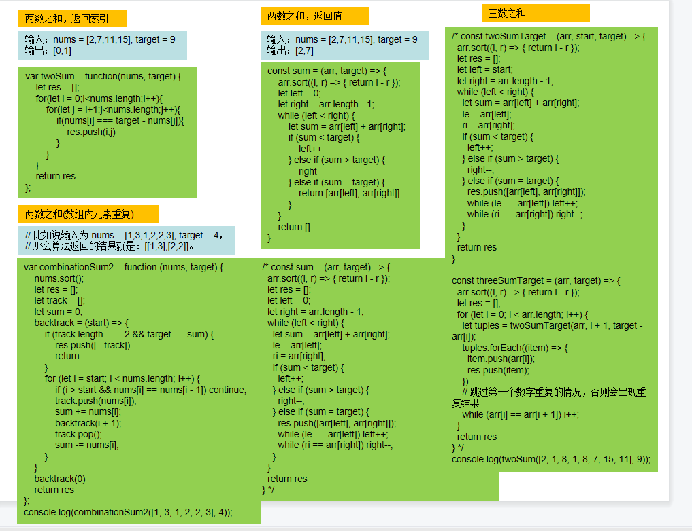

# 框架-2：Map/Set-----------


#### 最长连续序列

```javascript
//输入：nums = [100,4,200,1,3,2]
//输出：4
//解释：最长数字连续序列是 [1, 2, 3, 4]。它的长度为 4。
var longestConsecutive = function (nums) {
    let set = new Set();
    for (let item of nums) {
        set.add(item)
    }

    let result = 0
    for (let item of set) {
        let res = 1;
        if (!set.has(item - 1)) {
            while (set.has(item + 1)) {
                res++;
                item++;
            }
        }
        result = Math.max(res, result)
    }
    return result
};

var longestConsecutive = function(nums) {
    let map = new Map();
    for (let num of nums) {
        map.set(num, num)
    }
    let res = 0;
    for (let item of nums) {
        if (!map.has(item - 1)) {
            let right = map.get(item);
            while (map.has(right + 1)) {
                right = map.get(right + 1);
            }
            map.set(item, right)
            res = Math.max(res, right - item + 1)
        }

    }
    return res
};
```

#### 只出现一次的数字

```javascript
 var singleNumber = function(nums) {
    let nums1 =Array.from(new Set(nums));
    return nums1.reduce((r,l)=>r+l)*2-nums.reduce((r,l)=>r+l)
};
```
#### 多数元素

```javascript
var majorityElement = function(nums) {
    let map =new Map();
    for(let i = 0;i<nums.length;i++){
        let count = map.get(nums[i]);
        map.set(nums[i],(count||0)+1)
    }
    for(let [key,value] of [...map]){
        if(value>Math.floor(nums.length/2)) return key
    }
};
```
#### 字母异位词分组

```javascript
//输入: strs = ["eat", "tea", "tan", "ate", "nat", "bat"]
//输出: [["bat"],["nat","tan"],["ate","eat","tea"]]
var groupAnagrams = function(strs) {
    
    let map = new Map();
    const getKey =(a)=>{
        return a.split('').sort().join('');
    };

    for(let i = 0;i<strs.length;i++){
        let key = getKey(strs[i]);
        if(map.get(key)){
            map.set(key,[strs[i],...map.get(key)])
        }else{
            map.set(key,[strs[i]])
        }
    }
    return [...map.values()]
};
```


#### 两数之和

```javascript
var twoSum = function(nums, target) {
    let map = new Map();
    for(let i = 0;i<nums.length;i++){
        if(map.has(target - nums[i])){
            return [map.get(target - nums[i]),i]
        }else{
            map.set(nums[i],i)
        }
    }
};
```
#### 查找数组中重复的元素

```javascript
// 输入: [4,1,2,1,2]
// 输出: [1,2]
const target = (nums) => {
    let map = new Map();
    for (let i = 0; i < nums.length; i++) {
        let count = map.get(nums[i]);
        map.set(nums[i], (count || 0) + 1);
    }
    let res = [];
    for (let [key, value] of [...map]) {
        if (value > 1) res.push(key)
    }
    return res
};
console.log(target([4, 1, 2, 1, 2]));
```
# 框架-1：栈-----------

#### 有效的括号

```javascript
var isValid = function(s) {
    let stack = [];
    for(let i = 0;i<s.length;i++){
        if(s[i]==='('||s[i]==='['||s[i]==='{'){
            stack.push(s[i]);
        }else if(s[i] ===')'&&stack[stack.length-1]==='('||
                s[i] ==='}'&&stack[stack.length-1]==='{'||
                s[i] ===']'&&stack[stack.length-1]==='['
        ){
            stack.pop()
        }else{
            return false
        }
    }

    return stack.length === 0?true:false
};

//最长有效的括号
//输入：s = "(()"
//输出：2
//解释：最长有效括号子串是 "()"

//输入：s = ")()())"
//输出：4
//解释：最长有效括号子串是 "()()"

var longestValidParentheses = function(s) {
    if(s == null||s.length ==0 ) return 0;
    let stack  = [];
    //防止当第一个字母是)时发生越界异常
    stack.push(-1);
    let res = 0;
    for(let i = 0;i<s.length;i++){
        if(s[i] == '('){
            stack.push(i)
        }else{
            stack.pop();
            if(stack.length ==0){
                stack.push(i)
            }else{
                //当前全部人数减去剩余无法配对的人数
                res = Math.max(res,i - stack[stack.length - 1])
            }
        }
    };
    return res
};
```
#### 单调栈的应用

```javascript
//每日温度
// 版本一
var dailyTemperatures = function(temperatures) {
    const n = temperatures.length;
    const res = Array(n).fill(0);
    const stack = [];  // 递增栈：用于存储元素右面第一个比他大的元素下标
    stack.push(0);
    for (let i = 1; i < n; i++) {
        // 栈顶元素
        const top = stack[stack.length - 1];
        if (temperatures[i] < temperatures[top]) {
            stack.push(i);
        } else if (temperatures[i] === temperatures[top]) {
            stack.push(i);
        } else {
            while (stack.length && temperatures[i] > temperatures[stack[stack.length - 1]]) {
                const top = stack.pop();
                res[top] = i - top;
            }
            stack.push(i);
        }
    }
    return res;
};

// 版本二
var dailyTemperatures = function(temperatures) {
    const n = temperatures.length;
    const res = Array(n).fill(0);
    const stack = [];  // 递增栈：用于存储元素右面第一个比他大的元素下标
    stack.push(0);
    for (let i = 1; i < n; i++) {
        while (stack.length && temperatures[i] > temperatures[stack[stack.length - 1]]) {
            const top = stack.pop();
            res[top] = i - top;
        }
        stack.push(i);
    }
    return res;
};

//下一个更大的元素1
输入：nums1 = [4,1,2], nums2 = [1,3,4,2].
输出：[-1,3,-1]
解释：nums1 中每个值的下一个更大元素如下所述：
- 4 ，用加粗斜体标识，nums2 = [1,3,4,2]。不存在下一个更大元素，所以答案是 -1 。
- 1 ，用加粗斜体标识，nums2 = [1,3,4,2]。下一个更大元素是 3 。
- 2 ，用加粗斜体标识，nums2 = [1,3,4,2]。不存在下一个更大元素，所以答案是 -1 。
var nextGreaterElement = function(nums1, nums2) {
    let stack = [];
    let map = new Map();
    for(let i = 0;i<nums2.length;i++){
        while(stack.length&&nums2[i]>nums2[stack[stack.length-1]]){
            let top = stack.pop();
            map.set(nums2[top],nums2[i])
        }
        stack.push(i)
    } 
    let res = [];
    for(let i = 0;i<nums1.length;i++){
        if(map.get(nums1[i])){
            res[i] = map.get(nums1[i])
        }else{
            res[i] = -1
        }
    }
    return res
};

//下一个更大的元素2
给定一个循环数组（最后一个元素的下一个元素是数组的第一个元素），输出每个元素的下一个更大元素。数字 x 的下一个更大的元素是按数组遍历顺序，这个数字之后的第一个比它更大的数，这意味着你应该循环地搜索它的下一个更大的数。如果不存在，则输出 -1。

示例 1:

输入: [1,2,1]
输出: [2,-1,2]
解释: 第一个 1 的下一个更大的数是 2；数字 2 找不到下一个更大的数；第二个 1 的下一个最大的数需要循环搜索，结果也是 2。
//可以拼接数组，两次原数组
var nextGreaterElements = function (nums) {
  const len = nums.length;
  let stack = [];
  let res = Array(len).fill(-1);
  for (let i = 0; i < len * 2; i++) {
    while (
      stack.length &&
      nums[i % len] > nums[stack[stack.length - 1]]
    ) {
      const index = stack.pop();
      res[index] = nums[i % len];
    }
    stack.push(i % len);
  }
  return res;
};


//接雨水

var trap = function(height) {
    const len = height.length;
    if(len <= 2) return 0; // 可以不加
    const st = [];// 存着下标，计算的时候用下标对应的柱子高度
    st.push(0);
    let sum = 0;
    for(let i = 1; i < len; i++){ // 只处理的情况三，其实是把情况一和情况二融合了
        while (st.length !== 0 && height[i] > height[st[st.length - 1]]) { // 注意这里是while
            let mid = st[st.length - 1];
            st.pop();
            if (st.length !== 0) {
                let h = Math.min(height[st[st.length - 1]], height[i]) - height[mid];
                let w = i - st[st.length - 1] - 1; // 注意减一，只求中间宽度
                sum += h * w;
            }
        }
        st.push(i);
    }
    return sum;
};

//柱状图中最大的矩形
//单调栈 简洁
var largestRectangleArea = function(heights) {
    let maxArea = 0;
    const stack = [];
    heights = [0,...heights,0]; // 数组头部加入元素0 数组尾部加入元素0
    for(let i = 0; i < heights.length; i++){ // 只用考虑情况一 当前遍历的元素heights[i]小于栈顶元素heights[stack[stack.length-1]]]的情况
        while(heights[i] < heights[stack[stack.length-1]]){// 当前bar比栈顶bar矮
            const stackTopIndex = stack.pop();// 栈顶元素出栈，并保存栈顶bar的索引
            let w = i - stack[stack.length -1] - 1;
            let h = heights[stackTopIndex]
            // 计算面积，并取最大面积
            maxArea = Math.max(maxArea, w * h);
        }
        stack.push(i);// 当前bar比栈顶bar高了，入栈
    }
    return maxArea;
};

```
# 框架0：数组-----------

#### 搜索二维矩阵2

```js
编写一个高效的算法来搜索 m x n 矩阵 matrix 中的一个目标值 target 。该矩阵具有以下特性：

每行的元素从左到右升序排列。
每列的元素从上到下升序排列。

来源：力扣（LeetCode）
链接：https://leetcode.cn/problems/search-a-2d-matrix-ii
著作权归领扣网络所有。商业转载请联系官方授权，非商业转载请注明出处。

var searchMatrix = function(matrix, target) {
     if (matrix.length == 0) return false // 判空
    let [left, up] = [matrix[0].length - 1, 0]; // 初始化位置
    while (left >= 0 && up < matrix.length) {
        if (matrix[up][left] > target) {
            left--;
        } else if (matrix[up][left] < target) {
            up++;
        } else {
            return true;
        }
    }
    return false;
};
```


#### 根据身高重建队列

```javascript
//输入：people = [[7,0],[4,4],[7,1],[5,0],[6,1],[5,2]]
//输出：[[5,0],[7,0],[5,2],[6,1],[4,4],[7,1]]
var reconstructQueue = function(people) {
    people.sort((a, b) =>{
       return a[0] === b[0] ? a[1] - b[1] : b[0] - a[0]
    });

    let res = [];
    for(let item of people){
        if(res.length<=item[1]){
            res.push([...item])
        }else{
    res = [...res.slice(0,item[1]),item,...res.slice(item[1])]
        }
    }
    return res
};
```

#### 前k个高频元素

```javascript
	let map = new Map();
    for(let item of nums){
        let count = map.get(item);
        map.set(item,(count||0)+1)
    }

    let arr = Array.from(map);//根据表生成数组
    let res = [];
    arr.sort((a,b) => b[1] - a[1]);//依据出现次数从多到少排序
    for(let j = 0; j < k; j++){
        res.push(arr[j][0]);
    }
    return res;
```

#### 和为K的子数组

```javascript
给你一个整数数组 nums 和一个整数 k ，请你统计并返回 该数组中和为 k 的连续子数组的个数 
var subarraySum = function(nums, k) {
    let count = 0;
    for(let i = 0;i<nums.length;i++){
        let sum = 0;
        for(let j = i;j>=0;j--){
            sum +=nums[j];
            if(sum ==k){
                count++
            }
        }
    }
    return count;
};
```


#### 最短无序连续子数组

```javascript
输入：nums = [2,6,4,8,10,9,15]
输出：5
解释：你只需要对 [6, 4, 8, 10, 9] 进行升序排序，那么整个表都会变为升序排序。
。
var findUnsortedSubarray = function(nums) {
    let snums = nums.slice().sort((a,b)=>a-b);
    let start = nums.length;
    let end = 0;
    for(let i = 0;i<nums.length;i++){
        if(snums[i] !==nums[i]){
            start = i;
            break;
        }
    }
    for(let i = nums.length-1;i>=0;i--){
        if(snums[i] !==nums[i]){
            end = i
            break;
        }
    }
    return end - start > 0 ? end - start + 1 : 0;
};
```

#### 找到数组中所有消失的元素

```javascript
var findDisappearedNumbers = function(nums) {
    let dp = Array.from(new Set(nums));
    let res = [];
    for(let i = 1;i<=nums.length;i++){
        if(!dp.includes(i)){
            res.push(i)
        }
    }
    return res
};
```
#### 只出现一次的数字

```javascript
// 给定一个非空整数数组，除了某个元素只出现一次以外，
// 其余每个元素均出现两次。找出那个只出现了一次的元素。

// 输入: [4,1,2,1,2]
// 输出: 4

/* const target = (arr) => {
  for (let i = 0; i < arr.length; i++) {
    if (arr.indexOf(arr[i]) === arr.lastIndexOf(arr[i])) {
      return arr[i]
    }
  }
} */

const target = (nums) => {
  const numsGroup = nums.map(num => nums.filter(v => v === num));
  console.log(numsGroup);

  return numsGroup.find(num => num.length === 1)[0];
};

console.log(target([4, 1, 2, 1, 2]));
```
#### 两数与三数之和

```js
//两数之和------利用Map()
var twoSum = function(nums, target) {
    let map = new Map();
    for(let i = 0;i<nums.length;i++){
        if(map.has(target - nums[i])){
            return [map.get(target - nums[i]),i]
        }else{
            map.set(nums[i],i)
        }
    }
};
```



#### 旋转数组

```javascript
// 给定一个数组，将数组中的元素向右移动 k 个位置，其中 k 是非负数。
// 输入: [1,2,3,4,5,6,7] 和 k = 3
// 输出: [5,6,7,1,2,3,4]
// 解释:
// 向右旋转 1 步: [7,1,2,3,4,5,6]
// 向右旋转 2 步: [6,7,1,2,3,4,5]
// 向右旋转 3 步: [5,6,7,1,2,3,4]

/* const rotate = (arr, k) => {
  for (let i = 0; i < k; i++) {
    arr.unshift(arr.pop())
  }
  return arr
} */

const rotate = (arr, k) => {
  let after = arr.splice(arr.length - k, k)
  arr.unshift(...after)
  return arr

}
console.log(rotate([1, 2, 3, 4, 5, 6, 7], 3));

```
#### 旋转图像

```javascript
// 顺时针旋转90：先沿对角线反转矩阵，再沿竖中轴线反转矩阵；
// 顺时针旋转180：先沿横中轴线反转矩阵，再沿竖中轴线反转矩阵；
// 顺时针旋转270：先沿对角线反转矩阵，再沿横中轴线反转矩阵
```
#### 从排序数组中删除重复项

```javascript
// 给定一个排序数组，你需要在原地删除重复出现的元素，使得每个元素只出现一次，
// 返回移除后数组的新长度。
// 不要使用额外的数组空间，你必须在原地修改输入数组并在使用 O(1) 
// 额外空间的条件下完成。

let nums = [0, 0, 1, 1, 1, 2, 2, 3, 3, 4];
const removeDu = (array) => {
  let count = 0;
  for (let index = 1; index < array.length; index++) {
    if (array[count] !== array[index]) {
      array[count + 1] = array[index];
      count++;
    }
  };
  return count + 1
}


console.log(removeDu(nums));

```
#### 加一

```javascript
// 给定一个由整数组成的非空数组所表示的非负整数，在该数的基础上加一。
// 最高位数字存放在数组的首位， 数组中每个元素只存储单个数字。
// 你可以假设除了整数 0 之外，这个整数不会以零开头。
// 输入: [1,2,3]
// 输出: [1,2,4]
// 解释: 输入数组表示数字 123。

const plusOne = function (digits) {
  return (parseInt(digits.join('')) + 1).toString().split('');
};
console.log(plusOne([1, 2, 9]));

```
#### 移动0

```javascript
// 给定一个数组 nums，编写一个函数将所有 0 移动到数组的末尾，
// 同时保持非零元素的相对顺序。必须在原数组上操作，不能拷贝额外的数组。

// 输入: [0,1,0,3,12]
// 输出: [1,3,12,0,0]

const move = (arr) => {
  let count = 0;
  for (let index = 0; index < arr.length; index++) {
    if (arr[index] !== 0) {
      arr[count] = arr[index];
      count++;
    }
  }
  return arr.fill(0, count, arr.length)
}

//双指针优化
// const moveZeroes = function (nums) {
//   let j = 0;
//   let temp = '';
//   for (let i = 0; i < nums.length; i++) {
//     if (nums[i] !== 0) {
//       temp = nums[j];
//       nums[j] = nums[i];
//       nums[i] = temp;
//       j++;
//     }
//   }
// };

console.log(move([0, 1, 0, 3, 12]));
```

#### 颜色分类

```javascript
//输入：nums = [2,0,2,1,1,0]
//输出：[0,0,1,1,2,2]
var sortColors = function(nums) {
    let count = 0;

    for(let i = 0;i<nums.length;i++){
        if(nums[i] ==0){
            [nums[i],nums[count]]=[nums[count],nums[i]]
            count++;
        }
    }
    for(let i = 0;i<nums.length;i++){
        if(nums[i] ==1){
            [nums[i],nums[count]]=[nums[count],nums[i]]
            count++;
        }
    }
    return nums
};
```

#### 比特位计数

```javascript
//输入：n = 5
// 输出：[0,1,1,2,1,2]
// 解释：
// 0 --> 0
// 1 --> 1
// 2 --> 10
// 3 --> 11
// 4 --> 100
// 5 --> 101
var countBits = function(n) {
    let dp = Array(n+1);
    dp[0] = 0;
   for(let i = 1; i <= n; i++){
        if(i % 2 == 1) dp[i] = dp[i-1] + 1;//奇数1的个数是上一个偶数1个数+1
        else dp[i] = dp[i/2];//偶数1的个数是该数除以2的偶数的1的个数
    }
        
   return dp;
};
```

#### 最大盛水器

```javascript
var maxArea = function(height) {
    let i = 0;
    let j = height.length-1;
    let res = 0;
    while(i<j){
        if(height[i]<height[j]){
            res = Math.max(res,height[i]*(j-i));
            i++;
        }else{
            res = Math.max(res,height[j]*(j-i));
            j--;
        }
    }
    return res
};
```
#### 合并区间

```javascript
//输入：intervals = [[1,3],[2,6],[8,10],[15,18]]
//输出：[[1,6],[8,10],[15,18]]
//解释：区间 [1,3] 和 [2,6] 重叠, 将它们合并为 [1,6].
var merge = function(intervals) {
    let res = new Array(intervals.length).fill(0).map(()=> new Array(2).fill(0));
    intervals.sort((left,right)=>{
        return left[0] - right[0]
    });
    let left = 0
    res[left][0] = intervals[0][0];
    res[left][1] = intervals[0][1];

    for(let i =1;i<intervals.length;i++){
        if(intervals[i][0]>res[left][1]){
            res[left+1][0] = intervals[i][0];
            res[left+1][1] = intervals[i][1];
            left++;
        }else{
            res[left][1] =Math.max(res[left][1],intervals[i][1]) ;
        }
    }
    return res.slice(0,left+1)
};
```


#### 除本身外的数组之积

```javascript
// 输入: [1,2,3,4]
// 输出: [24,12,8,6]

// 说明: 请不要使用除法，且在 O(n) 时间复杂度内完成此题。

// 进阶：
// 你可以在常数空间复杂度内完成这个题目吗？（出于对空间复杂度分析的目的，输出数组不被视为额外空间）

/* const productExceptSelf = (array) => {
  let res = [];
  let sum = 1;
  for (let index = 0; index < array.length; index++) {
    sum = sum * array[index];
  }

  for (let index = 0; index < array.length; index++) {
    res.push(sum / array[index])
  }

  return res
} */


const productExceptSelf = (nums) => {
  const len = nums.length;
  const result = [1];
  let right = 1;
  // 计算左侧数字的乘积，存到 result 中
  for (let i = 1; i < len; i += 1) {
    result[i] = result[i - 1] * nums[i - 1];
  }
  // 用变量 right 存储每个数字右侧的乘积，并且进行累积相乘
  for (let j = len - 1; j >= 0; j -= 1) {
    result[j] *= right;
    right *= nums[j];
  }
  return result;
};

console.log(productExceptSelf([1, 2, 3, 4]));

```
#### 判断是否存在重复元素

```javascript
// 给定一个整数数组，判断是否存在重复元素。
// 如果任何值在数组中出现至少两次，函数返回 true。如果数组中每个元素都不相同，则返回 false。


// 输入: [1,2,3,1]
// 输出: true

// 输入: [1,2,3,4]
// 输出: false

const containsDuplicate = (array) => {
  for (let index = 0; index < array.length; index++) {
    if (array.indexOf(array[index]) !== array.lastIndexOf(array[index])) {
      return true
    }
  }
  return false
}

console.log(containsDuplicate([1, 2, 3, 1]));

```
#### 数组交集

```javascript
// 给定两个数组，计算数组交集。
// 输出结果中每个元素出现的次数，应与元素在两个数组中出现的次数一致。
// 我们可以不考虑输出结果的顺序。

// 输入: nums1 = [1,2,2,1], nums2 = [2,2]
// 输出: [2,2]
// 输入: nums1 = [4,9,5], nums2 = [9,4,9,8,4]
// 输出: [4,9]

/* const jiaoji = (arr1, arr2) => {
  return arr1.filter((item) => {
    return arr2.includes(item)
  })
}

console.log(jiaoji([4, 5, 6], [6, 9])); */


const intersect = function (nums1, nums2) {
  const longerArr = nums1.length > nums2.length ? nums1 : nums2;
  const shorterArr = nums1.length > nums2.length ? nums2 : nums1;
  const result = [];
  for (let i = 0; i < shorterArr.length; i++) {
    if (longerArr.indexOf(shorterArr[i]) > -1) {
      result.push(shorterArr[i]);
      longerArr.splice(longerArr.indexOf(shorterArr[i]), 1);
    }
  }
  return result;
};
console.log(intersect([6, 6, 9], [4, 5, 6]));


```

#### 一周中的第几天

```javascript
// 给你一个日期，请你设计一个算法来判断它是对应一周中的哪一天。
// 输入为三个整数：day、month 和 year，分别表示日、月、年。
// 您返回的结果必须是这几个值中的一个 {"Sunday", "Monday", "Tuesday", "Wednesday", "Thursday", "Friday", "Saturday"}。
// 说明：给出的日期一定是在 1971 到 2100 年之间的有效日期。
/* 
输入：day = 31, month = 8, year = 2019
输出："Saturday" */


const dayOfTheWeek = function (day, month, year) {
  const date = new Date(Date.parse(`${year}/${month}/${day}`));
  const Week = ['Sunday', 'Monday', 'Tuesday', 'Wednesday', 'Thursday', 'Friday', 'Saturday'];
  return Week[date.getDay()];
};


```
#### 矩阵置零

```javascript
// 给定一个 m x n 的矩阵，如果一个元素为 0，
// 则将其所在行和列的所有元素都设为 0。请使用原地算法。
/* 输入: 
[
  [1,1,1],
  [1,0,1],
  [1,1,1]
]
输出: 
[
  [1,0,1],
  [0,0,0],
  [1,0,1]
] */


const setZeroes = function (matrix) {
  const len = matrix.length;
  const width = matrix[0].length;
  const vertical = [];
  const horizontal = [];
  for (let i = 0; i < len; i++) {
    for (let j = 0; j < width; j++) {
      if (!matrix[i][j]) {
        vertical.push(j);
        horizontal.push(i);
      }
    }
  }
  for (let i = 0; i < len; i++) {
    if (horizontal.indexOf(i) > -1) {
      matrix[i].fill(0, 0, width);
    }
    for (let j = 0; j < vertical.length; j++) {
      matrix[i][vertical[j]] = 0;
    }
  }
};

```
#### 三数之和

```javascript
const twoSum = (start, array, target) => {
  array.sort((l, r) => { return l - r })
  let result = [];
  let left = start;
  let right = array.length - 1;
  while (left < right) {
    let le = array[left];
    let ri = array[right];
    let sum = array[left] + array[right];
    if (sum < target) {
      left++;
    } else if (sum > target) {
      right--;
    } else if (sum = target) {
      result.push([array[left], array[right]])
      while (le === array[left]) left++
      while (ri === array[right]) right--
    }
  }
  return result
}

const threeSum = (array, target) => {
  array.sort((l, r) => { return l - r })
  let result = []
  for (let index = 0; index < array.length; index++) {
    let res = twoSum(index + 1, array, target - array[index])
    res.forEach((item) => {
      item.push(array[index])
      result.push(item)
    })
    while (array[index] === array[index + 1]) index++
  }
  return result
}

console.log(threeSum([-1, 0, 1, 2, -1, -4], 0))
```

# 框架0：字符串-----------

#### 判断是否符合某格式

```javascript
// 给定字符串，判断是否符合以下格式
// XXX-XXX-XXXX
function match(str) {
    return /^\d{3}-\d{3}-\d{4}$/.test(str)
}
console.log(match('111-111-1111'));
console.log(match('111-111-1111'));
```
#### 十进制转二进制

```javascript
//十进制转二进制
function va(num) {
    let res = num.toString(2);
    return res;
}
console.log(va(128, 2));

//给一个二进制字符串，转换成10进制的数字
function base10(str) {
    return parseInt(str, 2)
}
console.log(base10('11000000'));
```

#### 异或运算

```javascript
let num_1 = 14;
let num_2 = 21;

console.log(num_1.toString(2));//01110
console.log(num_2.toString(2));//10101

//与运算，都为1才是1，否则为0
console.log((num_1 & num_2).toString(2));//100


//或运算，都为0才是0，否则为1；
console.log((num_1 | num_2).toString(2));//11111

//异或运算，不想等为1，相等为0

console.log((num_1 ^ num_2).toString(2));//11111

//左移
console.log((num_1 << 1).toString(2));

//右移
console.log((num_1 >> 2).toString(2));
```
#### 汉明距离

```javascript
//输入：x = 1, y = 4
//输出：2
//解释：
//1   (0 0 0 1)
//4   (0 1 0 0)
//       ↑   ↑
//上面的箭头指出了对应二进制位不同的位置。
var hammingDistance = function(x, y) {
    let res = (x ^ y).toString(2);
    let result = 0;
    for(let i = 0;i<res.length;i++){
        if(res[i] == '1'){
            result++;
        }
    }
    return result;
};
```


#### 翻转整数

```javascript
/* 示例 1:
输入: 123
输出: 321

示例 2:
输入: -123
输出: -321

示例 3:
输入: 120
输出: 21 */
const reverse = (x) => {
  if (x === 0) return 0
  const rest = x > 0 ?
    String(x)
      .split('')
      .reverse()
      .join('')
    : String(x)
      .slice(1)
      .split('')
      .reverse()
      .join('');
  // 转换为正常值，区分正负数
  const result = x > 0 ? parseInt(rest, 10) : 0 - parseInt(rest, 10);
  return result

}
console.log(reverse(985));
```
#### 有效的字母异或词

```javascript
/* 输入: s = "anagram", t = "nagaram"
输出: true
输入: s = "rat", t = "car"
输出: false */
const isAnagram = (s, t) => {
  const sArr = s.split('');
  const tArr = t.split('');
  const sortFn = (a, b) => {
    return a.charCodeAt() - b.charCodeAt();
  };
  sArr.sort(sortFn);
  tArr.sort(sortFn);
  return sArr.join('') === tArr.join('');
};
console.log(isAnagram('zlfzlf', 'lzfflz'));
```
#### 反转字符串

```javascript
const reverseString = function (s) {
  for (let i = 0; i < s.length / 2; i++) {
    [s[i], s[s.length - 1 - i]] = [s[s.length - 1 - i], s[i]];
  }
  return s;
};
//不得开辟新空间
console.log(reverseString(['zz', 'll', 'i', 'ff', 'bb']));


function reverseString(string) {
  // return string.split("").reverse().join("");
  return [...string].reverse().join("");
}
console.log(reverseString("hello yunmu 2022年不要孤单了"));
```

#### 字符串中的第一个唯一字符

```javascript
// s = "leetcode"
// 返回 0.

// s = "loveleetcode",
// 返回 2. 

const firstUniqChar = (s) => {
  for (let i = 0; i < s.length; i++) {
    if (s.indexOf(s[i]) === s.lastIndexOf(s[i])) {
      return i
    }
  }
  return -1;
}

console.log(firstUniqChar('zlfzoiuiiu'));


/**
 * @param {string} s
 * @return {number}
 */
/* const firstUniqChar = function (s) {
 const hash = {};
 for (let i = 0; i < s.length; i += 1) {
   if (!hash[s[i]]) {
     hash[s[i]] = 1;
   } else {
     hash[s[i]] += 1;
   }
 }
 for (let i = 0; i < s.length; i += 1) {
   if (hash[s[i]] === 1) {
     return i;
   }
 }
 return -1;
}; */
```

#### 验证回文字符串

```javascript
/* 输入: "A man, a plan, a canal: Panama"
输出: true
输入: "race a car"
输出: false
 */
/**
 * @param {string} s
 * @return {boolean}
 */
const isPalindrome = (s) => {
  // 方便比较,统一转化为小写,并去除非字母和数字
  const arr = s.toLowerCase().replace(/[^A-Za-z0-9]/g, '');
  const newArr = arr.split('').reverse().join('');
  return arr === newArr
};
console.log(isPalindrome('zlfflz'));

/* const isPalindrome = (s) => {
  // 将传入的字符串,统一转化为小写,同时去除非字母和数字,在转换为数组
  const arr = s.toLowerCase().replace(/[^A-Za-z0-9]/g, '').split('');
  let i = 0;
  let j = arr.length - 1;
  // 循环比较元素
  while (i < j) {
    // 从首尾开始, 一一比较元素是否相等
    if (arr[i] === arr[j]) {
      // 若相等,即第二个元素和倒数第二个元素继续比较,依次类推
      i += 1;
      j -= 1;
    } else {
      // 只要有一个相对位置上不相等,既不是回文串
      return false;
    }
  }
  // 是回文串
  return true;
}; */
```

#### 最长回文字符串

```javascript
function longest(s) {
  let res = '';
  for (let i = 0; i < s.length; i++) {
    const s1 = asklong(s, i, i);
    const s2 = asklong(s, i, i + 1);
    res = res.length > s1.length ? res : s1;
    res = res.length > s2.length ? res : s2;

  }
  return res
}

function asklong(s, l, r) {
  while (l >= 0 && r < s.length && s[l] == s[r]) {
    l--;
    r++;
  }
  return s.slice(l + 1, r)
}

console.log(longest('zhggglutrttrt'));


function longest(str) {
    let len = str.length;
    let dp = new Array(len).fill().map(() => new Array(len).fill(0));
    let res = 0;
    let left = 0;
    let right = 0;
    for (let i = len - 1; i >= 0; i--) {
        for (let j = i; j < len; j++) {
            if (str[i] == str[j]) {
                if (j - i <= 1) {
                    dp[i][j] = 1;
                    if (res < j - i) {
                        res = j - i;
                        left = i;
                        right = j;
                    }
                } else if (dp[i + 1][j - 1]) {
                    dp[i][j] = 1;
                    if (res < j - i) {
                        res = j - i;
                        left = i;
                        right = j;
                    }
                }
            }
        }
    }
    return str.substr(left, right - left + 1);
}
```

#### 查找第一次出现的位置

```javascript
/* 
给定 haystack = 'hello world', needle = 'll'
返回2 
*/

const str = (left, right) => {
  for (let i = 0; i < left.length - right.length + 1; i++) {
    if (left[i] !== right[0]) {
      continue;
    }
    if (left.substr(i, right.length) === right) {
      return i
    }
  }
  return -1
}

console.log(str('zlfll', 'll'));


```

#### 无重复字符的最长子串

```javascript
// 输入: "abcabcbb"
// 输出: 3
// 解释: 因为无重复字符的最长子串是 "abc"，所以其长度为 3。
var lengthOfLongestSubstring = function(s) {
    let map = new Map();
    let left = 0;
    let res = 0;
    for (let i = 0; i < s.length; i++) {
        if (map.has(s[i])) {
            left = Math.max(left,map.get(s[i])+1);
        }
        map.set(s[i],i)
        res = Math.max(res,i-left+1)
    };
    return res;
};
```

#### 最小覆盖子串

```javascript
//输入：s = "ADOBECODEBANC", t = "ABC"
//输出："BANC"
var minWindow = function(s, t) {
    let need = new Map();
    let window = new Map();
    for (let i = 0; i < t.length; i++) {
        need.set(t[i], (need.get(t[i]) || 0) + 1)
    };
    let len = need.size;

    let left = 0;
    let start =0;
    let valid = 0;
    
    let res = Number.MAX_VALUE;//最小覆盖子串长度

    for(let i = 0;i<s.length;i++){
        if(need.has(s[i])){
            window.set(s[i],(window.get(s[i]) || 0) + 1);
            if(window.get(s[i]) == need.get(s[i])){
                valid++;
            }
        };
        while(valid == len){
            if(i+1-left<res){
                start = left;
                res = i+1 - left
            }
            if(need.has(s[left])){
                if(window.get(s[left]) == need.get(s[left])){
                    valid--;
                }
                window.set(s[left],window.get(s[left])-1)
            }
            left++;
        }
    }
    return res === Number.MAX_VALUE ? "" : s.substr(start, res);
};
```


# 框架0：排序与搜索--------

#### 二分查找

```javascript
//排序数组中寻找一个数
function binarySearch(nums, tar) {
    let left = 0;
    let right = nums.length - 1;
    while (left <= right) {
        let mid = Math.floor((left + right) / 2);
        if (nums[mid] === tar) {
            return mid;
        } else if (nums[mid] < tar) {
            left = mid + 1;
        } else if (nums[mid] > tar) {
            right = mid - 1;
        }
    }
    return -1;
}

//寻找左侧边界的二分搜索
function binary_1(nums, tar) {
    let left = 0;
    let right = nums.length - 1;
    while (left <= right) {
        let mid = Math.floor((left + right) / 2);
        if (nums[mid] === tar) {
            right = mid - 1;
        } else if (nums[mid] < tar) {
            left = mid + 1;
        } else if (nums[mid] > tar) {
            right = mid - 1;
        }
    }
    if (left >= nums.length || nums[left] !== tar) return -1
    return left;
}

//寻找右侧边界的二分搜索
function binary_2(nums, tar) {
    let left = 0;
    let right = nums.length - 1;
    while (left <= right) {
        let mid = Math.floor((left + right) / 2);
        if (nums[mid] === tar) {
            left = mid + 1;
        } else if (nums[mid] < tar) {
            left = mid + 1;
        } else if (nums[mid] > tar) {
            right = mid - 1;
        }
    }
    if (right < 0 || nums[right] !== tar) return -1
    return right;
}

```
#### 二分查找--旋转数组

```javascript
let left = start
let right = end
let mid
while (left <= right) {
    mid = (left + right) / 2
    if (array[mid] === target) {
        return result
    }
    if (array[mid] < target) {
        left = mid + 1
    }
    if (array[mid] > target) {
        right = mid - 1
    }
}


//二分法的扩展
/* 假设按照升序排序的数组在预先未知的某个点上进行了旋转。
( 例如，数组 [0,1,2,4,5,6,7] 可能变为 [4,5,6,7,0,1,2] )。
请找出其中最小的元素。你可以假设数组中不存在重复元素。

解法分析：

1、暴力求解，遍历数组，记录最小值，时间复杂度是 O(N)，N是给定数组的大小
2、二分法，时间复杂度是 O(logN)， */

//寻找旋转排序数组中的最小值
const findMin = function (nums) {
    if (!nums.length) return null
    if (nums.length === 1) return nums[0]
    let left = 0, right = nums.length - 1, mid
    // 此时数组单调递增，first element就是最小值
    if (nums[right] > nums[left]) return nums[0]
    while (left <= right) {
        mid = left + ((right - left) >> 1)
        if (nums[mid] > nums[mid + 1]) {
            return nums[mid + 1]
        }
        if (nums[mid] < nums[mid - 1]) {
            return nums[mid]
        }
        if (nums[mid] > nums[0]) {
            left = mid + 1
        } else {
            right = mid - 1
        }
    }
    return null
}

console.log(findMin([4, 5, 6, 7, 8, 0, 1]));


/* 2.2 旋转数组系列 II
题目链接：搜索旋转排序数组

题目描述：

假设按照升序排序的数组在预先未知的某个点上进行了旋转。
( 例如，数组 [0,1,2,4,5,6,7] 可能变为 [4,5,6,7,0,1,2] )。
搜索一个给定的目标值，如果数组中存在这个目标值，则返回它的索引，否则返回 -1 。
你可以假设数组中不存在重复的元素。 你的算法时间复杂度必须是 O(log n) 级别。 */
const search = function (nums, target) {
    if (!nums.length) return -1
    let left = 0, right = nums.length - 1, mid
    while (left <= right) {
        mid = left + ((right - left) >> 1)
        if (nums[mid] === target) {
            return mid
        }
        if (nums[mid] >= nums[left]) {
            if (target >= nums[left] && target < nums[mid]) {
                right = mid - 1
            } else {
                left = mid + 1
            }
        } else {
            if (target > nums[mid] && target <= nums[right]) {
                left = mid + 1
            } else {
                right = mid - 1
            }
        }
    }
    return -1
}

/* 2.3 旋转数组系列 III
题目链接：搜索旋转排序数组 II

题目描述：

假设按照升序排序的数组在预先未知的某个点上进行了旋转
。( 例如，数组 [0,0,1,2,2,5,6] 可能变为 [2,5,6,0,0,1,2] )。
编写一个函数来判断给定的目标值是否存在于数组中。
若存在返回 true，否则返回 false。 */

const search_02 = function (nums, target) {
    if (!nums.length) return false
    let left = 0, right = nums.length - 1, mid
    while (left <= right) {
        mid = left + ((right - left) >> 1)
        if (nums[mid] === target) {
            return true
        }
        if (nums[left] === nums[mid]) {
            ++left
            continue
        }
        if (nums[mid] >= nums[left]) {
            if (target >= nums[left] && target < nums[mid]) {
                right = mid - 1
            } else {
                left = mid + 1
            }
        } else {
            if (target > nums[mid] && target <= nums[right]) {
                left = mid + 1
            } else {
                right = mid - 1
            }
        }
    }
    return false
}

```

#### 排序--五法

```javascript
//冒泡排序----------每轮循环中最大的挨个向后排
Array.prototype.bubbleSort = function () {
    for (let i = 0; i < this.length - 1; i++) {
        for (let j = 0; j < this.length - 1 - i; j++) {
            if (this[j] > this[j + 1]) {
                [this[j], this[j + 1]] = [this[j + 1], this[j]]
            }
        }
    }
}
//选择排序-----每轮循环中最小的与每轮循环的第一个交换位置
Array.prototype.sectionSort = function () {
    let minIndex;
    for (let i = 0; i < this.length - 1; i++) {
        minIndex = i;
        for (let j = i; j < this.length; j++) {
            if (this[j] < this[minIndex]) {
                minIndex = j
            }
        }
        [this[i], this[minIndex]] = [this[minIndex], this[i]]
    }
}
//插入排序------
Array.prototype.insertionSort = function () {
    for (let i = 1; i < this.length; i++) {
        const temp = this[i];
        let j = i;
        while (j > 0 && this[j - 1] > temp) {
            this[j] = this[j - 1]
            j--;
        }
        this[j] = temp;
    }
}
//快速排序
Array.prototype.quickSort = function () {
    const rec = (arr) => {
        if (arr.length === 1 || arr.length === 0) {
            return arr;
        }
        const left = [];
        const right = [];
        const mid = arr[0];
        for (let i = 1; i < arr.length; i++) {
            if (arr[i] < mid) {
                left.push(arr[i])
            } else {
                right.push(arr[i])
            }
        };
        return [...rec(left), mid, ...rec(right)]
    }
    const res = rec(this);
    return res
}
//归并排序
function mergeSort(arr) {
    let len = arr.length;
    if (len > 1) {
        let mid = Math.floor(len / 2);
        let L = arr.slice(0, mid);
        let R = arr.slice(mid, len);
        let temp = [];
        let i = 0;
        let j = 0;

        L = mergeSort(L);
        R = mergeSort(R);
        while (i < L.length && j < R.length) {
            if (L[i] < R[j]) {
                temp.push(L[i]);
                i++;
            } else {
                temp.push(R[j]);
                j++;
            }
        }

        while (i < L.length) {
            temp.push(L[i]);
            i++;
        }
        while (j < R.length) {
            temp.push(R[j]);
            j++;
        }
        return temp;
    } else {
        return arr
    }
}

```

#### 3.题目

```javascript
//合并两个升序数组
const merge = function (nums1, m, nums2, n) {
    const res = [];
    let i = 0;
    let j = 0;
    while (i < m && j < n) {
        if (nums1[i] < nums2[j]) {
            res.push(nums1[i]);
            i++;
        } else {
            res.push(nums2[j]);
            j++;
        }
    };
    if (i < m) {
        res.push(...nums1.slice(i, m))
    };
    if (j < n) {
        res.push(...nums2.slice(j, n))
    };
    nums1.splice(0, nums1.length);
    nums1.push(...res);
    return nums1;
}
console.log(merge([1, 2, 3], 3, [2, 5, 6], 3));
const merge_1 = function (nums1, m, nums2, n) {
    // 两数组合并，将 nums1 后面的占位删除并放入 nums2
    nums1.splice(m, n, ...nums2);
    // 排序
    nums1.sort((a, b) => a - b);
};

//搜索旋转后的排序数组
const search = function (nums, target) {
    const min = Math.min.apply(null, nums);
    const max = Math.max.apply(null, nums);
    const len = nums.length;
    let left;
    let right;
    let mid;
    if (target > nums[len - 1]) {
        right = nums.indexOf(max);
        left = 0;
    } else {
        right = len - 1;
        left = nums.indexOf(min);
    }
    while (left <= right) {
        mid = Math.floor((left + right) / 2);
        if (nums[mid] == target) return mid;
        if (nums[mid] < target) {
            left = mid + 1;
        } else {
            right = mid - 1;
        }
    }
    return -1;
};
console.log(search([4, 5, 6, 7, 0, 1, 2], 0));
```

# 框架一：链表----------------

stack结构——依据队列或栈都可以

快慢指针——解决环的问题及中间、倒数的问题

#### 1.反转链表系列

```javascript
function ReverseList(pHead){
    // write code here
    let p = pHead;
    let dummy = new ListNode(-1);
    let res = dummy;
    let stack = [];
    while(p){
        stack.push(p);
        p = p.next;    
    }
    while(stack.length){
        res.next = stack.pop();
        res = res.next;
    }
    res.next = null;
    return dummy.next;
}
//假头法
var reverseList = function(head) {
    let hea = head;
    let dummy = new ListNode(-1);
    let p = dummy

    while(hea){
        temp = hea.next;
        hea.next = dummy.next;
        dummy.next = hea;
        hea = temp;
    }
    return p.next
};

//指定区间反转
function reverseBetween( head ,  m ,  n ) {
    // write code here
      // write code here
    let p = head;
    let dummy = new ListNode(-1);
    let res = dummy;
    let stack = [];
    
    for(let i =1;i<m;i++){
        res.next = new ListNode(p.val);
        p=p.next;
        res=res.next;
    }
    
    for(let i =m;i<=n;i++){
       stack.push(p);
        p=p.next;
    }
    while(stack.length){
        res.next = new ListNode(stack.pop().val);
        res=res.next;
    }
    
     while(p){
        res.next = new ListNode(p.val);
        p=p.next;
        res=res.next;
     }
    return dummy.next;
}

//每k个反转
function reverseKGroup( head ,  k ) {
    // write code here
    let p =head;
    let dummy = new ListNode(-1);
    let res = dummy;
    let stack =[];
    while(p){
        stack.push(p);
        p=p.next;
        if(stack.length ==k){
            while(stack.length){
                res.next = new ListNode(stack.pop().val);
                res = res.next;
            }
        }
    }
     while(stack.length){
                res.next = new ListNode(stack.shift().val);
                res = res.next;
     }
    return dummy.next
}
```
#### 2.合并链表系列
```javascript
function Merge(pHead1, pHead2){
    let p1 = l1;
    let p2 = l2;
    let dummy  = new ListNode(-1);
    let res = dummy;

    while(p1&&p2){
        if(p1.val>p2.val){
            res.next = p2;
            p2 = p2.next
            res = res.next;
        }else{
            res.next = p1;
            p1 = p1.next
            res = res.next;
        }
    };
    if(p1){
        res.next = p1
    }
    if(p2){
        res.next = p2
    }
    return dummy.next
}
```
```javascript
//合并k个链表
function mergeKLists( lists ) {
    // write code here
    let dummy  = new ListNode(-1);
    let res = dummy;
    let stack = [];
    for(let i = 0;i<lists.length;i++){
            let len = lists[i];
            while(len){
                stack.push(len);
                len = len.next;
            }
    }   
    stack.sort((l,r)=>{
        return r.val-l.val
    })
    while(stack.length){
        res.next = stack.pop();
        res = res.next;
    }
    res.next = null;
    return dummy.next
}
```

#### 3.链表环

```javascript
//判断是否有环
function hasCycle( head ) {
    // write code here
    let p1 = head;
    let p2 = head;
    while(p1 && p1.next){
        p1 = p1.next.next;
        p2 = p2.next;
        if(p1 == p2 ){
            return true
        }
    }
    return false
}
```
```javascript
//判断环入口结点
function EntryNodeOfLoop(head){
    // write code here
    let p1 = head;
    let p2 = head;
    while(p1 && p1.next){
        p1 = p1.next.next;
        p2 = p2.next;
        if(p1 == p2 ){
            break
        }
    }
    if(!p1 || !p1.next){
        return null
    }
    p2 = head;
    while(p1!=p2){
        p1 = p1.next;
        p2 = p2.next;
    }
    return p1
}
```

#### 4.链表倒数最后k个结点
```javascript
function FindKthToTail( pHead ,  k ) {
    // write code here
    let p1 = pHead;
    let p2 = pHead;
    for(let i = 0;i<k;i++){
        if(p1){
            p1 = p1.next
        }else{
            return p1
        }
    }
    
    while(p1){
        p1 = p1.next;
        p2 = p2.next;
    }
    return p2
}
```
#### 5.删除链表倒第n个结点
```javascript
function removeNthFromEnd( head ,  n ) {
    // write code here
    let dummy = new ListNode(-1);
    dummy.next = head;
    let p1 = dummy;
    let p2 = dummy;
    
    for(let i = 0;i<n+1;i++){
        if(p1){
            p1 = p1.next
        }else{
            return p1
        }
    }
    
    while(p1){
        p1 = p1.next;
        p2 = p2.next;
    }
    p2.next = p2.next.next;
    return dummy.next
}
```

#### 6.两个链表的第一个公共结点
```javascript
function FindFirstCommonNode(pHead1, pHead2){
    // write code here
    let p1 = pHead1;
    let p2 = pHead2;
    while(p1 != p2){
        if(p1){
            p1 =p1.next
        }else{
            p1 = pHead2
        }
        
        if(p2){
            p2 =p2.next
        }else{
            p2 = pHead1
        }
    }
    return p1
}
```

#### 7.单链表排序
```javascript
function sortInList( head ) {
    // write code here
    let stack = [];
    let dummy = new ListNode(-1);
    let p  = dummy;
    while(head){
        stack.push(head.val);
        head = head.next;
    }
    stack.sort((l,r)=>{
        return l - r;
    })
    while(stack.length>0){
        p.next = new ListNode(stack.shift());
        p = p.next;
    }
    return dummy.next;
}
```

#### 8.判断链表是否回文
```javascript
function isPail( head ) {
    // write code here
    let stack = [];
    let dummy = new ListNode(-1);
    let p  = dummy;
    while(head){
        stack.push(head.val);
        head = head.next;
    }
    let left = 0;let right = stack.length - 1;
    while(left<=right){
        if(stack[left] !== stack[right]) return false;
        left++;
        right--
    }
    return true;
}
```

#### 9.链表的奇偶重排
```javascript
function oddEvenList( head ) {
    // write code here
    let dummy = new ListNode(-1);
    let p = dummy;
    let stack_1 = [];
    let stack_2 = [];
    let count = 0;
    while(head){
        if(count%2 === 0){
            stack_1.push(head.val);
            head = head.next;
            count++
        }else{
            stack_2.push(head.val);
            head = head.next;
            count++;
        }
    };
    while(stack_1.length>0){
        p.next = new ListNode(stack_1.shift());
        p = p.next;
    }
    while(stack_2.length>0){
        p.next = new ListNode(stack_2.shift());
        p = p.next;
    }
    return dummy.next;
}
```

#### 10.删除链表中重复元素
```javascript
function deleteDuplicates( head ) {
    // write code here
    if(!head) return head;
    let dummy = new ListNode(head.val);
    let p  =dummy;
    while(head){
        if(p.val !== head.val){
            p.next = new ListNode(head.val);
            p =p.next;
        };
        head = head.next;
    }
    return dummy;
}
//删除链表中重复元素_22
var deleteDuplicates = function(head) {
    if(!head||!head.next) return head;
    let dummy = new ListNode(-1);
    let p  =dummy;
    
    let map = new Map();
    while(head){
        const str = head.val;
        const count = map.get(str);
        map.set(str, (count || 0)+1); 
        head = head.next;
    }
    const map1 = [...map].filter(([key,value])=>{
        return value === 1
    })
    while(map1.length>0){
        p.next = new ListNode(map1.shift()[0]);
        p = p.next;
    };
    return dummy.next;
};

```

#### 11.链表相加
```javascript
var addTwoNumbers = function(head1, head2) {
     // write code here
    let dummy = new ListNode(-1);
    let str_1 = '';
    let str_2 = '';
    while(head1){
        str_1 += head1.val;
        head1 = head1.next;
    }
    while(head2){
        str_2 += head2.val;
        head2 = head2.next;
    }
    let sum = (BigInt(str_1) + BigInt(str_2)).toString().split('');
    while(sum.length>0){
        let cur = new ListNode(sum.pop());
        cur.next = dummy.next;
        dummy.next = cur;
    }
    return dummy.next;
}
```

# 框架二：二叉树-------------

#### 1.层序遍历框架（10）

1. 102——二叉树的层序遍历
```javascript
let qq = [root];      
let res = [];
while(qq.length){
	let len = qq.length;
	res.push([]);
	for(let i = 0;i<len;i++){  
    	const n = qq.shift();
		res[res.length-1].push(n.val)
		if(n.left) qq.push(n.left);    
		if(n.right) qq.push(n.right);   
	}
}
```
2. 107——二叉树的层序遍历2

   之字形打印，while每轮结束判断长度是否为偶进行翻转；

3. 199——二叉树的右视图

4. 637——二叉树的层平均值

5. 429——N叉树的层序遍历

6. 515——在每个树行中找最大值

7. 116——填充每个节点的下一个右侧节点指针
```javascript
let qq = [root];      
let res = [];
while(qq.length){
	let len = qq.length;
	let res = [];
	for(let i = 0;i<len;i++){  
    	let n = qq.shift();
		res.push(n);
		if(res.length>1) res[res.length-2].next = n
		if(n.left) qq.push(n.left);    
		if(n.right) qq.push(n.right);   
	}
}
```

8. 117——填充每个节点的下一个右侧节点指针2

9. 104——二叉树的最大深度

```javascript
let qq = [root];      
let res = 0;
while(qq.length){
	let len = qq.length;
	res = rea + 1;
	for(let i = 0;i<len;i++){  
    	const n = qq.shift();
		if(n.left) qq.push(n.left);    
		if(n.right) qq.push(n.right);   
	}
}
return res
```
10. 111——二叉树的最小深度

```javascript
let qq = [root];      
let res = 0;
while(qq.length){
	let len = qq.length;
	res = rea + 1;
	for(let i = 0;i<len;i++){  
    	const n = qq.shift();
		if(n.left) qq.push(n.left);    
		if(n.right) qq.push(n.right); 
        if(!n.left&&!n.right) return res
	}
}
```
#### 2.后序遍历框架(回溯思路)
##### 最大深度
```javascript
if(!root) return 0;
let left = back(root.left);
let right = back(root.right);
return Math.max(left,right) + 1;
```
##### 验证平衡树
```javascript
var isBalanced = function(root) {
    const get = (root)=>{
        if(!root) return 0;
        let left = get(root.left);
        if(left === -1) return -1;
        let right = get(root.right);
        if(right === -1) return -1;
        return Math.abs(left - right) >1?-1:Math.max(left,right) + 1
    }
    return get(root) === -1?false:true
};
```
##### 最大直径
```javascript
var diameterOfBinaryTree = function(root) {
    let res = 0;
    const map = (root)=>{
        if(!root) return 0;
        let left = map(root.left);
        let right = map(root.right);
        res = Math.max(res,left+right)
        return Math.max(left,right) + 1
    }
    map(root);
    return res
};
```

##### 二叉树变链表
```javascript
if(!root) return;
flatten(root.left);
flatten(root.right);

let left = root.left;
let right = root.right;
root.left = null;
root.right = left;
let p = root;
while(p.right){
	p = p.right;
}
p.right = right;
return root
```
##### 二叉树找最近公共祖先
```javascript
var lowestCommonAncestor = function(root, p, q) {
    const gonggong = (root, p, q)=>{
        if(!root) return null;
        if(root ==q ||root == p ){
            return root;
        };
        let left = gonggong(root.left,p,q);
        let right = gonggong(root.right,p,q);
        if(left && right) return root;
        if(!left) return right;
        return left; 
    }
    return gonggong(root, p, q)
};
```
##### 二叉搜索树找最近公共祖先
```javascript
if((root.val<=p&&root.val>=q)||(root.val<=q&&root.val>=p)){
        return root.val
    }else if(root.val>=p&&root.val>=q){
        return lowestCommonAncestor(root.left,p,q); 
    }else{
        return lowestCommonAncestor(root.right,p,q);
}
```
##### 树中头到尾和为某值的路径
```javascript
    let res = [];
    let track = [];
    const backtrack = (root,sum)=>{
        if(!root) return;
        track.push(root.val);
        sum -=root.val;
        if(!root.left&&!root.right&&sum ==0){
            res.push([...track])
        }
       backtrack(root.left,sum);
       backtrack(root.right,sum);
       track.pop();
    }
    backtrack(root,sum);
    return res.length === 0?false:true;
//路径和二
var pathSum = function(root, targetSum) {
    let res = [];
    let track = [];
    const backtrack = (root,sum)=>{
        if(!root) return;
        track.push(root.val);
        sum -= root.val;
        if(!root.left && !root.right && sum ===0){
            res.push([...track])
        };
        backtrack(root.left,sum);
        backtrack(root.right,sum);
        track.pop();
    }
    backtrack(root,targetSum);
    return res;
};
```

##### 树中根到头所有路径
```javascript
var binaryTreePaths = function(root) {
    let result = [];
    let str = '';
    const back = (root,str)=>{
        if(!root) return
        str += root.val;
        if(!root.left && !root.right){
            result.push(str);
            return
        }
        back(root.left,str + '->');
        back(root.right,str + '->');
    }
    back(root,str);
    return result
};
```
##### 二叉树中最大路径和--不一定根到叶
```javascript
var maxPathSum = function(root) {
    let res = Number.MIN_SAFE_INTEGER;
    const back = (root)=>{    
        if(!root) return 0
        //计算左边分支最大值，左边分支如果为负数还不如不选择
        let left = Math.max(0,back(root.left)) ;
         //计算右边分支最大值，右边分支如果为负数还不如不选择
        let right = Math.max(0,back(root.right)) ;
        //left->root->right 作为路径与已经计算过历史最大值做比较
        res = Math.max(res,left + right + root.val);
        // 返回经过root的单边最大分支给当前root的父节点计算使用
        return Math.max(left,right) + root.val;
    }
    back(root);
    return res
};
```

##### 寻找重复的子树
```javascript
 var findDuplicateSubtrees = function(root) {
    const res = [];
    const visited = new Map();
    const traverse = (root)=> {
      if (!root) return '#'
      const left = traverse(root.left);
      const right = traverse(root.right);

      const str = `${left}+${right}+${root.val}`;
      const count = visited.get(str);
      if (count == 1) res.push(root)
      visited.set(str, (count || 0)+1);
      return str
    }
    traverse(root);
    return res;
};
```

#### 3.前序遍历框架

##### 二叉搜索树的搜索
```javascript
var searchBST = function(root, val) {
    const ses = (root,val)=>{
        if(!root) return null;
        if(root.val === val) return root;
        if(root.val > val) return ses(root.left,val);
        if(root.val < val) return ses(root.right,val);
    }
    return ses(root,val)
};
```

##### 验证二叉搜索树
```javascript
var isValidBST = function(root) {
    let res = true;
    const isValid = (root,min,max)=>{
        if(!root) return;
        if(root.val<=min || root.val>=max){
            res = false;
        }
        isValid(root.left,min,root.val);
        isValid(root.right,root.val,max)
    }
    isValid(root,Number.MIN_SAFE_INTEGER,Number.MAX_SAFE_INTEGER);
    return res;
};
```


##### 二叉搜索子树的最大键值和
```javascript
var maxSumBST = function(root) {
    const isValid = (root,min,max)=>{
        if(!root) return true;
        if(root.val<=min||root.val>=max){
            return false
        };
        return isValid(root.left,min,root.val)&&isValid(root.right,root.val,max);
    }
    let result = Number.MIN_SAFE_INTEGER;
    const sum = (root)=>{
        if(!root) return 0;
        let left = sum(root.left);
        let right = sum(root.right);    
        result  = Math.max(left + right +root.val,result); 
        return left + right +root.val
    }
    const deep = (root)=>{
        if(!root) return
        if(isValid(root,Number.MIN_SAFE_INTEGER,Number.MAX_SAFE_INTEGER)){
            return sum(root);
        }
        deep(root.left);
        deep(root.right);
    }
    deep(root);
    return result > 0? result:0;
};
```

##### 左叶子之和
```javascript
var sumOfLeftLeaves = function(root) {
    let res = 0;
    const sum = (root)=>{
        if(!root) return 0;
        if(root.left&&!root.left.left&&!root.left.right){
            res += root.left.val
        }
        sum(root.left);
        sum(root.right);
    }
    sum(root);
    return res;
};
```

##### 翻转二叉树
```javascript
var invertTree = function(root) {
    if(!root) return null;
    const track = (root)=>{
        if(!root) return;
        [root.right,root.left] = [root.left,root.right];
        track(root.right);
        track(root.left);
    };
    track(root);
    return root
};
```
##### 对称二叉树
```javascript
	if(!pRoot) return true
    const backtrack = (root1,root2)=>{
        if(!root1&&!root2) return true;
        if(root1 == null || root2 === null||root1.val != root2.val) return false;
        return backtrack(root1.left,root2.right)&&backtrack(root1.right,root2.left)
    }
    return backtrack(pRoot.left,pRoot.right)
```
##### 合并二叉树
```javascript
	 const backtrack =(t1 , t2)=>{
        if(!t1&&!t2) return 
        if(t1&&t2)  t1.val = t1.val+t2.val;
        if(t1&&!t2) return t1
        if(!t1&&t2) return t2
        
        t1.left = backtrack(t1.left,t2.left);
        t1.right = backtrack(t1.right,t2.right)
        return t1//为什么要return，不return不行吗，你不是遍历，你写t1.left但没有返回值，岂不是undefined，只有一个根节点吗
    }
    backtrack(t1,t2);
    return t1
```
##### 最大二叉树
```javascript
var constructMaximumBinaryTree = function(nums) {
    if(nums.length==0){
        return null
    }
    let maxNum = Math.max(...nums);
    let index = nums.indexOf(maxNum);
    
    let root =  new TreeNode(maxNum);
    root.left = constructMaximumBinaryTree(nums.slice(0,index)),
    root.right = constructMaximumBinaryTree(nums.slice(index+1))
    return root;
};
```
##### 前和中构造二叉树
```javascript
var buildTree = function(preorder, inorder) {
    const build =(preorder,inorder)=>{
        if(preorder.length === 0){
            return null
        }
        let index = inorder.indexOf(preorder[0]);

        let leftsize = preorder.slice(1,index + 1);
        let rightsize = preorder.slice(index + 1);

        let root = new TreeNode(preorder[0]);
        root.left = build(leftsize,inorder.slice(0,index))
        root.right = build(rightsize,inorder.slice(index+1));
        return root
    }
    return build(preorder,inorder);
};
```

##### 中和后构造二叉树
```javascript
var buildTree = function(inorder, postorder) {
     const build =(inorder,postorder)=>{
        if(inorder.length === 0){
            return null
        }
        let index = inorder.indexOf(postorder[postorder.length - 1]);

        let leftsize = postorder.slice(0,index);
        let rightsize = postorder.slice(index,postorder.length - 1);

        let root = new TreeNode(postorder[postorder.length - 1]);
        root.left = build(inorder.slice(0,index),leftsize)
        root.right = build(inorder.slice(index+1),rightsize);
        return root
    }
    return build(inorder,postorder);
};
```
##### 前和后构造二叉树
```javascript
var constructFromPrePost = function(preorder, postorder) {
    const back = (preorder,postorder)=>{
        if(preorder.length == 0) return null;

        let node = new TreeNode(preorder[0]);
        let index = postorder.indexOf(preorder[1]);
        node.left = back(preorder.slice(1,index+2),postorder.slice(0,index+1));
        node.right = back(preorder.slice(index+2),postorder.slice(index+1,postorder.length-1));
        return node;
    }
    return back(preorder,postorder)
};
```
#### 4.中序遍历框架
##### 二叉搜索树第k小
```javascript
var kthSmallest = function(root,k) {
    let res = 0;
    let rank = 0;
    const build = (root)=>{
        if(!root) return 
        build(root.left);
        res++;
        if(res === k){
            rank = root.val;
            return
        }
        build(root.right)
    }
    build(root);
    return rank;
};
```
##### 二叉搜索树转累加数
```javascript
var convertBST = function(root) {
    let sum = 0;
    const build=(root)=>{
        if(!root) return 
        build(root.right);
        sum += root.val;
        root.val = sum;
        build(root.left);
    }
    build(root);
    return root
};
```

# 框架三：回溯算法---------

总原则就是**暴力加剪枝**

backtrack递归里面加for循环——纵向+横向寻找，递归开头根据条件进行筛选，

1. 组合总和问题——res=[]、track=[]、sum=0、
2. 子集问题——res=[]、track=[]
3. 全排列问题——res=[]、track=[]、used=new Array().fill()、

##### 组合
```javascript
nums = [1, 2, 3, 4];

var combine = function (nums, k) {
  let res = [];
  let track = [];
  backtrack = (nums, start) => {
    if (track.length === k) {
      res.push([...track])
      return
    }
    for (let i = start; i < nums.length; i++) {
      track.push(nums[i]);
      backtrack(nums, i + 1);
      track.pop()
    }
  }
  backtrack(nums, 0)
  return res
};

combine(nums, 2)
```

##### 组合总和
```javascript
// 39. 组合总和
// 力扣题目链接(opens new window)
// 给定一个无重复元素的数组 candidates 和一个目标数 target ，找出 candidates 中所有可以使数字和为 target 的组合。
// candidates 中的数字可以无限制重复被选取。
// 说明：
// 所有数字（包括 target）都是正整数。
// 解集不能包含重复的组合。
// 示例 1： 输入：candidates = [2,3,6,7], target = 7, 所求解集为： [ [7], [2,2,3] ]
// 示例 2： 输入：candidates = [2,3,5], target = 8, 所求解集为： [   [2,2,2,2],   [2,3,3],   [3,5] ]

var combine = function (nums, target) {
  let res = [];
  let track = [];
  let sum = 0;
  backtrack = (start, nums, target) => {

    if (target == sum) {
      res.push([...track])
      return
    }
    if (target < sum) {
      return
    }
    for (let i = start; i < nums.length; i++) {
      track.push(nums[i]);
      sum += nums[i];
      backtrack(i, nums, target);
      sum -= nums[i];
      track.pop();
    }
  }
  backtrack(0, nums, target)
  return res
};

combine([2, 3, 5], 8)
```

##### 组合总和2
```javascript
// 40.组合总和II
// 力扣题目链接(opens new window)
// 给定一个数组 candidates 和一个目标数 target ，找出 candidates 中所有可以使数字和为 target 的组合。
// candidates 中的每个数字在每个组合中只能使用一次。
// 说明： 所有数字（包括目标数）都是正整数。 解集不能包含重复的组合。
// 示例 1: 输入: candidates = [10,1,2,7,6,1,5], target = 8, 所求解集为: [ [1, 7], [1, 2, 5], [2, 6], [1, 1, 6] ]
// 示例 2: 输入: candidates = [2,5,2,1,2], target = 5, 所求解集为: [   [1,2,2],   [5] ]

var combine = function (nums, target) {
  let res = [];
  let track = [];
  let sum = 0;
  nums.sort();
  backtrack = (start, nums, target) => {

    if (target == sum) {
      res.push([...track])
      return
    }
    if (target < sum) {
      return
    }
    for (let i = start; i < nums.length; i++) {
      if (i > start && nums[i] == nums[i - 1]) continue
      track.push(nums[i]);
      sum += nums[i];
      backtrack(i + 1, nums, target);
      track.pop();
      sum -= nums[i];
    }
  }
  backtrack(0, nums, target)
  return res
};

combine([10, 1, 2, 7, 6, 1, 5], 8)
```

##### 组合总和3
```javascript
var combine = function (n, k) {
  let res = [];
  let track = [];
  let sum = 0;
  backtrack = (start) => {
    if (track.length === k && sum == n) {
      res.push([...track])
      return
    }

    if (sum > n) { // 剪枝操作
      return; // 如果path.size() == k 但sum != targetSum 直接返回
    }
    if (track.length > k) {
      return
    }

    for (let i = start; i <= 9; i++) {
      track.push(i);
      sum += i;
      backtrack(i + 1);
      track.pop();
      sum -= i;
    }
  }
  backtrack(1)
  return res
};

combine(9, 2)
```
##### 子集
```javascript

nums = [1, 2, 3, 4];

var combine = function (nums) {
  let res = [];
  let track = [];
  backtrack = (nums, start) => {
    res.push([...track])
    for (let i = start; i < nums.length; i++) {
      track.push(nums[i]);
      backtrack(nums, i + 1);
      track.pop()
    }
  }
  backtrack(nums, 0)
  return res
};

combine(nums)
```
##### 子集2
```javascript
// 90.子集II
// 力扣题目链接(opens new window)
// 给定一个可能包含重复元素的整数数组 nums，返回该数组所有可能的子集（幂集）。
// 说明：解集不能包含重复的子集。

// 示例:
// 输入: [1,2,2]
// 输出: [ [2], [1], [1,2,2], [2,2], [1,2], [] ]
nums = [1, 2, 2];

var combine = function (nums) {
  let res = [];
  let track = [];
  nums.sort()
  backtrack = (nums, start) => {
    res.push([...track])
    for (let i = start; i < nums.length; i++) {
      if (i > start && nums[i] == nums[i - 1]) continue
      track.push(nums[i]);
      backtrack(nums, i + 1);
      track.pop()
    }
  }
  backtrack(nums, 0)
  return res
};

combine(nums)
```
##### 全排列
```javascript
// 46.全排列
// 力扣题目链接(opens new window)

// 给定一个 没有重复 数字的序列，返回其所有可能的全排列。

// 示例:

// 输入: [1,2,3]
// 输出: [ [1,2,3], [1,3,2], [2,1,3], [2,3,1], [3,1,2], [3,2,1] ]

nums = [1, 2, 3];

var combine = function (nums) {
  let res = [];
  let track = [];
  let used = new Array(nums.length).fill(false)
  backtrack = (nums) => {
    if (track.length === nums.length) {
      res.push([...track])
      return
    }

    for (let i = 0; i < nums.length; i++) {
      if (used[i]) continue
      track.push(nums[i]);
      used[i] = true
      backtrack(nums);
      track.pop()
      used[i] = false
    }
  }
  backtrack(nums)
  return res
};

combine(nums)
```
##### 全排列2
```javascript
// 47.全排列 II
// 力扣题目链接(opens new window)

// 给定一个可包含重复数字的序列 nums ，按任意顺序 返回所有不重复的全排列。
// 示例 1：

// 输入：nums = [1,1,2]
// 输出： [[1,1,2], [1,2,1], [2,1,1]]
// 示例 2：

// 输入：nums = [1,2,3]
// 输出：[[1,2,3],[1,3,2],[2,1,3],[2,3,1],[3,1,2],[3,2,1]]

// 提示：
// 1 <= nums.length <= 8
// -10 <= nums[i] <= 10
nums = [1, 2, 2];
var combine = function (nums) {
  let res = [];
  let track = [];
  nums.sort();
  let used = new Array(nums.length).fill(false)
  backtrack = (nums) => {
    if (track.length === nums.length) {
      res.push([...track])
      return
    }

    for (let i = 0; i < nums.length; i++) {
      if (i > 0 && nums[i] == nums[i - 1] && !used[i - 1]) continue
      if (used[i]) continue
      track.push(nums[i]);
      used[i] = true
      backtrack(nums);
      track.pop()
      used[i] = false
    }
  }
  backtrack(nums)
  return res
};
combine(nums)
```
##### 电话号码
```javascript

const map = {
    2: ['a', 'b', 'c'],
    3: ['d', 'e', 'f'],
    4: ['g', 'h', 'i'],
    5: ['j', 'k', 'l'],
    6: ['m', 'n', 'o'],
    7: ['p', 'q', 'r', 's'],
    8: ['t', 'u', 'v'],
    9: ['w', 'x', 'y', 'z']
};

var letterCombinations = function (digits) {
    if (digits.length === 0) return []
    let res = [];
    backtrack = (str, digits) => {
        if (digits.length == 0) {
            res.push(str)
            return
        }
        const digit = digits[0];
        const letter = map[digit];
        for (let i = 0; i < letter.length; i++) {
            //不要这样子写
            //str += letter[i];
            //backtrack(str + letter[i], str);
            //这样子后面的遍历都会改变，形成了闭包
            backtrack(str + letter[i], digits.slice(1));
        }
    }
    backtrack('', digits)
    return res
};
```

##### 括号生成
```javascript
const generateParenthesis = n => {
    const res = [];
    // left :左括号个数， right:右括号个数
    function helper(left, right, max, str) {
        if (left === max && right === max) {
            res.push(str);
            return;
        }
        // 先从左括号开始填充
        if (left < max) {
            helper(left + 1, right, max, `${str}(`);
        }
        // 保证两类括号数目一致
        if (left > right) {
            helper(left, right + 1, max, `${str})`);
        }
    }
    helper(0, 0, n, '');
    return res;
};

console.log(generateParenthesis(3));
```

##### 单词匹配
```javascript
/**
 * @param {character[][]} board
 * @param {string} word
 * @return {boolean}
 */
const exist = function (board, word) {
    const m = board.length;//行
    const n = board[0].length;//列

    for (let i = 0; i < m; i++) {
        for (let j = 0; j < n; j++) {
            if (wordSearch(i, j, 0)) {
                return true;
            }
        }
    }

    function wordSearch(i, j, k) {
        // 超出边界或者不匹配时，返回 false
        if (i < 0 || j < 0 || i >= m || j >= n || word[k] !== board[i][j]) {
            return false;
        }

        // 找到最后一个字符，返回 true，为递归的终止条件
        if (k === word.length - 1) {
            return true;
        }

        // 先占位
        const temp = board[i][j];
        board[i][j] = '-';
        // 往四个方向递归搜索，有一个方向匹配就可以了
        const res = wordSearch(i + 1, j, k + 1) ||
            wordSearch(i - 1, j, k + 1) ||
            wordSearch(i, j + 1, k + 1) ||
            wordSearch(i, j - 1, k + 1);

        // 四个方向搜索完了释放
        board[i][j] = temp;

        return res;
    }

    return false;
};
```

##### 岛屿问题
```javascript
//遍历框架
void dfs(int[][] grid, int r, int c) {
    // 判断 base case
    // 如果坐标 (r, c) 超出了网格范围，直接返回
    if (!inArea(grid, r, c)) {
        return;
    }
    // 访问上、下、左、右四个相邻结点
    dfs(grid, r - 1, c);
    dfs(grid, r + 1, c);
    dfs(grid, r, c - 1);
    dfs(grid, r, c + 1);
}

// 判断坐标 (r, c) 是否在网格中
boolean inArea(int[][] grid, int r, int c) {
    return 0 <= r && r < grid.length 
        	&& 0 <= c && c < grid[0].length;
}
//如何避免重复遍历----以岛屿为例
void dfs(int[][] grid, int r, int c) {
    // 判断 base case
    if (!inArea(grid, r, c)) {
        return;
    }
    // 如果这个格子不是岛屿，直接返回
    if (grid[r][c] != 1) {
        return;
    }
    grid[r][c] = 2; // 将格子标记为「已遍历过」
    
    // 访问上、下、左、右四个相邻结点
    dfs(grid, r - 1, c);
    dfs(grid, r + 1, c);
    dfs(grid, r, c - 1);
    dfs(grid, r, c + 1);
}

// 判断坐标 (r, c) 是否在网格中
boolean inArea(int[][] grid, int r, int c) {
    return 0 <= r && r < grid.length 
        	&& 0 <= c && c < grid[0].length;
}

///////////////////////////////////////////岛屿数量
var numIslands = function(grid) { 
    const inArea=(grid,i,j)=>{
        return 0 <= i && i < grid.length && 0 <= j && j < grid[0].length;
    }
    let res = 0;
    for(let i = 0;i<grid.length;i++){
        for(let j = 0;j<grid[0].length;j++){
            if(grid[i][j] == 1){
                dfs(grid,i,j);
                res++
            }
        }
    }
    function dfs(grid,r,c){
        if (!inArea(grid, r, c)) {
            return;
        }
        if (grid[r][c] != 1) {
           return;
        }
        grid[r][c] = 2; // 将格子标记为「已遍历过」
        dfs(grid, r - 1, c);
        dfs(grid, r + 1, c);
        dfs(grid, r, c - 1);
        dfs(grid, r, c + 1);
    }
    return res
};


//岛屿的最大面积695
public int maxAreaOfIsland(int[][] grid) {
    int res = 0;
    for (int r = 0; r < grid.length; r++) {
        for (int c = 0; c < grid[0].length; c++) {
            if (grid[r][c] == 1) {
                int a = area(grid, r, c);
                res = Math.max(res, a);
            }
        }
    }
    return res;
}

int area(int[][] grid, int r, int c) {
    if (!inArea(grid, r, c)) {
        return 0;
    }
    if (grid[r][c] != 1) {
        return 0;
    }
    grid[r][c] = 2;
    
    return 1 
        + area(grid, r - 1, c)
        + area(grid, r + 1, c)
        + area(grid, r, c - 1)
        + area(grid, r, c + 1);
}

boolean inArea(int[][] grid, int r, int c) {
    return 0 <= r && r < grid.length 
        	&& 0 <= c && c < grid[0].length;
}

//岛屿周长----463
public int islandPerimeter(int[][] grid) {
    for (int r = 0; r < grid.length; r++) {
        for (int c = 0; c < grid[0].length; c++) {
            if (grid[r][c] == 1) {
                // 题目限制只有一个岛屿，计算一个即可
                return dfs(grid, r, c);
            }
        }
    }
    return 0;
}

int dfs(int[][] grid, int r, int c) {
    // 函数因为「坐标 (r, c) 超出网格范围」返回，对应一条黄色的边
    if (!inArea(grid, r, c)) {
        return 1;
    }
    // 函数因为「当前格子是海洋格子」返回，对应一条蓝色的边
    if (grid[r][c] == 0) {
        return 1;
    }
    // 函数因为「当前格子是已遍历的陆地格子」返回，和周长没关系
    if (grid[r][c] != 1) {
        return 0;
    }
    grid[r][c] = 2;
    return dfs(grid, r - 1, c)
        + dfs(grid, r + 1, c)
        + dfs(grid, r, c - 1)
        + dfs(grid, r, c + 1);
}

// 判断坐标 (r, c) 是否在网格中
boolean inArea(int[][] grid, int r, int c) {
    return 0 <= r && r < grid.length 
        	&& 0 <= c && c < grid[0].length;
}


```

# 框架四：动态规划----------

## 1.基础题目
##### 斐波那契数列
```javascript
function fib(n) {
  let dp = [0, 1];
  for (let i = 2; i <= n; i++) {
    dp[i] = dp[i - 1] + dp[i - 2]
  }
  return dp[n]
}
```

##### 爬楼梯-爬法数量
```javascript
function fib(n) {
  let dp = [0, 1, 2];
  for (let i = 3; i <= n; i++) {
    dp[i] = dp[i - 1] + dp[i - 2]
  }
  return dp[n]
}
```

##### 爬楼梯-最小花费
```javascript
var minCostClimbingStairs = function(cost) {
    let dp = [cost[0],cost[1]];
    for(let i = 2;i<cost.length;i++){
        dp[i]  = Math.min(dp[i - 1],dp[ i -2]) + cost[i]
    }
    return Math.min(dp[cost.length - 1],dp[cost.length - 2])
};
```

##### 跳跃游戏
```javascript
var canJump = function(nums) {
    let dp = new Array(nums.length).fill(false);
    dp[0] = true;
    for(let i = 1;i<nums.length;i++){
        for(let j = 0;j<i;j++){
            if(dp[j]&&nums[j]+j>=i){
                dp[i] = true;
                break
            }
        }
    }
    return dp[nums.length-1]
};
```

##### 不同路径-1、2
```javascript
var uniquePaths = function(m, n) {
    let dp = new Array(m).fill().map(() => new Array(n).fill(0));
    for (let i = 0; i < m; i++) dp[i][0] = 1;
    for (let j = 0; j < n; j++) dp[0][j] = 1;
    for (let i = 1; i < m; i++) {
        for (let j = 1; j < n; j++) {
            dp[i][j] = dp[i - 1][j] + dp[i][j - 1];
        }
    }
    return dp[m - 1][n - 1];
};
//存在障碍物时
var uniquePathsWithObstacles = function(obstacleGrid) {
    let m = obstacleGrid.length;
    let n = obstacleGrid[0].length;

    let dp = new Array(m).fill(0).map(() => new Array(n).fill(0));
    for (let i = 0; i < m && obstacleGrid[i][0] == 0; i++) dp[i][0] = 1;
    for (let j = 0; j < n && obstacleGrid[0][j] == 0; j++) dp[0][j] = 1;
    for (let i = 1; i < m; i++) {
        for (let j = 1; j < n; j++) {
            if (obstacleGrid[i][j] == 1) continue;
            dp[i][j] = dp[i - 1][j] + dp[i][j - 1];
        }
    }
    return dp[m - 1][n - 1];
};

//最小路径和
//给定一个包含非负整数的 m x n 网格 grid ，请找出一条从左上角到右下角的路径，使得路径上的数字总和为最小。
var minPathSum = function(grid) {
    let m = grid.length;
    let n =grid[0].length;
    let dp = new Array(m).fill().map(() => new Array(n).fill(0));
    dp[0][0]=grid[0][0];
    for (let i = 1; i < m; i++) dp[i][0] = dp[i-1][0] + grid[i][0];
    for (let j = 1; j < n; j++) dp[0][j] = dp[0][j-1] + grid[0][j];
    for (let i = 1; i < m; i++) {
        for (let j = 1; j < n; j++) {
            dp[i][j] = Math.min(dp[i - 1][j],dp[i][j - 1])+grid[i][j] ;
        }
    }
    return dp[m - 1][n - 1];
};
```
##### 整数拆分
```javascript
var integerBreak = function(n) {
    let dp = new Array(n + 1).fill(0)
    dp[2] = 1

    for(let i = 3; i <= n; i++) {
        for(let j = 1; j < i; j++) {
            dp[i] = Math.max(dp[i], dp[i - j] * j, (i - j) * j)
        }
    }
    return dp[n]
};
```

##### 不同的二叉搜索树

```javascript
const numTrees =(n) => {
    let dp = new Array(n+1).fill(0);
    dp[0] = 1;
    dp[1] = 1;
    for(let i = 2; i <= n; i++) {
        for(let j = 1; j <= i; j++) {
            dp[i] += dp[j-1] * dp[i-j];
        }
    }
    return dp[n];
};
```
## 2.背包问题

```javascript
背包问题大体的解题模板是两层循环，分别遍历物品nums和背包容量target，然后写转移方程，
根据背包的分类我们确定物品和容量遍历的先后顺序，根据问题的分类我们确定状态转移方程的写法

首先是背包分类的模板：
1、0/1背包：外循环nums,内循环target,target倒序且target>=nums[i];
2、完全背包：外循环nums,内循环target,target正序且target>=nums[i];

然后是问题分类的模板：
1、最值问题: dp[i] = max/min(dp[i], dp[i-nums]+1)或dp[i] = max/min(dp[i], dp[i-num]+nums);
2、存在问题(bool)：dp[i]=dp[i]||dp[i-num];
3、组合问题：dp[i]+=dp[i-num];

首先在回顾一下01背包的核心代码
for(int i = 0; i < weight.size(); i++) { // 遍历物品
    for(int j = bagWeight; j >= weight[i]; j--) { // 遍历背包容量
        dp[j] = max(dp[j], dp[j - weight[i]] + value[i]);
    }
}
我们知道01背包内嵌的循环是从大到小遍历，为了保证每个物品仅被添加一次。
而完全背包的物品是可以添加多次的，所以要从小到大去遍历，即：
// 先遍历物品，再遍历背包
for(int i = 0; i < weight.size(); i++) { // 遍历物品
    for(int j = weight[i]; j <= bagWeight ; j++) { // 遍历背包容量
        dp[j] = max(dp[j], dp[j - weight[i]] + value[i]);

    }
}
如果求组合数就是外层for循环遍历物品，内层for遍历背包。
如果求排列数就是外层for遍历背包，内层for循环遍历物品。
```

背包问题---背包---最大容量V

​			  ---物品---价值W

​			  ---每个物品的数量------只有一个-----(选或不选)-----01背包

​												  无数个--------(选或不选)-----完全背包


#### a.01背包

|      | 0    | 1    | 2    | 3    | 4    | 5    | 6    | 7    | 8    | 9    | 10   | 11   | 12   | 13   | 14   | 15   |
| ---- | ---- | ---- | ---- | ---- | ---- | ---- | ---- | ---- | ---- | ---- | ---- | ---- | ---- | ---- | ---- | ---- |
| 7    | 0    | 0    | 0    | 0    | 0    | 0    | 0    | 7    | 7    | 7    | 7    | 7    | 7    | 7    | 7    | 7    |
| 6    | 0    | 0    | 0    | 0    | 0    | 0    | 6    | 7    | 7    | 7    | 7    | 7    | 7    | 13   | 13   | 13   |
| 5    | 0    | 0    | 0    | 0    | 0    | 5    | 6    | 7    | 7    | 7    | 7    | 11   | 12   | 13   | 13   | 13   |
| 4    | 0    | 0    | 0    | 0    | 4    | 5    | 6    | 7    | 7    | 9    | 10   | 11   | 12   | 13   | 13   | 15   |
| 3    | 0    | 0    | 0    | 3    | 4    | 5    | 6    | 7    | 8    | 9    | 10   | 11   | 12   | 13   | 14   | 15   |
| 2    | 0    | 0    | 2    | 3    | 4    | 5    | 6    | 7    | 8    | 9    | 10   | 11   | 12   | 13   | 14   | 15   |
| 1    | 0    | 1    | 2    | 3    | 4    | 5    | 6    | 7    | 8    | 9    | 10   | 11   | 12   | 13   | 14   | 15   |

```javascript

function testweightbagproblem (weight, value, size) {
    let dp = Array(weight.length).fill().map(() => Array(size + 1).fill(0));
    for (let j = weight[0]; j <= size; j++) {
        dp[0][j] = value[0];
    }
    for(let i = 1; i < weight.length; i++) {
      for(let j = 0; j <= size; j++) {
        if(weight[i]>j){
   			dp[i][j] = dp[i-1][j]
        }else{
   			dp[i][j] = Math.max(dp[i - 1][j], value[i] + dp[i - 1][j - weight[i]])
        }
      }
    } 
    return dp[weight.length - 1][size];
}
console.log(testweightbagproblem([1, 3, 4], [15, 20, 30], 4));

//一维数组
function testWeightBagProblem(weight, value, size) {
    let dp = Array(size + 1).fill(0);
    for (let i = 0; i < weight.length; i++) {
        for (let j = size; j >= weight[i]; j--) {
            dp[j] = Math.max(dp[j], value[i] + dp[j - weight[i]]);
        }
    }
    return dp[size];
}
console.log(testWeightBagProblem([1, 3, 4], [15, 20, 30], 4));
```

##### 分割等和子集
```javascript
var canPartition = function(nums) {
   const sum = nums.reduce((left,right)=> left + right);
   if(sum %2 ==1) return false;
   let dp = Array(sum/2 +1).fill(0);
   for(let i = 0;i<nums.length;i++){
       for(let j = dp.length - 1;j>=nums[i];j--){
           dp[j] = Math.max(dp[j],dp[j - nums[i]]+nums[i]);
           if(dp[j]===sum/2){
               return true;
           }
       }
   }
   return false;
}
```
##### 最后一块石头的重量2
```javascript
var lastStoneWeightII = function(stones) {
    let sum = stones.reduce((s, n) => s + n);
    let dpLen = Math.floor(sum / 2);
    let dp = new Array(dpLen + 1).fill(0);
    for (let i = 0; i < stones.length; ++i) {
        for (let j = dpLen; j >= stones[i]; --j) {
            dp[j] = Math.max(dp[j], dp[j - stones[i]] + stones[i]);
        }
    }
    return sum - dp[dpLen] - dp[dpLen];
};
```
##### 最后一块石头的重量（每次取两个最大的）
```javascript
var lastStoneWeight = function(stones) {
    const dp = new MaxPriorityQueue();
    for(const stone of stones){
        dp.enqueue('x',stone)
    };

    while(dp.size()>1){
        const a = dp.dequeue()['priority'];
        const b = dp.dequeue()['priority'];
        if (a > b) {
            dp.enqueue('x', a - b);
        }else{
            dp.enqueue('x', b - a);
        }
    };
    return dp.isEmpty() ? 0 : dp.dequeue()['priority'];
};
```
##### 目标和

|      | 0    |  1   |  2   |  3   |  4   |
| ---- | ---- | :--: | :--: | :--: | :--: |
| 1    | 1    |  1   |  0   |  0   |  0   |
| 1    | 1    |  2   |  1   |  0   |  0   |
| 1    | 1    |  3   |  3   |  1   |  0   |
| 1    | 1    |  4   |  6   |  4   |  1   |
| 1    | 1    |  5   |  10  |  10  |  5   |

```javascript
var findTargetSumWays = function(nums, target) {
    let sum = nums.reduce((a, b) => a+b);
    if(Math.abs(target) > sum)  return 0;
    if((target + sum) % 2) return 0;

    let halfSum = (target + sum) / 2;
    let dp = new Array(halfSum+1).fill(0);
    dp[0] = 1;
    for(let i = 0; i < nums.length; i++) {
        for(let j = halfSum; j >= nums[i]; j--) {
            dp[j] += dp[j - nums[i]];
        }
    }
    return dp[halfSum];
};
```

#### b.完全背包

```javascript
首先在回顾一下01背包的核心代码
for(int i = 0; i < weight.size(); i++) { // 遍历物品
    for(int j = bagWeight; j >= weight[i]; j--) { // 遍历背包容量
        dp[j] = max(dp[j], dp[j - weight[i]] + value[i]);
    }
}
我们知道01背包内嵌的循环是从大到小遍历，为了保证每个物品仅被添加一次。
而完全背包的物品是可以添加多次的，所以要从小到大去遍历，即：
// 先遍历物品，再遍历背包
for(int i = 0; i < weight.size(); i++) { // 遍历物品
    for(int j = weight[i]; j <= bagWeight ; j++) { // 遍历背包容量
        dp[j] = max(dp[j], dp[j - weight[i]] + value[i]);

    }
}
如果求组合数就是外层for循环遍历物品，内层for遍历背包。
如果求排列数就是外层for遍历背包，内层for循环遍历物品。
```

##### 零钱兑换1、2
```javascript
//暴力解法
// var coinChange = function(coins, amount) {
//     if(amount === 0) return 0;
//     if(amount <0) return -1;
//     let res = Number.MAX_SAFE_INTEGER;
//     for(let coin of coins){
//         let sub = coinChange(coins,amount - coin);
//         if(sub == -1) continue;
//         res = Math.min(res,sub + 1);
//     }
//     return res == Number.MAX_SAFE_INTEGER ? -1 :res;
// };

// var coinChange = function(coins, amount) {
//     let memo = new Array(amount+1).fill(-666);
//     const zihanshu = (coins, amount)=>{
//         if(amount === 0) return 0;
//         if(amount <0) return -1;
//         if(memo[amount] != -666){
//             return memo[amount]
//         }
//         let res = Number.MAX_SAFE_INTEGER;
//         for(let coin of coins){
//             let sub = zihanshu(coins,amount - coin);
//             if(sub == -1) continue;
//             res = Math.min(res,sub + 1);
//         }
//         memo[amount] = (res == Number.MAX_SAFE_INTEGER) ? -1 :res;
//         return memo[amount];
//     }   
//     return zihanshu(coins,amount)
// };

//钱币最少
var coinChange = function(coins, amount) {
    let dp = Array(amount + 1).fill(Infinity);
    dp[0] = 0;
    for(let i = 0;i<coins.length;i++){
        for(let j =coins[i];j<=amount;j++){
            dp[j] = Math.min(dp[j],dp[j - coins[i]] + 1);
        }
    }
    return dp[amount] === Infinity ?-1:dp[amount];
}
//组合数
var change = function(amount, coins) {
    let dp = Array(amount + 1).fill(0);
    dp[0]  = 1;
    for(let i = 0;i< coins.length;i++){
        for(let j = coins[i];j<=amount;j++){
            dp[j] +=dp[j-coins[i]];
        }
    }
    return dp[amount]
};
```
##### 组合总和④
```javascript
var combinationSum4 = function(nums, target) {
    let dp = Array(target + 1).fill(0);
    dp[0] = 1;

    for(let i = 1; i <= target; i++) {
        for(let j = 0; j < nums.length; j++) {
            if (i >= nums[j]) {
                dp[i] += dp[i - nums[j]];
            }
        }
    }
    return dp[target];
};
```


##### 爬楼梯-进阶版（m为2即为原题）
```javascript
var climbStairs = function(n) {
    let dp = Array(n+1).fill(0);
    dp[0] = 1;
    for(let i = 1;i<=n;i++){
        for(let j = 1;j<=2;j++){
            if(i>=j) dp[i] += dp[i-j]
        }
    }
    return dp[n];
};

var climbStairs = function(n) {
    let dp = Array(n+1).fill(0);
    dp[0] = 1;
    for(let i = 1;i<=n;i++){
        for(let j = 1;j<=m;j++){//每次可以跳1次到m次
            if(i>=j) dp[i] += dp[i-j]
        }
    }
    return dp[n];
};
```

##### 完全平方数
```javascript
var numSquares = function(n) {
    let dp = new Array(n + 1).fill(Infinity)
    dp[0] = 0

    for(let i = 1; i**2 <= n; i++) {
        let val = i**2
        for(let j = val; j <= n; j++) {
            dp[j] = Math.min(dp[j], dp[j - val] + 1)
        }
    }
    return dp[n]
};
```
##### 单词拆分
```javascript
const wordBreak = (s, wordDict) => {
    let dp = Array(s.length + 1).fill(false);
    dp[0] = true;

    for(let i = 0; i <= s.length; i++){
        for(let j = 0; j < wordDict.length; j++) {
            if(i >= wordDict[j].length) {
 if(s.slice(i - wordDict[j].length, i) === wordDict[j] && dp[i - wordDict[j].length]) {
                    dp[i] = true
                }
            }
        }
    }
    return dp[s.length];
}
```

#### c.打家劫舍

```js
//打家劫舍1
//dp[i]是包含下标i(包括i)以内的房屋，最多可以偷窃的金额为dp[i]
//决定dp[i]的因素就是第i房间偷还是不偷。
如果偷第i房间，那么dp[i] = dp[i - 2] + nums[i] ，即：第i-1房一定是不考虑的，找出 下标i-2（包括i-2）以内的房屋，最多可以偷窃的金额为dp[i-2] 加上第i房间偷到的钱。

如果不偷第i房间，那么dp[i] = dp[i - 1]，即考虑i-1房，（注意这里是考虑，并不是一定要偷i-1房，这是很多同学容易混淆的点）

然后dp[i]取最大值，即dp[i] = max(dp[i - 2] + nums[i], dp[i - 1]);
const rob = nums => {
    // 数组长度
    const len = nums.length;
    // dp数组初始化
    const dp = [nums[0], Math.max(nums[0], nums[1])];
    // 从下标2开始遍历
    for (let i = 2; i < len; i++) {
        dp[i] = Math.max(dp[i - 2] + nums[i], dp[i - 1]);
    }
    return dp[len - 1];
};


//打家劫舍2---变成了环
var rob = function(nums) {
  const n = nums.length
  if (n === 0) return 0
  if (n === 1) return nums[0]
  const result1 = robRange(nums, 0, n - 2)
  const result2 = robRange(nums, 1, n - 1)
  return Math.max(result1, result2)
};

const robRange = (nums, start, end) => {
  if (end === start) return nums[start]
  const dp = Array(nums.length).fill(0)
  dp[start] = nums[start]
  dp[start + 1] = Math.max(nums[start], nums[start + 1])
  for (let i = start + 2; i <= end; i++) {
    dp[i] = Math.max(dp[i - 2] + nums[i], dp[i - 1])
  }
  return dp[end]
}

//打家劫舍3---变成了树
const rob = root => {
    // 后序遍历函数
    const postOrder = node => {
        // 递归出口
        if (!node) return [0, 0];
        // 遍历左子树
        const left = postOrder(node.left);
        // 遍历右子树
        const right = postOrder(node.right);
        // 不偷当前节点，左右子节点都可以偷或不偷，取最大值
        const DoNot = Math.max(left[0], left[1]) + Math.max(right[0], right[1]);
        // 偷当前节点，左右子节点只能不偷
        const Do = node.val + left[0] + right[0];
        // [不偷，偷]
        return [DoNot, Do];
    };
    const res = postOrder(root);
    // 返回最大值
    return Math.max(...res);
};
```

#### d.股票问题

```javascript
///////////////////////////买卖股票的最佳时机
// 给定一个数组，它的第 i 个元素是一支给定股票第 i 天的价格。 
// 如果你最多只允许完成一笔交易（即买入和卖出一支股票），
// 设计一个算法来计算你所能获取的最大利润。 注意你不能在买入股票前卖出股票。

// 输入: [7,1,5,3,6,4]
// 输出: 5
// 解释: 在第 2 天（股票价格 = 1）的时候买入，在第 5 天（股票价格 = 6）的时候卖出，
// 最大利润 = 6-1 = 5 。
// 注意利润不能是 7-1 = 6, 因为卖出价格需要大于买入价格。

const maxProfit = prices => {
    const len = prices.length;
    // 创建dp数组
    const dp = new Array(len).fill([0, 0]);
    // dp数组初始化
    dp[0] = [-prices[0], 0];
    for (let i = 1; i < len; i++) {
        // 更新dp[i]
        dp[i] = [
            Math.max(dp[i - 1][0], -prices[i]),
            Math.max(dp[i - 1][1], prices[i] + dp[i - 1][0]),
        ];
    }
    return dp[len - 1][1];
};
///////////////////////////买卖股票的最佳时机--无限次
const maxProfit = (prices) => {
    let dp = Array.from(Array(prices.length), () => Array(2).fill(0));
    // dp[i][0] 表示第i天持有股票所得现金。
    // dp[i][1] 表示第i天不持有股票所得最多现金
    dp[0][0] = 0 - prices[0];
    dp[0][1] = 0;
    for(let i = 1; i < prices.length; i++) {
    // 如果第i天持有股票即dp[i][0]， 那么可以由两个状态推出来
    // 第i-1天就持有股票，那么就保持现状，所得现金就是昨天持有股票的所得现金 即：dp[i - 1][0]
    // 第i天买入股票，所得现金就是昨天不持有股票的所得现金减去 今天的股票价格 即：dp[i - 1][1] - prices[i]
        dp[i][0] = Math.max(dp[i-1][0], dp[i-1][1] - prices[i]);
        
// 在来看看如果第i天不持有股票即dp[i][1]的情况， 依然可以由两个状态推出来
// 第i-1天就不持有股票，那么就保持现状，所得现金就是昨天不持有股票的所得现金 即：dp[i - 1][1]
// 第i天卖出股票，所得现金就是按照今天股票佳价格卖出后所得现金即：prices[i] + dp[i - 1][0]
        dp[i][1] = Math.max(dp[i-1][1], dp[i-1][0] + prices[i]);
    }
    return dp[prices.length -1][1];
};

///////////////////////////买卖股票的最佳时机--最多两次

const maxProfit = prices => {
    const len = prices.length;
    const dp = new Array(len).fill(0).map(x => new Array(5).fill(0));
    dp[0][1] = -prices[0];
    dp[0][3] = -prices[0];
    for (let i = 1; i < len; i++) {
        dp[i][0] = dp[i - 1][0];
        dp[i][1] = Math.max(dp[i - 1][1], dp[i - 1][0] - prices[i]);
        dp[i][2] = Math.max(dp[i - 1][2], dp[i - 1][1] + prices[i]);
        dp[i][3] = Math.max(dp[i - 1][3], dp[i - 1][2] - prices[i]);
        dp[i][4] = Math.max(dp[i - 1][4], dp[i - 1][3] + prices[i]);
    }
    return dp[len - 1][4];
};


///////////////////////////买卖股票的最佳时机--最多K次
const maxProfit = (k,prices) => {
    if (prices == null || prices.length < 2 || k == 0) {
        return 0;
    }
    
    let dp = Array.from(Array(prices.length), () => Array(2*k+1).fill(0));

    for (let j = 1; j < 2 * k; j += 2) {
        dp[0][j] = 0 - prices[0];
    }
    
    for(let i = 1; i < prices.length; i++) {
        for (let j = 0; j < 2 * k; j += 2) {
            dp[i][j+1] = Math.max(dp[i-1][j+1], dp[i-1][j] - prices[i]);
            dp[i][j+2] = Math.max(dp[i-1][j+2], dp[i-1][j+1] + prices[i]);
        }
    }

    return dp[prices.length - 1][2 * k];
};
///////////////////////////买卖股票的最佳时机--含冷冻期
const maxProfit = (prices) => {
    if(prices.length < 2) {
        return 0
    } else if(prices.length < 3) {
        return Math.max(0, prices[1] - prices[0]);
    }

    let dp = Array.from(Array(prices.length), () => Array(4).fill(0));
    dp[0][0] = 0 - prices[0];

    for(i = 1; i < prices.length; i++) {
        dp[i][0] = Math.max(dp[i - 1][0], Math.max(dp[i-1][1], dp[i-1][3]) - prices[i]);
        dp[i][1] = Math.max(dp[i -1][1], dp[i - 1][3]);
        dp[i][2] = dp[i-1][0] + prices[i];
        dp[i][3] = dp[i-1][2];
    }

    return Math.max(dp[prices.length - 1][1], dp[prices.length - 1][2], dp[prices.length - 1][3]);
};

///////////////////////////买卖股票的最佳时机--含手续费
const maxProfit = (prices,fee) => {
    let dp = Array.from(Array(prices.length), () => Array(2).fill(0));
    dp[0][0] = 0 - prices[0];
    for (let i = 1; i < prices.length; i++) {
        dp[i][0] = Math.max(dp[i - 1][0], dp[i - 1][1] - prices[i]);
        dp[i][1] = Math.max(dp[i - 1][0] + prices[i] - fee, dp[i - 1][1]);
    }
    return Math.max(dp[prices.length - 1][0], dp[prices.length - 1][1]);
}
```

#### e.子序列问题

##### 一二维连续数组、序列问题
```javascript
	//////////////////内部一维进行比较
//最长递增子序列----------------------序列可不连续
var lengthOfLIS = function(nums) {
    let dp = Array(nums.length).fill(1);
    for(let i = 1;i<dp.length;i++){
        for(let j = 0;j<i;j++){
            if(nums[j] < nums[i]){
                dp[i] = Math.max(dp[i],dp[j] + 1);
            }
        }
    }
    return Math.max.apply(null,dp);
};
//最长连续子数组----------------------要求连续
var findLengthOfLCIS = function(nums) {
    let dp = Array(nums.length).fill(1);
    for(let i = 1;i<dp.length;i++){
        if(nums[i-1] < nums[i]){
            dp[i] = dp[i-1] + 1
        }
    }
    return Math.max.apply(null,dp);
};
	////////////////////二维进行比较
//最长公共重复子数组---------------
var findLength = function (nums1, nums2) {
    let m = nums1.length;
    let n = nums2.length;
    let dp = Array(m + 1).fill(0).map(() => Array(n + 1).fill(0));
    let res = 0;
    for (let i = 1; i <= m; i++) {
        for (let j = 1; j <= n; j++) {
            if (nums1[i - 1] === nums2[j - 1]) {
                dp[i][j] = dp[i - 1][j - 1] + 1;
            };
            res = dp[i][j] > res ? dp[i][j] : res;
        }
    }
    return res;
};
//最长公共子序列---------------要求是序列，不连续
var longestCommonSubsequence = function(text1, text2) {
    let m = text1.length;
    let n = text2.length;
    let dp = Array(m + 1).fill(0).map(()=>Array(n +1).fill(0));
    for(let i = 1;i<=m;i++){
        for(let j = 1;j<=n;j++){
            if(text1[i-1] === text2[j-1]){
                dp[i][j] = dp[i-1][j-1] + 1;
            }else{
                dp[i][j] = Math.max(dp[i-1][j],dp[i][j-1])
            }
        }
    }
    return dp[m][n];
};
```
##### 连续子数组最大和
```javascript
const maxSubArray = nums => {
    // 数组长度，dp初始化
    const len = nums.length;
    let dp = new Array(len).fill(0);
    dp[0] = nums[0];
    // 最大值初始化为dp[0]
    let max = dp[0];
    for (let i = 1; i < len; i++) {
        dp[i] = Math.max(dp[i - 1] + nums[i], nums[i]);
        // 更新最大值
        max = Math.max(max, dp[i]);
    }
    return max;
};
```

##### 连续子数组最大乘积
```javascript
var maxProduct = function(nums) {
    if(nums.length == 0) return 0;
    let ans = nums[0];
    //两个mDP分别定义为以i结尾的子数组的最大积与最小积；
    let maxDP = new Array(nums.length);
    let minDP = new Array(nums.length);
    //初始化DP；
    maxDP[0] = nums[0]; minDP[0] = nums[0];

    for(let i = 1; i < nums.length; i++){
        //最大积的可能情况有：元素i自己本身，上一个最大积与i元素累乘，上一个最小积与i元素累乘；
        //与i元素自己进行比较是为了处理i元素之前全都是0的情况；
        maxDP[i] = Math.max(nums[i], Math.max(maxDP[i-1]*nums[i], minDP[i-1]*nums[i]));
        minDP[i] = Math.min(nums[i], Math.min(maxDP[i-1]*nums[i], minDP[i-1]*nums[i]));
        //记录ans；
        ans = Math.max(ans, maxDP[i]);
    }
    return ans;

};
```

##### --------------

##### 判断子序列

```javascript
var isSubsequence = function(s, t) {
    let m = s.length;
    let n = t.length;
    let dp = Array(m + 1).fill(0).map(()=>Array(n +1).fill(0));
    for(let i = 1;i<=m;i++){
        for(let j = 1;j<=n;j++){
            if(s[i-1] === t[j-1]){
                dp[i][j] = dp[i-1][j-1] + 1;
            }else{
                dp[i][j] = Math.max(dp[i-1][j],dp[i][j-1])
            }
        }
    }
    return dp[m][n] == s.length?true:false;
}
//利用删除来做
var isSubsequence = function(s, t) {
    let m = s.length;
    let n = t.length;
    let dp = Array(m + 1).fill(0).map(()=>Array(n +1).fill(0));
    for(let i = 1;i<=m;i++){
        for(let j = 1;j<=n;j++){
            if(s[i-1] === t[j-1]){
                dp[i][j] = dp[i-1][j-1] + 1;
            }else{
                dp[i][j] = dp[i][j-1]
            }
        }
    }
    return dp[m][n] == s.length?true:false;
};
```
##### 不同的子序列
```javascript
var numDistinct = function(s, t) {
    let m = s.length;
    let n = t.length;
    let dp = Array(n + 1).fill(0).map(()=>Array(m +1).fill(0));
    for(let j = 0;j<dp[0].length;j++){
        dp[0][j] =  1;
    }
    for(let i = 1;i<=n;i++){
        for(let j = 1;j<=m;j++){
            if(t[i-1] === s[j-1]){
                dp[i][j] = dp[i-1][j-1] + dp[i][j-1];
            }else{
                dp[i][j] = dp[i][j-1]
            }
        }
    }
    return dp[n][m]
};
```

##### 两个字符串的删除操作
```javascript
var minDistance = function(word1, word2) {
    let m = word1.length;
    let n = word2.length;
    let dp = Array(m + 1).fill(0).map(() => Array(n+1).fill(0));
    for(let i = 1; i <= m; i++) {
        dp[i][0] = i; 
    }
    for(let j = 1; j <= n; j++) {
        dp[0][j] = j;
    }
    for(let i = 1; i <= m; i++) {
        for(let j = 1; j <= n; j++) {
            if(word1[i-1] ===word2[j-1]) {
               dp[i][j] = dp[i-1][j-1];
            } else {
               dp[i][j] = Math.min(dp[i-1][j] + 1, dp[i][j-1] + 1, dp[i-1][j-1] + 2);
            }
        }
    }
    return dp[m][n];
};
```
##### 编辑距离
```javascript
var minDistance = function(word1, word2) {
    let m = word1.length;
    let n = word2.length;
    let dp = Array(m + 1).fill(0).map(() => Array(n+1).fill(0));
    for(let i = 1; i <= m; i++) {
        dp[i][0] = i; 
    }
    for(let j = 1; j <= n; j++) {
        dp[0][j] = j;
    }
    for(let i = 1; i <= m; i++) {
        for(let j = 1; j <= n; j++) {
            if(word1[i-1] ===word2[j-1]) {
               dp[i][j] = dp[i-1][j-1];
            } else {
               dp[i][j] = Math.min(dp[i-1][j] + 1, dp[i][j-1] + 1, dp[i-1][j-1] + 1);
            }
        }
    }
    return dp[m][n];
};
```
##### 编辑距离总结
```javascript
判断子序列
动态规划：392.判断子序列 (opens new window)给定字符串 s 和 t ，判断 s 是否为 t 的子序列。
这道题目 其实是可以用双指针或者贪心的的，但是我在开篇的时候就说了这是编辑距离的入门题目，因为从题意中我们也可以发现，只需要计算删除的情况，不用考虑增加和替换的情况。

if (s[i - 1] == t[j - 1])
t中找到了一个字符在s中也出现了
if (s[i - 1] != t[j - 1])
相当于t要删除元素，继续匹配

状态转移方程：
if (s[i - 1] == t[j - 1]) dp[i][j] = dp[i - 1][j - 1] + 1;
else dp[i][j] = dp[i][j - 1];

#不同的子序列
动态规划：115.不同的子序列给定一个字符串 s 和一个字符串 t ，计算在 s 的子序列中 t 出现的个数。
本题虽然也只有删除操作，不用考虑替换增加之类的，但相对于动态规划：392.判断子序列 (opens new window)就有难度了，这道题目双指针法可就做不了。
当s[i - 1] 与 t[j - 1]相等时，dp[i][j]可以有两部分组成。
一部分是用s[i - 1]来匹配，那么个数为dp[i - 1][j - 1]。
一部分是不用s[i - 1]来匹配，个数为dp[i][j - 1]。
这里可能有同学不明白了，为什么还要考虑 不用s[i - 1]来匹配，都相同了指定要匹配啊。
例如： s：bagg 和 t：bag ，s[3] 和 t[2]是相同的，但是字符串s也可以不用s[3]来匹配，即用s[0]s[1]s[2]组成的bag。
当然也可以用s[3]来匹配，即：s[0]s[1]s[3]组成的bag。
所以当s[i - 1] 与 t[j - 1]相等时，dp[i][j] = dp[i - 1][j - 1] + dp[i - 1][j];
当s[i - 1] 与 t[j - 1]不相等时，dp[i][j]只有一部分组成，不用s[i - 1]来匹配，即：dp[i - 1][j]
所以递推公式为：dp[i][j] = dp[i - 1][j];
状态转移方程：
if (s[i - 1] == t[j - 1]) {
    dp[i][j] = dp[i - 1][j - 1] + dp[i - 1][j];
} else {
    dp[i][j] = dp[i - 1][j];
}

#两个字符串的删除操作
动态规划：583.两个字符串的删除操作 (opens new window)给定两个单词 word1 和 word2，找到使得 word1 和 word2 相同所需的最小步数，每步可以删除任意一个字符串中的一个字符。
本题和动态规划：115.不同的子序列 (opens new window)相比，其实就是两个字符串可以都可以删除了，情况虽说复杂一些，但整体思路是不变的。

当word1[i - 1] 与 word2[j - 1]相同的时候，dp[i][j] = dp[i - 1][j - 1];
当word1[i - 1] 与 word2[j - 1]不相同的时候，有三种情况：

情况一：删word1[i - 1]，最少操作次数为dp[i - 1][j] + 1
情况二：删word2[j - 1]，最少操作次数为dp[i][j - 1] + 1
情况三：同时删word1[i - 1]和word2[j - 1]，操作的最少次数为dp[i - 1][j - 1] + 2

那最后当然是取最小值，所以当word1[i - 1] 与 word2[j - 1]不相同的时候，
递推公式：dp[i][j] = min({dp[i - 1][j - 1] + 2, dp[i - 1][j] + 1, dp[i][j - 1] + 1});
状态转移方程：
if (word1[i - 1] == word2[j - 1]) {
    dp[i][j] = dp[i - 1][j - 1];
} else {
    dp[i][j] = min({dp[i - 1][j - 1] + 2, dp[i - 1][j] + 1, dp[i][j - 1] + 1});
}

#编辑距离
动态规划：72.编辑距离 (opens new window)给你两个单词 word1 和 word2，请你计算出将 word1 转换成 word2 所使用的最少操作数 。

编辑距离终于来了，有了前面三道题目的铺垫，应该有思路了，本题是两个字符串可以增删改，比 动态规划：判断子序列 (opens new window)，动态规划：不同的子序列 (opens new window)，动态规划：两个字符串的删除操作 (opens new window)都要复杂的多。

在确定递推公式的时候，首先要考虑清楚编辑的几种操作，整理如下：

if (word1[i - 1] == word2[j - 1])
不操作
if (word1[i - 1] != word2[j - 1])
增
删
换
也就是如上四种情况。

if (word1[i - 1] == word2[j - 1]) 那么说明不用任何编辑，dp[i][j] 就应该是 dp[i - 1][j - 1]，即dp[i][j] = dp[i - 1][j - 1];

此时可能有同学有点不明白，为啥要即dp[i][j] = dp[i - 1][j - 1]呢？
那么就在回顾上面讲过的dp[i][j]的定义，word1[i - 1] 与 word2[j - 1]相等了，那么就不用编辑了，以下标i-2为结尾的字符串word1和以下标j-2为结尾的字符串word2的最近编辑距离dp[i - 1][j - 1] 就是 dp[i][j]了。

在下面的讲解中，如果哪里看不懂，就回想一下dp[i][j]的定义，就明白了。
在整个动规的过程中，最为关键就是正确理解dp[i][j]的定义！
if (word1[i - 1] != word2[j - 1])，此时就需要编辑了，如何编辑呢？

操作一：word1增加一个元素，使其word1[i - 1]与word2[j - 1]相同，那么就是以下标i-2为结尾的word1 与 i-1为结尾的word2的最近编辑距离 加上一个增加元素的操作。
即 dp[i][j] = dp[i - 1][j] + 1;

操作二：word2添加一个元素，使其word1[i - 1]与word2[j - 1]相同，那么就是以下标i-1为结尾的word1 与 j-2为结尾的word2的最近编辑距离 加上一个增加元素的操作。
即 dp[i][j] = dp[i][j - 1] + 1;
这里有同学发现了，怎么都是添加元素，删除元素去哪了。
word2添加一个元素，相当于word1删除一个元素，例如 word1 = "ad" ，word2 = "a"，word2添加一个元素d，也就是相当于word1删除一个元素d，操作数是一样！

操作三：替换元素，word1替换word1[i - 1]，使其与word2[j - 1]相同，此时不用增加元素，那么以下标i-2为结尾的word1 与 j-2为结尾的word2的最近编辑距离 加上一个替换元素的操作。
即 dp[i][j] = dp[i - 1][j - 1] + 1;

综上，当 if (word1[i - 1] != word2[j - 1]) 时取最小的，即：dp[i][j] = min({dp[i - 1][j - 1], dp[i - 1][j], dp[i][j - 1]}) + 1;
递归公式代码如下：
if (word1[i - 1] == word2[j - 1]) {
    dp[i][j] = dp[i - 1][j - 1];
}
else {
    dp[i][j] = min({dp[i - 1][j - 1], dp[i - 1][j], dp[i][j - 1]}) + 1;
}
#总结
心思的录友应该会发现我用了三道题做铺垫，才最后引出了动态规划：72.编辑距离 (opens new window)，Carl的良苦用心呀，你们体会到了嘛！
```
##### ---------------

##### 回文子串个数
```javascript
//回文子串的个数
var countSubstrings = function(s) {
    let dp = Array(s.length).fill(0).map(()=> Array(s.length).fill(0));
    let res = 0;
    for(let i = s.length - 1;i>=0;i--){
        for(let j = i;j<s.length;j++){
            if(s[i] == s[j]){
                if(j-i<=1){ //第一二种情况
                    res++;
                    dp[i][j] = 1;
                }else if(dp[i +1][j-1]){//第三种情况
                    res++;
                    dp[i][j] = 1;
                }
            }
        }
    }
    return res;
};
```
##### 最长回文子序列
```javascript
var longestPalindromeSubseq = function(s) {
    let dp = Array(s.length).fill(0).map(()=> Array(s.length).fill(0));
    for(let i = 0;i<s.length;i++){
        dp[i][i] = 1;
    }
    for(let i = s.length - 1;i>=0;i--){
        for(let j = i+1;j<s.length;j++){
            if(s[i] == s[j]){
               dp[i][j] = dp[i+1][j-1] + 2;
            }else{
                dp[i][j] = Math.max(dp[i+1][j],dp[i][j-1])
            }
        }
    }
    return dp[0][s.length-1];
};
```
##### 总总总结
1. 一维的最长递增序列和连续子数组的问题；
2. 二维数组的公共子序列和公共子数组问题；
3. 子序列的问题
4. 回文的问题